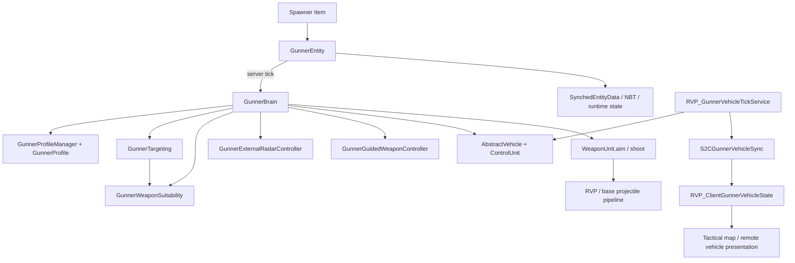

# limitless-vehicle-rvp-addon：Gunner（AI 炮手）系统架构、数据流与关键入口

> 调研日期：2026-09-05  
> 代码基线：`D:\WgameProject\limitless-vehicle-rvp-addon` 当前工作树，Git `HEAD=3c57aa72`；调研时 Gunner 相关 Java 文件无未提交改动。  
> 本体参照：`D:\WgameProject\ywzj_vehicle_fish`，仅用于确认 `AbstractVehicle`、`WeaponUnit`、`ControlUnit` 等公开 API，未修改本体。  
> 本文描述的是当前实际实现，不以旧计划文档或历史 Mixin 方案为准。

## 1. 结论先行

当前 Gunner 不是 Forge `Goal`/`Brain` 体系中的普通生物 AI，而是一个**以 `GunnerEntity.tick()` 为入口、直接操纵本体载具 API 的服务端状态机**：

1. `GunnerEntity` 作为真实 `Mob` 实体骑乘 `AbstractVehicle`，保存归属、Profile、目标、武器索引以及驾驶/战术/SEAD 等运行时状态。
2. 服务端每 tick 由 `GunnerEntity.tick()` 调用 `GunnerBrain.tick()`。
3. `GunnerBrain` 负责总编排：读取 Profile、解析座位和武器站、索敌、雷达/外置雷达、制导控制源、驾驶、反制、补给、武器选择与开火。
4. `GunnerTargeting`、`GunnerWeaponSuitability`、`GunnerExternalRadarController`、`GunnerGuidedWeaponController` 分别承接候选目标、武器门控、外置雷达和制导会话。
5. `RVP_GunnerVehicleTickService` 是独立的 Forge 服务端低频服务，负责 Gunner 驾驶载具的阵营/航向 S2C 快照及一层自动热焰弹/箔条响应；它不是 Gunner 主脑入口。
6. 客户端主要消费 `SynchedEntityData` 和 `S2CGunnerVehicleSync`，用于实体渲染、HUD、战术地图和远程载具姿态；战斗决策仍在服务端。
7. 当前没有专门以 Gunner 命名的 Mixin。核心闭环主要依赖本体公开 API、Forge 事件、RVP 独立状态表和网络包；部分雷达数据能力仍由通用 `RadarUnitDataMixin` 等扩展支撑。

一句话调用链：

```text
生成器物品
  -> 创建 GunnerEntity 并 startRiding(vehicle)
  -> GunnerEntity.tick() [服务端，每 tick]
  -> GunnerBrain.tick()
       -> Profile / 座位 / WeaponUnit
       -> GunnerTargeting
       -> 雷达、外置雷达、制导控制源
       -> 驾驶 / SEAD / 反制 / 无限弹药
       -> GunnerWeaponSuitability
       -> WeaponUnit.aim(...)
       -> WeaponUnit.shoot(..., gunner)
       -> RVP/本体弹体与既有网络、告警、制导链
```

## 2. 模块分层

| 层 | 当前职责 | 关键类 |
|---|---|---|
| 注册与部署 | 注册 Gunner 实体和 4 类生成物品；选择座位/Profile；创建、上车、拆除 | `RVP_Entities`、`RVP_Items`、`GunnerSpawnerItem`、`FixedProfileGunnerSpawnerItem` |
| 实体与状态 | 生命周期、NBT、同步字段、座位自愈、冷却和驾驶状态容器 | `GunnerEntity` |
| 配置 | 从服务器资源包读取 Profile，归一化参数，提供默认值和阵营 | `GunnerProfileManager`、`GunnerProfile`、`RVP_EnumGunnerFaction` |
| 决策编排 | 每 tick 串联索敌、反制、雷达、制导、驾驶、SEAD、武器选择和射击 | `GunnerBrain` |
| 目标决策 | 候选收集、敌我过滤、目标类型过滤、优先级与评分、CIWS/威胁搜索 | `GunnerTargeting` |
| 武器门控 | 弹药/冷却检查、目标包线、GPS/ARM/RF/锁定条件、雷达锁写入 | `GunnerWeaponSuitability` |
| 火控适配 | 自动部署中继 UAV、外置雷达锁定；GPS/照射/HITL 控制源维护 | `GunnerExternalRadarController`、`GunnerGuidedWeaponController` |
| 低频载具服务 | 每 5 tick 扫描 Gunner 驾驶载具；自动热焰弹/箔条；阵营/航向快照 | `RVP_GunnerVehicleTickService` |
| 客户端表现 | Gunner 模型、车内状态 HUD、远程载具阵营/姿态缓存、战术标记 | `GunnerRenderer`、`RVP_GunnerOverlay`、`RVP_ClientGunnerVehicleState`、`RVP_ClientEvents`、`RVP_TacticalMapScreen` |
| 外围协作 | Gunner 雷达服务端补扫、反制系统、主动 ECM、SBW 兼容、远程区块租约 | `RVP_RadarScanService`、`RVP_CountermeasureRuntimeManager`、`RVP_EcmActiveManager`、`RVP_SbwThreatManager`、`RVP_RemoteVehicleChunkLeaseService` |

### 2.1 核心类关系



## 3. 注册、生成与乘员绑定

### 3.1 注册入口

- `RVP_MOD` 构造函数注册 `RVP_Entities` 和 `RVP_Items`；`onCommonSetup()` 初始化 `RVP_Network`。
- `RVP_Entities.GUNNER` 注册名为 `ywzj_rvp:gunner`，类别为 `CREATURE`，尺寸 `0.6 × 1.8`，更新间隔为 1。
- `RVP_Entities.onEntityAttributeCreationEvent()` 注册 8 点最大生命和 `0.1` 移速。
- 客户端 `RVP_ClientBootstrap.onClientSetup()` 将实体绑定到 `GunnerRenderer`。
- `RVP_Items` 注册：
  - `gunner_spawner`：可切换 Profile 的通用生成器；
  - `friendly_gunner`：固定 `ywzj_rvp:friendly`，绑定放置者；
  - `enemy_gunner`：固定 `ywzj_rvp:enemy`，不绑定放置者；
  - `team_gunner`：固定 `ywzj_rvp:team`，绑定放置者。

### 3.2 部署流程

`GunnerSpawnerItem.interactEntity()` 和 `FixedProfileGunnerSpawnerItem.interactEntity()` 的主要流程相同：

```text
玩家右键 AbstractVehicle
  -> 清除 seats 中指向不存在实体的 passengerId
  -> 校验指定座位或是否存在空座
  -> RVP_Entities.GUNNER.create(ServerLevel)
  -> moveTo(vehicle position)
  -> 可选 initOwner(player)
  -> setProfileId(...)
  -> level.addFreshEntity(gunner)
  -> gunner.startRiding(vehicle, true)
  -> 指定座位：vehicle.changeSeat(...)
     自动座位：遍历空座，优先找到关联非空 WeaponUnit 的座位
```

通用生成器的物品 NBT 保存：

| NBT 键 | 含义 |
|---|---|
| `PreferredSeat` | `-1` 为自动座位，否则为 `0..9`；潜行右键空气循环 |
| `ProfileId` | 当前 Profile；普通右键空气按 `default -> ground -> air -> mixed -> friendly -> enemy -> team` 循环 |

右键一个既有 Gunner 会执行拆除。通用生成器要求“本人所有”或创造模式；固定 Profile 生成器还允许拆除无在线 Owner 的 Gunner。

### 3.3 与本体座位系统的绑定

Gunner 没有复制一套载具座位/武器系统，而是直接复用本体：

- `AbstractVehicle.changeSeat()` 更新 `Seat.passengerId`、座位 `PartUnit.owner`，0 号座位还会设置 `ControlUnit.operator`。
- `AbstractVehicle.getDriver()` 返回 `ControlUnit.operator`。
- `AbstractVehicle.getOwnOperatorUnit(gunner)` 由 `Seat.passengerId` 找到对应 `PartUnit`。
- `GunnerBrain.isDriver()` 优先比较 `vehicle.getDriver() == gunner`，并以 `seatIndex == 0` 作兼容判定。
- 若 Gunner 是司机，但司机座不是 `WeaponUnit`，`resolveWeaponUnit()` 会回退选择载具第一个含武器的 `WeaponUnit`，因此司机 AI 可以同时驾驶并控制一个武器站。

## 4. `GunnerEntity`：生命周期与状态模型

### 4.1 主 tick

`GunnerEntity.tick()` 是 AI 的真正入口：

- 客户端调用 `super.tick()` 后立即返回，不执行决策。
- 服务端若正在骑乘 `AbstractVehicle`：
  - `detachedTicks = 0`；
  - 每 20 tick 检查当前座位是否关联 `WeaponUnit`；若不是，`repairSeat()` 尝试换到可用武器座；
  - 调用 `GunnerBrain.tick(this, vehicle)`。
- 未骑乘载具时：清理驾驶状态和目标；`detachedTicks` 超过 40 后 `discard()`。

因此 Gunner 是**依附载具存在的 AI 乘员**，不是可独立巡逻的步兵实体。`shouldBeSaved()` 返回 `true` 且 `removeWhenFarAway()` 返回 `false`，但脱离载具超过约 2 秒仍会主动删除。

### 4.2 三类状态

| 状态类别 | 字段/内容 | 传播与寿命 |
|---|---|---|
| 实体同步字段 | `PROFILE_ID`、`PROFILE_FACTION`、`TRACKED_TARGET_ID`、`CONTROLLED_WEAPON_INDEX` | `SynchedEntityData`，服务器同步到追踪该 Gunner 的客户端；HUD/渲染可读 |
| NBT 持久化 | `Owner`、`OwnerTeam`、`ProfileId`、`HomePosX/Y/Z` | 世界保存/读取后保留 |
| 仅运行时状态 | burst/rest、反制/导弹冷却、CIWS 目标冷却、卡住恢复、战术停车/规避、烟雾停车、空战阶段、SEAD 阶段等 | 不写 NBT；实体重载或服务重启后重置 |

### 4.3 Owner、Team 与 Faction 是三套相关但不同的概念

- `ownerUuid`：谁放置了 Gunner；用于“不可攻击主人”和拆除权限。
- `ownerTeamName` / `getTeam()`：优先读取在线 Owner 当前计分板队伍，Owner 离线时按保存的队伍名回查。
- `PROFILE_FACTION`：Profile 提供的 `FRIENDLY`、`ENEMY`、`TEAM`，独立于 Minecraft 计分板 Team。
- `ENEMY` 的实际语义更接近“无差别敌对”：目标过滤时不应用普通 Team 友军过滤，也不保护放置者。
- `TEAM` 仍需依赖计分板队伍区分同阵营 Gunner；队伍信息缺失时通常按非盟友处理。

## 5. Profile 数据流

### 5.1 加载路径和 ID 归一化

`GunnerProfileManager` 是 `AddReloadListenerEvent` 注册的服务器资源重载监听器：

1. 扫描资源目录 `gunner_profiles/*.json`；
2. 再扫描 `gunner/*.json`；
3. 两者都将扫描到的文件路径强制映射为 `ywzj_rvp:<path>`；
4. 同名时后扫描的 `gunner/` 覆盖 `gunner_profiles/`；
5. Gson 反序列化后调用 `GunnerProfile.normalize()`；解析异常目前被静默忽略；
6. 查不到指定 ID 时，`getProfile()` 回退 Java 内建 `DEFAULT_PROFILE`。

当前开发运行包的规范位置是：

```text
run/client_1/limitless_vehicle/rvp/data/rvp/gunner/<profile>.json
```

当前该目录有 `default`、`ground`、`air`、`mixed`、`friendly`、`enemy`、`team` 七个 Profile，且 `run/server` 副本哈希一致。`build.gradle` 明确说明 RVP 载具包只维护在 `run/client_1/limitless_vehicle/rvp`。

仓库另有 `src/main/resources/assets/ywzj_rvp/gunner_profiles/ps1sm_gunner.json`。从当前加载器是服务器数据资源重载监听器、而该文件位于 `assets` 而非 `data` 来看，它不应被视为当前服务端生效 Profile 的可靠来源；实际扩展 Profile 应放入载具包的 `data/<namespace>/gunner/`。

### 5.2 当前字段

| JSON 字段 | Java 默认值 | 单位/含义 | 当前消费点 |
|---|---:|---|---|
| `name` | `default` | 显示/标识名 | 调试输出 |
| `faction` | `friendly` | `friendly` / `enemy` / `team`；另接受 `hostile`、`faction` 别名 | 敌我识别、同步、标记颜色 |
| `target_types` | `rvp:missile, vehicle, monster, player` | 允许的目标类别 | `GunnerTargeting.matchProfileTarget()` |
| `gps_prefer_farthest` | `true` | 每个目标优先级层内，若 GPS 可用则选最远 GPS 可打击目标 | 索敌和武器选择 |
| `search_radius` | `96` | 格；地面基础索敌半径，固定翼/旋翼乘 6；有雷达时再取雷达最大距离 | 普通索敌 |
| `scan_interval_tick` | `10` | tick；普通目标重扫周期，最小 1 | `tickTargeting()` |
| `fire_window_deg` | `6` | 度；非制导武器炮塔俯仰/偏航允许误差，最小 1 | `tickCombat()` |
| `lead_scale` | `1.0` | 目标运动提前量倍率，最小 0 | 非发射架武器瞄准 |
| `burst_fire_tick` | `6` | tick；一轮射击窗口，最小 0 | burst 状态 |
| `burst_rest_tick` | `10` | tick；轮间停火，最小 0 | burst 状态 |
| `countermeasure_range` | `36` | 格；旧式武器站反制弹来袭扫描范围，最小 0 | `tickCountermeasure()` |
| `countermeasure_cooldown_tick` | `80` | tick；旧式反制武器冷却，最小 0 | `tickCountermeasure()` |
| `allow_drive` | `true` | 仅司机位生效；允许 AI 写入载具控制量并启用司机补给 | `GunnerBrain.tick()` |
| `drive_pursuit_distance` | `64` | 格；预期追击距离 | 当前主流程未读取 |
| `drive_stop_distance` | `12` | 格；地面接敌停车/战术规避距离 | 地面、发射架、旋翼驾驶 |
| `drive_stuck_check_tick` | `20` | tick；卡住检测间隔，最小 5 | 地面驾驶 |
| `drive_stuck_distance` | `1` | 格；检测周期内位移小于此值视为卡住，最小 0.05 | 地面驾驶 |
| `drive_recovery_tick` | `20` | tick；倒车脱困时长，最小 5 | 地面驾驶 |
| `rotary_cruise_altitude_min/max` | `28 / 60` | 格 AGL；旋翼巡航高度 | 旋翼驾驶 |
| `fixedwing_cruise_altitude_min/max` | `150 / 500` | 格 AGL；固定翼巡航高度 | 固定翼驾驶 |
| `fixedwing_combat_radius_min/max` | `40 / 550` | 格；相对首次司机上车位置的作战半径 | 固定翼回航/外扩 |
| `ground_wander_enabled` | `true` | 无目标时地面漫游开关 | 地面驾驶 |
| `ground_big_turn_interval_tick_min/max` | `300 / 600` | tick；无目标大转弯间隔 | 地面漫游 |
| `ground_big_turn_angle_deg_min/max` | `120 / 180` | 度；无目标大转弯角度 | 地面漫游 |
| `ground_big_turn_duration_tick` | `40` | tick；执行大转弯的最长时间 | 地面漫游 |
| `air_attack_phase_tick` | `200` | tick；空中攻击阶段基础时长 | 固定翼/旋翼阶段机 |
| `air_disengage_phase_tick` | `200` | tick；空中脱离阶段基础时长 | 固定翼/旋翼阶段机 |
| `air_initial_disengage_tick_min/max` | `300 / 400` | tick；首次进入空战时先脱离的随机区间 | 固定翼/旋翼阶段机 |

`target_types` 当前由 `GunnerTargeting` 自己解释，支持：

- 通用：`rvp:missile`、`monster`、`player`、`neutral`、`living`、`vehicle`；
- 载具细分：`vehicle:enemy_gunner`、`vehicle:friendly_gunner`、`vehicle:team_gunner`、`vehicle:player`、`vehicle:non_allied_gunner`。

注意：`GunnerProfile.matchesTarget()` 只实现了一部分旧式通用类别，当前索敌主流程并不调用它；真正权威入口是 `GunnerTargeting.matchProfileTarget()`。

## 6. 服务端主循环数据流

`GunnerBrain.tick()` 的当前执行顺序非常重要，因为后面的驾驶和开火会消费前面计算/写入的状态：

```text
1. gunner.tickCooldowns()
2. ProfileId -> normalizeProfileId -> GunnerProfile
3. getOwnOperatorUnit -> 判断 driver -> resolveWeaponUnit
4. tickTargeting -> target
5. 若 driver && allow_drive：首次补满/启动 + 持续无限弹药
   否则：清弹药计时器、必要时 reset 控制量、清司机状态
6. tickCountermeasure             旧式武器站反制弹
7. tickEcmActive                  主动 ECM
8. tickSmokeEvasion               地面司机烟雾规避
9. tickRadarLock                  本车雷达锁定
10. GunnerExternalRadarController 外置雷达/UAV
11. GunnerGuidedWeaponController  GPS/照射/HITL 飞行中控制
12. driver AI 时优先 tickSead
13. 未被 SEAD 接管时 tickDriving
14. weaponUnit + target + allowFire 时 tickCombat
15. 客户端物理环境下调用调试监控器
```

### 6.1 座位与武器站解析

- 炮手座直接关联 `WeaponUnit`：使用该武器站。
- 非司机且座位不关联武器站：不射击，目标被清空。
- 司机且座位不关联武器站：回退到载具第一个含武器的 `WeaponUnit`。
- `controlledWeaponIndex` 是 Gunner 本 tick 实际决定控制的武器索引，并同步给客户端 HUD；它不等同于本体玩家当前武器索引。

### 6.2 索敌

索敌分为一个逐 tick 的 CIWS 快路径和一个按 Profile 间隔执行的普通路径：

```text
tickTargeting
  -> findCiwsTarget()：每 tick，若命中则立即覆盖普通目标
  -> tickCount % scanInterval == 0：findBestTarget()
  -> 读取已同步到 GunnerEntity 的 trackedTargetId
  -> 目标不存在/死亡则清空
```

CIWS 路径：

- 搜索 1000 格内 RVP/本体导弹、炸弹、火箭；
- 普通载具要求目标弹药 AGL ≥ 50，具有发射架部署配置的载具下限为 0；
- 排除本车弹药、友方 Owner 发射物和处于单目标冷却中的弹药；
- 目标武器站必须至少有一把通过 `canSelectForTarget()` 包线/类型门控的武器。注意当前 `hasUsableWeaponForTarget()` 名称虽含 `Usable`，但它本身不检查弹药、冷却或装填；真正的即时可发射状态在后续武器选择阶段检查；
- 取最近目标。

普通路径：

1. 基础半径为 `search_radius`；固定翼/旋翼乘 6。
2. 若本车或已链接外置中继有雷达，再把半径扩展到最大雷达扫描距离。
3. 遍历 `ServerLevel.getEntities().getAll()`，用膨胀 AABB 做范围闸门，避免超大 `getEntities` 立方体扫描。
4. 执行存活、自身/乘客、弹药 Owner、创造/旁观、ECM 假目标、Profile 类别、Faction/Team 过滤。
5. 要求 `GunnerWeaponSuitability.hasUsableWeaponForTarget()` 为真，排除没有任何武器通过目标类型/包线门控的目标；该方法当前不检查弹药、冷却和装填，不能等同于“本 tick 一定可射”。
6. 按层级选目标：
   - 可拦截弹药；
   - 敌方 ECM 假目标；
   - 相对敌对的 Gunner 载具；
   - 玩家或玩家驾驶载具；
   - 其余有效目标。
7. 层级内若 `gps_prefer_farthest=true` 且存在 GPS 可打目标，选择最远者；否则使用 `距离 + 夹角 × 32` 的低分优先评分。发射架载具不计夹角惩罚。

### 6.3 武器选择与发射

`tickCombat()` 的主链如下：

```text
目标预测点 -> WeaponUnit.aim(...)
  -> selectWeaponIndex()
  -> 对空导弹 5 秒持锁纪律
  -> 全 RVP 制导武器 5 秒统一冷却
  -> burst 窗口
  -> 非制导武器炮塔误差窗口
  -> GunnerWeaponSuitability.prepareLaunchLock()
       若制导武器门控失败，回退非制导武器
  -> GunnerGuidedWeaponController.prepareForLaunch()
  -> 选择 RIPPLE 单管或 SALVO 全上下文
  -> WeaponUnit.shoot(index, aimContexts, gunner)
  -> 更新 burst / missile / CIWS 单目标冷却
```

实际制导武器优先级（数字越小越先选）为：

| 优先级 | 类型 |
|---:|---|
| 1 | GPS |
| 2 | AntiRadiation / ARM |
| 3 | IR、AIR |
| 4 | ARH、SARH |
| 5 | SACLOS、SALH、LBR、LH |
| 6 | HITL_TV、HITL_CLOS_TV |

普通目标先尝试制导武器，失败才找非制导武器。拦截弹药时，以 200 格为分界：远处优先制导武器，近处优先机炮/非制导武器。

`WeaponUnit.shoot()` 最终仍走本体权威链：武器舱开启、`VehicleFireEvent.Pre`、`weapon.shoot()`、`VehicleFireEvent.Post`、`ServerVehicleFire` 广播。传入的 `operator` 是 Gunner 实体，因此弹体 Owner、敌我识别、制导会话都可以按 Gunner UUID/实体继续工作。

### 6.4 `GunnerWeaponSuitability` 门控

选择阶段与发射前阶段共用同一套目标适配逻辑，但发射前会真正写锁定状态：

- 所有 RVP 武器先取 `WeaponUnit.proxyWeapon(rawWeapon)`，处理代理/子武器站。
- GPS 只允许攻击目标 AGL ≤ 5 格。
- 纯对空制导武器拒绝地面目标。
- 目标距离、高度和运动角度使用 `RVP_GuidanceModelResolver` 解析后的 launch/active 包线。
- 普通锁定还检查武器轴线与目标的 `maxOffAxisLockAngle`；发射架/垂发载具跳过轴线锥角。
- RF/ARH/SARH 在需要时必须有本车或外置中继可用雷达。
- 箔条禁锁期通过 `RVP_ChaffJamState` 和雷达锁链阻止 AI 逐 tick 立即重锁。
- AntiRadiation 武器扫描目标载具雷达 emitter，将预选写入 `RVP_WeaponLockStateTable`。
- 本车 RF 锁通过 `RVP_RadarRoleHelper` 和 `RadarUnit` 写入；外置雷达锁通过 `RVP_WeaponLockStateTable` 的 requested/locked entity ID 保存。

### 6.5 制导控制源

| 制导类型 | Gunner 提供的数据 | 写入入口 | 飞行中消费方式 |
|---|---|---|---|
| GPS | 目标包围盒中心点 + 维度，键为 Gunner | `GPSTargetManager.set()` | 弹体生成时消费并保存目标点 |
| LH / SALH | Gunner UUID 下的 designation point | `RVP_SaclosOperatorSession.setDesignation()` | 激光/半主动激光制导源按 Owner UUID 读取 |
| LBR / SACLOS | 当前 `WeaponUnit` 的瞄准方向 | `WeaponUnit.aim()` | 命令制导源读取操作者武器站方向 |
| HITL_TV DESIGNATE | 在途导弹目标实体 | `rvp$setHitlDesignatedEntity()` | 导弹跟随指定实体 |
| HITL_CLOS_TV MOUSE | 导弹到目标的 yaw/pitch 指令和 tick | `rvp$setHitlSteeringInput()` | 线控/HITL 转向读取输入 |
| AntiRadiation | 目标载具 + 雷达索引 + emitter 位置 | `RVP_WeaponLockStateTable.setArmPreselected()` | 反辐射导引头消费预选 emitter |
| ARH / SARH | 本车雷达或外置中继锁定实体 | `RadarUnit`、root `WeaponUnit`、锁状态表 | RF 制导与发射门控读取 |

`GunnerGuidedWeaponController.tick()` 还会在 4096 格范围闸门内遍历 Gunner 发射的在途 HITL/照射弹，持续维持 designation 或写转向命令；这保证开火后切换武器不会立刻丢失仍在飞行弹药所需的控制源。

## 7. 驾驶状态机

### 7.1 总分流

每 tick 驾驶前先 `vehicle.controlUnit.reset()`，再按载具类型写入本体 `ControlUnit`：

```text
FixedWingVehicle  -> 固定翼攻击/脱离阶段
RotaryWingVehicle -> 旋翼攻击/脱离阶段
有 launcher deploy 配置 -> 发射架地面逻辑
其他 -> 普通地面车辆逻辑
```

只有 `driver && profile.allow_drive` 时驾驶逻辑生效。非司机 Gunner 仍可操纵自己的武器座，但不写载具控制量，也不启用司机无限补给。

### 7.2 地面车辆

- 有目标：向目标转向，在 `drive_stop_distance` 附近先停车 100 tick，再以随机左右 `±55°` 偏置规避 140~280 tick。
- 希望前进但一个 `drive_stuck_check_tick` 周期内移动不足 `drive_stuck_distance`：倒车并带转向执行 `drive_recovery_tick`。
- 无目标：若 `ground_wander_enabled`，持续前进，并按配置周期进行 120~180° 大转弯。
- 处于烟雾规避状态时，优先驶向最近烟雾云；进入云半径约 60% 内后不给控制输入，即停车。

### 7.3 发射架车辆

- 任一非反制武器有弹：停车，让武器系统自由工作。
- 全部作战武器无弹/装填：执行地面游走或面向目标的战术移动。
- 由于其发射姿态通常为垂发/展开式，目标评分、瞄准误差和锁定轴线均有专门跳过逻辑。
- `LauncherDeployStateMachine` 把 Gunner 与玩家都视为“有人”，可满足 `requirePlayerPresent` 类展开条件。

### 7.4 固定翼

- 初始先进入随机时长的脱离阶段，然后在攻击/脱离阶段间切换。
- 只有攻击阶段允许常规开火；无目标时巡航但返回 `allowFire=false`。
- 以 AGL 配置维持高度；攻击阶段目标高度约束更偏向 175 格。
- 保存首次成为司机时的 `homePos`，按 `fixedwing_combat_radius_min/max` 做外扩或渐进回航。
- 目标过近时沿当前前向拉开，不继续扎向目标。

### 7.5 旋翼

- 低于起飞 AGL 时进入悬停/拉升，暂不允许开火。
- 达到高度后在攻击/脱离阶段间切换；攻击阶段面向目标，脱离阶段背向目标。
- 通过 collective、up/down 和俯仰命令维持巡航高度并做低高度/高下降率保护。

### 7.6 SEAD 复仇状态机

仅固定翼/旋翼司机 AI 生效。每 10 tick 扫描 1024 格内是否有敌方开启的 `RadarUnit` 正锁定本机，且本武器站存在可用 AntiRadiation 武器：

```text
未激活
  -> 若入口门控已满足，立即发射 1 枚 AntiRadiation
  -> 抛 CHAFF
  -> FLY_AWAY 100 tick：背向雷达源飞离
  -> REVERSAL 最多 160 tick：回旋并逐 tick 检查门控
  -> LOCK_FIRE 最多 40 tick：继续对准并尝试复仇发射
  -> 成功、目标丢失或总计超过 400 tick：退出
  -> 进入 400 tick SEAD 冷却
```

入口立即一发加复仇一发，单次状态机至多发射两枚；二者都受全局 100 tick 制导武器冷却和 AntiRadiation emitter 门控约束。

## 8. 补给与反制体系

### 8.1 司机无限补给

司机 AI 首次绑定某载具时：

- 设置 `homePos`；
- 开启发动机；
- 能量补到容量上限；
- 所有合法武器补满并将 reload time 置 0。

持续补给不是每 tick 直接填满：武器弹药归零后，以 `DRIVER_AMMO_READY_TIME` 等待该武器装填时长；单发容量武器还叠加射击间隔，到期后再补满。RVP 武器调用 `RVP_WeaponBase.ywzj_rvp$setReloadTime()`；本体武器通过 `ObfuscationReflectionHelper` 反射 `setReloadTime(int)`，失败只降级并记录日志。

该补给计时表是 `WeakHashMap<AbstractVehicleWeapon<?>, Long>`，使用系统毫秒时间且不持久化。

### 8.2 当前同时存在的自动防御路径

| 路径 | 触发周期/条件 | 动作 |
|---|---|---|
| `GunnerBrain.tickCountermeasure()` | 每 tick；Profile 冷却结束，近距危险弹药满足逼近条件 | 在武器站中寻找 ID 含 `decoy_flare` 或 `aps_grenade` 的本体式反制武器并射击 |
| `GunnerBrain.tickSmokeEvasion()` | 地面司机，每 10 tick 错相扫描；IR/AIR 锁定、100 格内敌方来袭导弹或敌方激光照射 | 通过 RVP Countermeasure 系统抛 `SMOKE`，驶入烟中停车约 260 tick |
| `GunnerBrain.tickEcmActive()` | RWR 出现 `RADAR_LOCK`/`MISSILE_LAUNCH`，或主动 ECM 半径内有敌方危险弹药 | `RVP_EcmActiveManager.tryFireForVehicle()` |
| `RVP_GunnerVehicleTickService` | 每 5 tick；RVP/本体导弹锁定或附近其他载具雷达锁定；同车 100 tick 节流 | IR/AIR -> `FLARE`；ARH/SARH/雷达锁 -> `CHAFF` |
| `RVP_SbwThreatManager` | SBW 红外导弹锁定 Gunner 驾驶载具 | 尝试同时抛 `FLARE` 与 `SMOKE`，自身冷却 |

这些路径覆盖不同武器体系和反制子系统，但可能在同一威胁下同时满足。真正的弹量、模块存活、发射节奏仍由 `RVP_CountermeasureRuntimeManager` 的服务端状态机校验；Gunner 驾驶载具的 RVP 干扰物装填时间被设置为玩家的 2 倍。

## 9. 雷达、外置 UAV 与锁定数据流

### 9.1 本车雷达

阶段 B 后，本车雷达锁由 `RVP_GunnerRadarActions.maintainLocalLock()` 维护（由 `GunnerBrain.tick()` 每 tick 调用）。它在以下情况工作：

- 当前武器站火控传感器为 RF；或
- 武器组内存在一把能打当前目标的 ARH/SARH 武器。

有效目标时，它会自动打开雷达，取首选锁定雷达，检查距离和雷达转角，调用 `detect()`，再把锁定写到 `RadarUnit` 和 root `WeaponUnit`。目标玩家若坐在载具内，会归一化为目标载具。目标为空或死亡时，动作适配器清除该武器站全部雷达部件锁及 root `WeaponUnit` 锁，避免目标 RWR 持续显示锁定或 SARH 中继挂空；该清理覆盖目标被分角度 RCS 感知过滤而丢失的情况。

由于 Gunner 没有玩家客户端向服务端回写雷达探测结果，`RVP_RadarScanService` 每 4 tick 为 Gunner 驾驶载具执行服务端扫描，每 2 tick 保活仍在扫描体积中的接触；这是导弹制导校验、火控锁定和远程可见性读取服务端 `detectedEntities` 的基础。

### 9.2 外置雷达/可部署 UAV

`GunnerExternalRadarController.tick()` 只在“司机 AI + 当前 root WeaponUnit 的火控传感器为 RF”时运行：

1. 查询已链接中继载具；无有效中继时每 20 tick 尝试 `RVP_DeployableUavService.deployLinkedUav()`。
2. 自动启动中继载具发动机并打开其全部雷达。
3. 选择首选中继锁定雷达。
4. 优先锁定 Gunner 当前目标；没有当前目标时，在中继雷达最大扫描范围内找最近敌对载具。
5. 检查距离、扫描高度和方位；检测目标。
6. 若目标处于箔条禁锁期则清锁；否则将目标写入中继 `RadarUnit`、发射车 root `WeaponUnit` 以及外置雷达 requested/locked 状态表。

这条链完全在服务端工作，不依赖玩家 UI 的 external radar snapshot。

## 10. 服务端低频服务与客户端同步

### 10.1 `RVP_GunnerVehicleTickService`

这是 `@Mod.EventBusSubscriber(... FORGE)` 自动注册的 `ServerTickEvent` 监听器，每 5 tick 执行：

1. 遍历各维度全部已加载实体，收集“存活、非 UAV、未摧毁且司机是 `GunnerEntity`”的载具。
2. 对每辆车执行自动 `FLARE`/`CHAFF` 威胁响应。
3. 对同维度、非旁观且当前正在乘坐载具的玩家，发送 4096 格内其他 Gunner 驾驶载具的快照。

快照 `S2CGunnerVehicleSync.Entry` 包含：

```text
vehicle entityId + yRot + xRot + Gunner faction
```

即使没有条目也发送空快照，以清理客户端过期缓存。

### 10.2 客户端消费

`S2CGunnerVehicleSync.handle()` 通过 `DistExecutor` 调用 `RVP_ClientGunnerVehicleState.applySnapshot()`：

- 按维度和载具 `entityId` 保存阵营/航向；
- 若远程载具实体当前已加载，直接回写 `yRot/xRot` 及上一帧角度，弥补远程实体自身不推进姿态的问题；
- `RVP_ClientEvents` 每客户端 tick 清理换维度或已不存在实体的缓存；
- `RVP_TacticalMapScreen` 在远程载具没有可见 driver 实体时，使用该侧表恢复友敌颜色。

此外：

- `GunnerRenderer` 使用默认 Slim 玩家模型和默认皮肤，整体缩放为 `0.9375`，始终显示名称。
- `RVP_GunnerOverlay` 只在本地玩家乘坐载具时显示同车最多 4 名 Gunner 的 Profile、`controlledWeaponIndex` 和当前目标。
- `RVP_ClientEvents` 每 10 tick 扫描 512 格内已加载的 Gunner 驾驶载具并绘制颜色标记；敌对为红，Owner/盟友/FRIENDLY 为蓝。

## 11. 外围集成点

| 系统 | 与 Gunner 的关系 | 关键入口 |
|---|---|---|
| 载具改装 | 车上存在玩家或 Gunner 时禁止换装，且速度需低于 5 km/h | `RVP_VehicleExtendedConfigManager.canModVehicle()` |
| 发射架展开 | Gunner 计入“有人”，保持需要乘员的发射架展开状态 | `LauncherDeployStateMachine.tick()` |
| 雷达扫描 | Gunner 驾驶载具没有玩家 DETECT 回写，改由服务端补扫 | `RVP_RadarScanService.onServerTick()` |
| 干扰物 | Gunner 驾驶时 RVP 反制系统装填时间乘 2 | `RVP_CountermeasureRuntimeManager.ensureState()` |
| SBW 兼容 | SBW 红外弹锁定 Gunner 车辆时自动热焰弹+烟雾 | `RVP_SbwThreatManager.maybeAutoDeploy()` |
| DIRCM / ECM IFF | 弹药 Owner 若为 Gunner，按 Profile Faction 参与敌我判断 | `RVP_DircmRuntimeManager`、`RVP_EcmIff` |
| 远程可见性/区块租约 | Gunner 司机使候选标记为 `aiOrUav=true` | `RVP_RemoteVehicleChunkLeaseService` |
| 弹体生成 | 若目标错误指向载具内 Gunner，会归一化到载具本体 | `RVP_ProjectileSpawner` |

需要特别注意：`RVP_RemoteVehicleChunkLeaseService` 不是“所有 Gunner 载具永久强加载”。Gunner 只是在已经进入远程可见性授权候选后被标记为 AI/UAV；是否得到租约仍取决于远程可见性开关、`ChunkLoadingMode`、观察者授权和预算。

## 12. 关键入口索引

以下行号基于本次调研的当前工作树。

### 12.1 Addon 入口

| 入口 | 文件与行 | 用途 |
|---|---|---|
| Mod 注册 | `src/main/java/org/ywzj/rvp/RVP_MOD.java:39` | 注册实体、物品、网络和客户端 bootstrap |
| Gunner 实体注册 | `src/main/java/org/ywzj/rvp/all/RVP_Entities.java:121` | `EntityType<GunnerEntity>` |
| Gunner 物品注册 | `src/main/java/org/ywzj/rvp/all/RVP_Items.java:15` | 通用/FRIENDLY/ENEMY/TEAM 生成器 |
| 通用部署 | `src/main/java/org/ywzj/rvp/item/GunnerSpawnerItem.java:61` | 创建、Owner、Profile、上车、选座、拆除 |
| 固定 Profile 部署 | `src/main/java/org/ywzj/rvp/item/FixedProfileGunnerSpawnerItem.java:55` | 固定阵营生成器 |
| 实体主 tick | `src/main/java/org/ywzj/rvp/entity/gunner/GunnerEntity.java:125` | 服务端 AI 总入口 |
| 座位自愈 | `src/main/java/org/ywzj/rvp/entity/gunner/GunnerEntity.java:151` | 重新寻找有效武器座 |
| AI 总编排 | `src/main/java/org/ywzj/rvp/entity/gunner/ai/GunnerBrain.java:131` | 每 tick 决策顺序 |
| 普通/CIWS 索敌 | `src/main/java/org/ywzj/rvp/entity/gunner/ai/GunnerTargeting.java:41`、`:437` | 候选过滤、优先级和 CIWS |
| 武器发射 | `src/main/java/org/ywzj/rvp/entity/gunner/ai/GunnerBrain.java:322` | 瞄准、选武器、锁定、射击、冷却 |
| 武器选择门控 | `src/main/java/org/ywzj/rvp/entity/gunner/ai/GunnerWeaponSuitability.java:83` | 判断某武器能否打当前目标 |
| 发射前锁定 | `src/main/java/org/ywzj/rvp/entity/gunner/ai/GunnerWeaponSuitability.java:112` | 写入 ARM/RF/实体锁定 |
| 外置雷达 | `src/main/java/org/ywzj/rvp/entity/gunner/ai/GunnerExternalRadarController.java:30` | 部署中继 UAV、开雷达、扫描和锁定 |
| 制导控制源 | `src/main/java/org/ywzj/rvp/entity/gunner/ai/GunnerGuidedWeaponController.java:29`、`:42` | tick 维持与发射前写入 |
| 驾驶分流 | `src/main/java/org/ywzj/rvp/entity/gunner/ai/GunnerBrain.java:456` | 地面/发射架/固定翼/旋翼 |
| SEAD | `src/main/java/org/ywzj/rvp/entity/gunner/ai/GunnerBrain.java:1455` | 反辐射复仇状态机 |
| Profile 加载 | `src/main/java/org/ywzj/rvp/entity/gunner/ai/profile/GunnerProfileManager.java:28`、`:40` | 资源扫描、解析和替换快照 |
| Profile schema | `src/main/java/org/ywzj/rvp/entity/gunner/ai/profile/GunnerProfile.java:14` | JSON 字段、默认值、normalize |
| 载具低频服务 | `src/main/java/org/ywzj/rvp/entity/gunner/RVP_GunnerVehicleTickService.java:67` | 自动反制与 S2C 快照 |
| 网络包注册 | `src/main/java/org/ywzj/rvp/network/RVP_Network.java:209` | 注册 `S2CGunnerVehicleSync` |
| 客户端侧表 | `src/main/java/org/ywzj/rvp/client/state/RVP_ClientGunnerVehicleState.java:31` | 远程阵营/姿态缓存 |
| HUD | `src/main/java/org/ywzj/rvp/client/gui/RVP_GunnerOverlay.java:22` | 同车 Gunner 状态 |
| 渲染注册 | `src/main/java/org/ywzj/rvp/client/RVP_ClientBootstrap.java:35` | 注册 `GunnerRenderer` |
| Gunner 雷达补扫 | `src/main/java/org/ywzj/rvp/radar/RVP_RadarScanService.java:51`、`:169` | 服务端雷达接触填充 |

### 12.2 本体 API 边界

| API | 本体文件与行 | Gunner 用法 |
|---|---|---|
| `AbstractVehicle.changeSeat()` | `ywzj_vehicle_fish/.../AbstractVehicle.java:977` | 部署与座位自愈 |
| `AbstractVehicle.getDriver()` | `ywzj_vehicle_fish/.../AbstractVehicle.java:1152` | 判断司机 AI |
| `AbstractVehicle.getOwnOperatorUnit()` | `ywzj_vehicle_fish/.../AbstractVehicle.java:1165` | 乘员到 PartUnit/WeaponUnit 映射 |
| `ControlUnit.reset()` 及控制字段 | `ywzj_vehicle_fish/.../ControlUnit.java:61` | AI 每 tick 写驾驶输入 |
| `WeaponUnit.shoot()` | `ywzj_vehicle_fish/.../WeaponUnit.java:745` | 最终权威开火入口 |
| `WeaponUnit.aim()` | `ywzj_vehicle_fish/.../WeaponUnit.java:797` | 炮塔与命令制导方向 |
| `WeaponUnit.proxyWeapon()` | `ywzj_vehicle_fish/.../WeaponUnit.java:1237` | 代理/子武器解析 |

## 13. 调试入口

客户端命令位于 `RVP_DebugCommands`：

```text
/rvpdebug gunner
/rvpdebug gunner monitor
/rvpdebug gunner stop
```

- `/rvpdebug gunner`：要求本地玩家正在载具上且同车有 Gunner；一次性输出 Profile、Faction、司机状态、弹药、目标等，并写 `logs/rvp_gunner_debug.log`。
- `monitor`：启动 `RVP_GunnerDebugMonitor`，设计上每 20 tick 输出一次更详细状态。
- 主动 ECM 另可在 `RVP_DebugFlags.ECM` 开启时写 `logs/rvp_ecm_server.log`。
- 烟雾规避日志受 `RVP_DebugFlags.GUNNER` 控制。

当前接线有一个重要边界：`GunnerEntity.tick()` 在逻辑客户端不会调用 `GunnerBrain.tick()`，而 `RVP_GunnerDebugMonitor.onTick()` 又只从 `GunnerBrain.tick()` 进入并限定物理客户端。因此持续 monitor 主要适用于集成服务器/单机的物理客户端环境；专用服务器 + 独立客户端下，客户端命令能启用 monitor，但客户端实体不会沿该入口喂数据。一次性 `/rvpdebug gunner` 不依赖这条周期回调。

## 14. 当前实现边界与维护注意点

以下不是历史计划，而是从当前代码可直接确认的边界：

1. **主脑是单体静态编排器。** `GunnerBrain` 已接近 1900 行，驾驶、反制、SEAD、补给和武器策略仍高度集中；修改执行顺序容易改变行为。
2. **多个运行时状态不持久化。** burst、导弹冷却、战术规避、空战阶段、SEAD、无限弹药计时等重载后都会重置。
3. **Profile 解析异常静默。** `GunnerProfileManager.apply()` 捕获异常后不记录文件名或错误，配置拼写错误可能表现为 Profile 缺失并静默回退默认值。
4. **存在未进入主流程的字段/方法。** `drive_pursuit_distance`、`GunnerProfile.matchesTarget()`、`GunnerTargeting.findNearbyAmmoTarget()`、`GunnerBrain.isCiwsAltitudeMet()` 当前未被主流程调用；`selectWeaponIndex()` 中的 `targetHighAlt` 也未参与分支。
5. **“有可用武器”预筛不检查即时可射状态。** `hasUsableWeaponForTarget()` 只调用 `canSelectForTarget()`，未检查弹药、冷却或装填；目标可能被保留，但随后 `selectWeaponIndex()` 找不到本 tick 可射武器。
6. **反制识别仍有武器 ID 子串。** `GunnerBrain.isCountermeasureWeapon()` 当前依赖 `decoy_flare` / `aps_grenade` 子串；这与项目现行“禁止硬编码武器 ID、优先数据字段”的规范存在技术债，应避免继续扩展这种判断。
7. **目标 ID 依赖客户端实体已加载。** `TRACKED_TARGET_ID` 只同步整数 ID；客户端 `getTrackedTarget()` 通过 `level.getEntity(id)` 解析，目标超出客户端实体加载范围时 HUD 会显示无目标。
8. **Owner 不是 SynchedEntityData。** Owner UUID 和 Owner Team 只写 NBT；远端客户端的友敌表现应优先依赖同步的 Profile Faction/专用快照，不宜假设 `gunner.isOwnedBy(localPlayer)` 总能成立。
9. **低频同步只发给正在乘坐载具的玩家。** 徒步玩家不会收到 `S2CGunnerVehicleSync` 的远程 Gunner 载具阵营/航向快照。
10. **外置雷达只服务 RF root WeaponUnit。** 非 RF 火控的武器站不会进入 `GunnerExternalRadarController`，即使载具配置了可部署中继 UAV。
11. **自动 CHAFF 的雷达威胁路径不做敌我过滤。** `RVP_GunnerVehicleTickService.resolveThreat()` 只要发现附近其他载具的开启雷达正锁定本车就会返回 CHAFF，不校验该雷达载具是否友方。
12. **无专用 Gunner Mixin。** 当前应继续优先通过 JSON、公开 API、Forge 事件、独立管理类和网络包扩展，不应根据旧文档恢复已删除的 Gunner Mixin。

## 15. 阅读代码的推荐顺序

若要继续修改 Gunner，建议按以下顺序建立上下文：

1. `GunnerEntity.tick()`：确认 AI 何时运行、状态存在哪里。
2. `GunnerBrain.tick()`：确认本 tick 的真实执行顺序。
3. `GunnerTargeting.findBestTarget()` / `findCiwsTarget()`：确认目标为何被选中或排除。
4. `GunnerWeaponSuitability.canSelectForTarget()` / `prepareLaunchLock()`：确认武器为何可选但不能发射，或为何被过滤。
5. `GunnerBrain.tickCombat()`：确认武器优先级、瞄准窗口、冷却和最终 `shoot()` 参数。
6. `GunnerGuidedWeaponController` / `GunnerExternalRadarController`：确认特殊制导和外置雷达数据源。
7. 对应驾驶分支或 `tickSead()`：确认 `ControlUnit` 如何被写入。
8. `RVP_GunnerVehicleTickService`、`RVP_RadarScanService` 和反制/远程可见性外围服务：确认并行服务是否也在修改同一辆车的状态。
