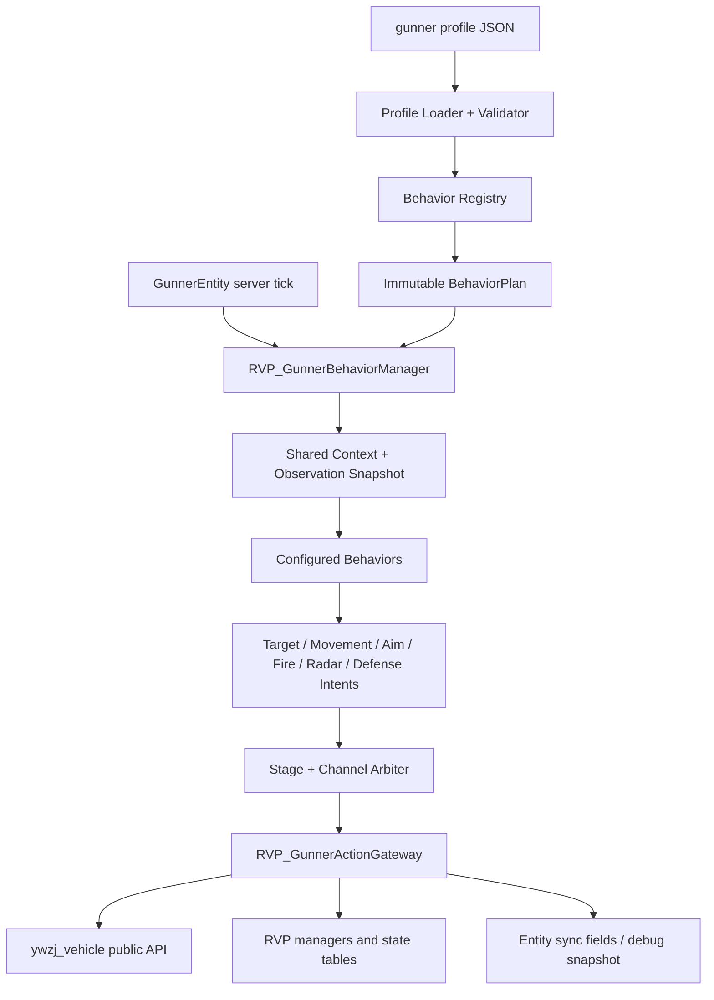

# RVP Gunner 行为组合渐进式重构实施方案

> 文档日期：2026-09-14  
> 状态：实施中；阶段 A、B 已完成，阶段 C～G 尚未实施
> 现状基线：[RVP_Gunner系统架构与数据流_20260905.md](./RVP_Gunner系统架构与数据流_20260905.md)  
> 实施范围：只修改 `limitless-vehicle-rvp-addon`；本体 `ywzj_vehicle` 仅作只读 API 参照  
> 本文目标：先把 Gunner 能调用的本体/RVP 动作封装成稳定能力层，再由 Gunner 行为管理器组合目标、攻击、移动、雷达、制导、反制等行为；不同 `gunner/*.json` 通过选择不同组合获得不同战术效果。

---

## 0. 结论先行

本次重构不应把 `GunnerBrain` 简单拆成更多静态工具类，也不应让每个行为继续直接修改载具、武器站和 Gunner 状态。目标结构分为四层：

1. **动作能力层**：集中封装本体公开 API 与 RVP 自有 API，例如移动控制、瞄准、开火、雷达锁定、干扰物、制导控制源和补给。行为不能越过该层直接写本体运行时对象。
2. **行为层**：把“普通索敌”“CIWS 拦截”“武器交战”“地面接敌移动”“固定翼空战”“SEAD 复仇”等独立战术单元做成可注册行为。行为只读取本 tick 上下文并提交意图。
3. **管理器层**：`RVP_GunnerBehaviorManager` 按阶段运行行为，仲裁目标、移动、瞄准、锁定和开火等互斥资源，再通过动作能力层一次性执行。
4. **Profile 层**：新版 `gunner/*.json` 只引用行为类型 ID、实例 ID、优先级和该行为的强类型配置，不引用 Java 类名，不包含脚本表达式。

最终数据流：

```text
gunner/<profile>.json
  -> Profile 解析与严格校验
  -> 行为注册表创建不可变 BehaviorPlan
  -> GunnerEntity 服务端 tick
  -> BehaviorManager 构建共享 Context / Observation
  -> 各行为提交 Intent
  -> 按执行阶段、通道、优先级确定唯一结果
  -> ActionGateway 调用本体公开 API / RVP 自有 API
  -> 同步必要的 target / controlled weapon 状态
```

关键约束：

- 不修改 `ywzj_vehicle` 本体源码。
- 不新增 Mixin、Accessor 或 Invoker；本方案所需能力可由本体公开 API、RVP 自有管理器和组合类完成。
- 不按载具 ID、武器 ID 或文件名选择行为；能力与适用性由实体类型、本体部件、RVP 数据字段和行为配置判断。
- 不允许多个行为在同一 tick 直接抢写 `ControlUnit`、`WeaponUnit` 或雷达锁。
- 不让每个行为各自全量扫描世界；扫描结果必须通过共享观察快照复用。
- 不在 Java 中实现旧 Gunner JSON 的别名、兼容解析或迁移。到 Profile 切换阶段时，用 `scripts/` 一次性改写载具包 JSON，并让加载器只接受当时的当前 schema。
- 核心生命周期、安全清理、冷却推进与状态同步属于不可关闭的管理器内核，不作为可从 JSON 移除的行为。

---

## 1. 为什么需要这次重构

### 1.1 当前结构的主要问题

当前 `GunnerEntity.tick()` 进入 `GunnerBrain.tick()` 后，由一个总编排类顺序执行索敌、补给、反制、雷达、制导、SEAD、驾驶和开火。虽然已有 `GunnerTargeting`、`GunnerWeaponSuitability`、`GunnerExternalRadarController`、`GunnerGuidedWeaponController` 等局部拆分，但仍存在以下耦合：

- `GunnerBrain` 同时负责“本 tick 应做什么”和“怎样直接操作本体对象”。
- 驾驶分支直接重置并写入 `vehicle.controlUnit`，新移动战术很容易互相覆盖。
- SEAD 同时涉及威胁识别、目标占用、移动、AntiRadiation 发射和冷却，不能作为独立组合项启停。
- 普通交战、CIWS 和 SEAD 都可能需要开火，但没有统一的开火通道仲裁。
- 本车雷达、外置雷达、RF 武器门控和制导控制源存在固定调用顺序，任意拆分都可能造成“选中但发不出”“发出后丢制导”或锁状态残留。
- 大量战术运行时字段放在 `GunnerEntity` 中；继续增加行为会让实体类不断膨胀。
- Profile 主要是一个大而平的参数表；`allow_drive=false` 只能关闭整类驾驶，不能表达“有攻击、无巡逻”“只做 CIWS”“只在固定翼上做 SEAD”等组合。

### 1.2 重构后要能表达的差异

至少应能仅通过不同 `gunner.json` 表达：

| Profile 效果 | 行为组合差异 |
|---|---|
| 固定炮手 | 索敌 + 雷达 + 攻击；不包含任何移动行为 |
| 地面突击车 | 普通索敌 + 地面接敌移动 + 脱困 + 攻击 + 反制 |
| 防空/CIWS | 来袭弹药索敌 + CIWS 交战 + 雷达；可不攻击普通地面目标 |
| 固定翼截击 | 空中索敌 + 固定翼空战移动 + RF/IR 交战 + 制导维持 |
| SEAD 飞行员 | 固定翼/旋翼移动 + SEAD 复仇 + AntiRadiation 发射 + Chaff |
| 发射架 | 远程索敌 + 发射架停车/装填期转移 + 外置雷达 + 制导交战 |
| 侦察/诱饵单位 | 移动 + 雷达/外置雷达；不包含攻击行为 |

### 1.3 非目标

本轮不做以下事项：

- 不引入行为树编辑器、脚本语言、条件表达式 DSL 或运行时热插 Java 类。
- 不改造本体玩家控制系统，也不让普通玩家通过该行为管理器驾驶。
- 不把客户端 HUD、渲染或战术地图变为 AI 决策源。
- 不改变既有武器伤害、弹道、制导模型或载具物理。
- 不修改任何载具结构模型。
- 不在第一阶段顺带优化所有 Gunner 算法；先保证行为等价，再独立做策略与性能优化。

---

## 2. 当前调用边界与可封装能力

### 2.1 本体公开能力

当前实现已经证明下列本体能力可以在服务端直接使用，无需修改本体：

| 能力域 | 本体入口 | 封装目的 |
|---|---|---|
| 乘员与座位 | `AbstractVehicle.getDriver()`、`getOwnOperatorUnit()`、`changeSeat()` | 判断司机/炮手角色，解析实际控制部件，执行座位自愈 |
| 发动机 | `AbstractVehicle.toggleEngine(true)` | 司机初始化与起飞前准备 |
| 载具控制 | `ControlUnit.reset()` 及其公开控制字段 | 将最终移动意图一次性写入前进、倒车、转向、升降、俯仰和偏航控制 |
| 武器枚举 | `WeaponUnit.getIndexedWeapons()`、`proxyWeapon()` | 获取真实可发射武器，支持代理/子武器站 |
| 武器瞄准 | `WeaponUnit.aim(Vec3)`、`aimContext()`、`aimContexts()` | 将最终瞄准点转换为本体武器站姿态和发射上下文 |
| 武器发射 | `WeaponUnit.shoot(index, contexts, gunner)` | 继续经过本体武器舱、Forge 开火事件、实际武器发射和网络广播权威链 |
| 雷达 | `RadarUnit.toggle()`、`detect()`、`setLockedEntity()` | 打开雷达、维护探测与锁定 |
| 武器站锁定 | `WeaponUnit.setLockedEntity()` | 维护 root WeaponUnit 的锁定目标 |

`ControlUnit` 字段虽然是公开字段，但行为层不应直接写入。应由动作能力层接收完整移动命令，在每 tick 仲裁结束后统一 `reset + apply`，从结构上避免多个行为互相覆盖。

### 2.2 RVP 自有能力

| 能力域 | 当前 RVP 入口 | 封装目的 |
|---|---|---|
| 目标与敌我 | `GunnerTargeting` | 候选收集、Faction/Team 过滤、目标分类、瞄准点预测 |
| 武器门控 | `GunnerWeaponSuitability` | 弹种/目标适配、包线、雷达、箔条、AntiRadiation emitter 和发射前锁定 |
| 制导准备与维持 | `GunnerGuidedWeaponController` | GPS、照射、SACLOS/LBR、HITL 等操作者控制源 |
| 外置雷达 | `GunnerExternalRadarController`、外置雷达状态表、UAV 服务 | 中继部署、扫描、requested/locked 状态 |
| RVP 干扰物 | `RVP_CountermeasureRuntimeManager` | Flare、Chaff、Smoke 的服务端权威发射和装填 |
| 主动 ECM | `RVP_EcmActiveManager` | 对雷达锁和危险弹药触发主动干扰 |
| 发射架识别 | `RVP_LauncherDeployConfigCache` | 按 JSON 能力判断发射架，不硬编码载具 ID |
| RVP 武器补给 | `RVP_WeaponBase.ywzj_rvp$setReloadTime()` 等 RVP 自有入口 | 隔离 Gunner 无限弹药补给实现 |
| 锁状态 | `RVP_WeaponLockStateTable` 等 | 维护外置雷达、AntiRadiation 和其他 RVP 锁定上下文 |

### 2.3 兼容性例外

当前司机无限弹药对本体武器使用反射调用装填时间方法。该逻辑已存在，但它不是应扩散的行为 API。重构时应：

1. 将现有反射集中在一个补给适配器中；
2. 行为只提交“为司机载具维持补给”的意图，不接触反射；
3. 反射失败继续安全降级并限频记录；
4. 不新增其他对本体私有字段/方法的反射访问；
5. 若未来本体提供公开补给 API，再只替换该适配器实现。

---

## 3. 目标分层架构



### 3.1 包结构建议

所有新类均放在 Addon 中：

```text
org.ywzj.rvp.entity.gunner.behavior
├─ api
│  ├─ RVP_IGunnerBehavior
│  ├─ RVP_GunnerBehaviorType
│  ├─ RVP_GunnerBehaviorContext
│  ├─ RVP_GunnerBehaviorRuntime
│  └─ RVP_GunnerBehaviorIntent
├─ action
│  ├─ RVP_GunnerActionGateway
│  ├─ RVP_GunnerMovementActions
│  ├─ RVP_GunnerWeaponActions
│  ├─ RVP_GunnerRadarActions
│  ├─ RVP_GunnerGuidanceActions
│  ├─ RVP_GunnerDefenseActions
│  └─ RVP_GunnerSupplyActions
├─ builtin
│  ├─ targeting
│  ├─ combat
│  ├─ movement
│  ├─ defense
│  ├─ radar
│  └─ support
├─ config
│  ├─ RVP_GunnerBehaviorSpec
│  ├─ RVP_GunnerBehaviorPlan
│  └─ RVP_GunnerBehaviorPlanCompiler
├─ runtime
│  ├─ RVP_GunnerBehaviorManager
│  ├─ RVP_GunnerBehaviorRegistry
│  ├─ RVP_GunnerIntentArbiter
│  └─ RVP_GunnerObservationService
└─ debug
   └─ RVP_GunnerBehaviorDebugSnapshot
```

目录是职责建议，不要求一次创建全部空类。实施时只随迁移中的行为增加必要类型。

### 3.2 动作能力层与战术行为层的区别

| 层 | 回答的问题 | 示例 |
|---|---|---|
| 动作能力 | “如何安全调用游戏能力？” | 写一次移动控制、让武器站瞄准、尝试开火、打开雷达、发射 Chaff |
| 战术行为 | “当前为什么要做这个动作？” | 接近目标、进入烟雾、拦截导弹、SEAD 脱离、固定翼回航 |

禁止把二者混为一层。例如“地面接敌移动”不应直接设置 `controlUnit.forward`；它应提交一个带目标航向、速度意图和制动意图的 `MovementIntent`。最终如何映射到本体控制字段，由 `RVP_GunnerMovementActions` 负责。

### 3.3 管理器内核与可配置行为的边界

下列职责必须始终执行，不允许 Profile 关闭：

- 确认服务端、Gunner 存活且正在骑乘有效载具；
- 解析座位角色、root WeaponUnit 和载具能力；
- 推进通用冷却和行为运行时计时；
- 创建单 tick 上下文和共享观察缓存；
- 仲裁并提交动作；
- 清理本 tick 未被续租的控制、锁定、GPS/照射/HITL 会话；
- 在离座、换车、Profile 切换、资源重载、实体移除时退出行为并释放状态；
- 更新 `trackedTargetId`、`controlledWeaponIndex` 等权威同步字段；
- 收集限频调试信息。

下列职责才是 Profile 可组合行为：

- 选择哪类目标；
- 是否优先 CIWS；
- 是否攻击、使用何种武器策略；
- 是否驾驶，以及采用何种地面/固定翼/旋翼战术；
- 是否执行 SEAD；
- 是否使用本车/外置雷达；
- 是否维持制导操作者控制源；
- 是否自动使用反制、ECM、烟雾规避和司机补给。

---

## 4. 动作能力层设计

### 4.1 统一入口

建议由 `RVP_GunnerActionGateway` 聚合各领域动作适配器。行为获得的不是裸 `AbstractVehicle` 写权限，而是：

- 只读 `RVP_GunnerBehaviorContext`；
- 提交意图的接口；
- 只属于该行为实例的运行时状态。

动作执行必须返回明确结果，例如“已执行”“暂时门控失败”“能力不支持”“目标失效”“本 tick 被更高优先级行为占用”。行为不得通过执行后的本体副作用猜测结果。

### 4.2 移动动作

`RVP_GunnerMovementActions` 只接受仲裁后的一个移动意图，并负责：

- 每 tick 至多一次 `ControlUnit.reset()`；
- 根据载具类型把抽象指令映射为 `forward/backward/left/right/up/down`；
- 写入固定翼/旋翼所需 `xRot/yRot` 与 keep 标志；
- 处理“停车”作为显式命令，而不是“本 tick 什么也不写”；
- 在 Gunner 不再是司机、移动行为失效或 Profile 切换时保证归零；
- 拒绝非司机行为提交的真实移动执行。

第一版不必设计通用寻路器。现有地面、发射架、固定翼、旋翼算法可先原样计算控制意图，保持物理表现等价。

### 4.3 武器动作

`RVP_GunnerWeaponActions` 负责一次完整且不可拆开的交战事务：

```text
校验目标/武器站
  -> 选择候选武器
  -> 检查弹药、装填和 Gunner 冷却
  -> 计算并提交瞄准
  -> 检查炮塔窗口/导弹纪律
  -> GunnerWeaponSuitability.prepareLaunchLock
  -> GunnerGuidedWeaponController.prepareForLaunch
  -> 选择 RIPPLE/SALVO aim contexts
  -> WeaponUnit.shoot(..., gunner)
  -> 仅在确认开火成功语义成立后推进对应冷却/目标冷却
```

“准备锁定”和“开火”必须处于同一个执行事务，避免行为 A 准备的锁被行为 B 消费。普通攻击、CIWS、SEAD 都提交 `FireIntent`，由同一动作适配器执行；不能各自复制发射代码。

### 4.4 雷达动作

`RVP_GunnerRadarActions` 统一处理：

- 本车雷达开关、探测和主雷达选择；
- root WeaponUnit 锁定；
- 外置雷达 requested/locked 状态；
- 箔条禁锁期；
- 目标归一化到所乘载具；
- 雷达/武器站/中继失效后的清锁；
- 行为退出时只清理该行为拥有的锁租约，避免误清其他有效控制源。

建议为锁状态引入“本 tick 续租”语义：拥有锁通道的行为每 tick 或按规定周期续租；若过期，由管理器清理。这样 Profile 删除雷达行为或目标消失时不会留下永久锁。

### 4.5 制导动作

`RVP_GunnerGuidanceActions` 封装 GPS、designation、SACLOS/LBR 视线、HITL 和 AntiRadiation 预选。它分为两类：

- **发射准备动作**：属于武器开火事务，发射前写入本发武器所需控制源。
- **在途维持动作**：允许同一 Gunner 同时维护多枚在途弹药，属于可共享通道，不能被单个普通开火意图覆盖。

行为关闭或 Gunner 离座时应按 Owner/会话归属清理，不得清除其他玩家或其他 Gunner 的制导状态。

### 4.6 防御动作

`RVP_GunnerDefenseActions` 应统一暴露：

- 尝试发射本体式反制武器；
- 尝试通过 RVP 状态机释放 Flare、Chaff、Smoke；
- 尝试触发主动 ECM；
- 查询真实执行结果和剩余装填，而不是由行为自行假设成功。

同一威胁可能同时被多条现有路径发现。动作层应以载具、反制类型和本 tick 为键去重，RVP 状态机继续负责弹量、模块存活和最终冷却校验。

### 4.7 补给动作

`RVP_GunnerSupplyActions` 隔离首次补满、持续补给计时和本体武器兼容反射。它不得被普通攻击行为直接调用；只有配置了司机补给行为且 Gunner 仍为司机时才能提交。

---

## 5. 行为接口与运行时模型

### 5.1 行为类型和行为实例

必须区分：

- **行为类型**：Java 注册表中的实现，如 `rvp:weapon_engagement`。
- **行为实例**：某个 Profile 中的一条配置，如 `id: "main_combat"`。

同一类型可出现多次，但实例 ID 在单个 Profile 内必须唯一。运行时状态以实例 ID 隔离，不能以 Java 类静态字段共享。

### 5.2 行为生命周期

概念上的接口生命周期为：

| 生命周期 | 用途 |
|---|---|
| `onEnter` | 首次启用、换 Profile 后初始化实例状态 |
| `sense` | 从共享观察服务请求/读取目标、威胁、雷达等只读信息 |
| `plan` | 依据上下文提交一个或多个意图，不直接修改游戏对象 |
| `onIntentResult` | 接收仲裁/执行结果，推进状态机和冷却 |
| `onExit` | Profile 切换、离座、能力失效或实体移除时清理实例状态 |

不要求 Java 方法必须使用这些名称，但必须保持相同职责边界。尤其是行为状态只能在收到真实执行结果后记录“已发射”“已进入下一阶段”。

### 5.3 单 tick 上下文

`RVP_GunnerBehaviorContext` 每 tick 新建或重置，至少提供：

| 数据 | 说明 |
|---|---|
| Gunner 身份 | 实体、UUID、Owner、Faction、Team |
| 载具快照 | 载具、类型、位置、速度、朝向、AGL、是否损毁 |
| 角色快照 | 是否司机、座位部件、root WeaponUnit、武器列表 |
| 目标快照 | 上 tick 提交目标、当前存活性、归一化载具目标 |
| 威胁快照 | 来袭弹药、雷达锁、激光照射、ECM 状态 |
| 能力集合 | 地面/固定翼/旋翼、雷达、RF 火控、外置雷达、反制、武器类型等 |
| 时间 | game time、实体 tick、Profile generation |
| 观察缓存 | 本 tick 或本扫描周期共享的候选实体、地形高度、雷达范围结果 |

行为不得自行保存 `AbstractVehicle`、`Entity` 的长期强引用。跨 tick 目标用实体 ID/UUID 与最后已知信息表示，每次从当前上下文重新解析。

### 5.4 运行时状态

`RVP_GunnerBehaviorRuntime` 由 `GunnerEntity` 拥有，内部按行为实例 ID 保存强类型状态，例如：

- 地面脱困剩余 tick 与上次检测位置；
- 固定翼攻击/脱离阶段；
- SEAD 目标 ID、阶段、总超时和是否已发射；
- burst、同目标重射、CIWS 目标冷却；
- 烟雾驻留和战术规避状态；
- 行为自己的下次扫描 tick。

默认均为服务端临时状态，不写 NBT、不做客户端同步。现有必须持久化的 Owner、Profile ID、Owner Team、home position 继续由实体持有。`trackedTargetId` 和 `controlledWeaponIndex` 继续作为表现/调试所需的少量同步字段。

当实例从新 Profile 中消失时，管理器必须调用退出清理并删除其状态；不得按相同 Java 类型误复用其他实例状态。

---

## 6. 执行阶段、意图通道与冲突仲裁

### 6.1 固定执行阶段

为了保留现行数据依赖并消除隐式调用顺序，管理器固定执行：

```text
1. KERNEL_PREPARE
   生命周期校验、冷却推进、座位/武器站解析、能力快照

2. OBSERVE
   共享扫描与传感器结果；行为不得产生游戏副作用

3. TARGET
   仲裁普通目标、CIWS 目标、SEAD 目标，提交本 tick 权威目标

4. PLAN
   各行为基于已提交目标产生移动、雷达、瞄准、开火、防御和补给意图

5. EXECUTE_SUPPORT
   必要的雷达/锁定准备、反制、补给与在途制导维护

6. EXECUTE_MOVEMENT
   只应用一个最终移动意图

7. EXECUTE_COMBAT
   应用瞄准，并执行至多一个常规开火事务

8. KERNEL_CLEANUP
   释放未续租状态、同步目标/武器索引、记录调试快照
```

固定阶段由管理器定义，JSON 不能任意改变，以避免“先开火后准备锁定”一类不可诊断错误。

### 6.2 意图通道

| 通道 | 仲裁规则 | 典型生产者 |
|---|---|---|
| `TARGET` | 单一胜者 | CIWS、SEAD、普通索敌 |
| `MOVEMENT` | 单一胜者；无胜者时明确归零 | SEAD、烟雾规避、脱困、空战、地面接敌、巡逻 |
| `AIM` | 单一胜者，通常与 FireIntent 绑定 | 普通攻击、CIWS、SEAD |
| `FIRE` | 每 tick 至多一个胜者 | 普通攻击、CIWS、SEAD |
| `RADAR_LOCK` | 每个 root WeaponUnit/外置雷达链一个胜者 | 本车雷达、外置雷达、RF 交战 |
| `COUNTERMEASURE` | 可合并；按类型去重并受状态机校验 | 威胁反制、SEAD、Smoke 规避 |
| `ECM` | 可合并后单次执行 | 主动 ECM |
| `GUIDANCE_MAINTAIN` | 可并行维护多会话 | 照射、SACLOS/LBR、HITL |
| `SUPPLY` | 每车单一胜者 | 司机无限补给 |

### 6.3 优先级规则

仲裁顺序固定为：

1. 意图优先级高者胜；
2. 优先级相同，Profile 中靠前的行为胜；
3. 仍相同，以行为实例 ID 字典序保证确定性；
4. 不允许依赖 HashMap 遍历顺序。

建议预留优先级带：

| 范围 | 用途 | 示例 |
|---:|---|---|
| 900–999 | 紧急/专用状态机 | SEAD 复仇、危险脱离 |
| 800–899 | 近防与生存 | CIWS、Smoke 规避、卡住恢复 |
| 400–799 | 正常交战 | 武器攻击、空战/地面接敌移动 |
| 100–399 | 无目标活动 | 巡逻、回航、漫游 |
| 0–99 | 空闲与兜底 | 原地停车、低优先级维护 |

Profile 可以在行为类型允许的范围内调整优先级，但行为注册元数据应声明可用范围，防止普通巡逻用极高优先级永久压住安全行为。

### 6.4 多通道行为

SEAD 会同时需要目标、移动、Chaff 和 AntiRadiation 开火。它可以提交多个意图，但各通道仍独立仲裁：

- SEAD 的移动意图获胜，不代表其开火一定获胜；
- Chaff 动作可以与移动同时执行；
- 开火失败时状态机不得直接进入“已发射”；
- 目标失效时，管理器在 TARGET 阶段拒绝后续所有关联意图；
- 同一行为的 AimIntent 与 FireIntent 使用同一事务 ID，防止瞄准 A、发射 B。

---

## 7. 首批内建行为目录

不是每个辅助方法都应变成行为。数学、目标分类、武器门控、控制映射和共享扫描仍是服务；只有能独立启停、组合或抢占资源的战术单元才注册为行为。

| 行为类型 ID | 作用 | 主要通道 | 适用条件 | 现行逻辑来源 |
|---|---|---|---|---|
| `rvp:primary_targeting` | 普通候选过滤、分层和评分 | TARGET | 有 WeaponUnit | `tickTargeting`、`GunnerTargeting.findBestTarget` |
| `rvp:ciws_targeting` | 优先选择可拦截弹药 | TARGET | 有可用拦截武器 | `findCiwsTarget` |
| `rvp:weapon_engagement` | 预测瞄准、选武器、门控、burst 和普通开火 | AIM、FIRE | 有目标和 WeaponUnit | `tickCombat`、武器选择方法 |
| `rvp:ground_engagement_move` | 有目标时接近、停车和战术侧移 | MOVEMENT | 地面载具、司机 | `tickGroundDriving` 的接敌部分 |
| `rvp:ground_patrol` | 无目标时漫游和大转弯 | MOVEMENT | 地面载具、司机 | `tickGroundWander` |
| `rvp:stuck_recovery` | 卡住检测与倒车脱困 | MOVEMENT | 地面载具、司机 | recovery 状态 |
| `rvp:launcher_positioning` | 有弹停车、装填期移动 | MOVEMENT | 有 launcher deploy 配置、司机 | `tickLauncherGroundDriving` |
| `rvp:fixed_wing_combat_flight` | 固定翼攻击/脱离、巡航、回航和高度保持 | MOVEMENT | 固定翼、司机 | `tickFixedWingDriving` 等 |
| `rvp:rotary_wing_combat_flight` | 旋翼起飞、攻击/脱离和高度保持 | MOVEMENT | 旋翼、司机 | `tickRotaryDriving` 等 |
| `rvp:sead_revenge` | 雷达锁威胁下的脱离、反转和 AntiRadiation 复仇 | TARGET、MOVEMENT、FIRE、COUNTERMEASURE | 固定翼/旋翼司机且有 AntiRadiation | `tickSead` |
| `rvp:smoke_evasion` | 地面威胁检测、释放 Smoke、驶入烟中停车 | MOVEMENT、COUNTERMEASURE | 地面载具、司机 | `tickSmokeEvasion` |
| `rvp:weapon_countermeasure` | 使用武器站内本体式反制武器 | COUNTERMEASURE | 武器站存在对应武器 | `tickCountermeasure` |
| `rvp:rvp_countermeasure` | 按制导/雷达威胁释放 Flare 或 Chaff | COUNTERMEASURE | 载具有 RVP 反制能力 | `RVP_GunnerVehicleTickService` 防御部分 |
| `rvp:active_ecm` | 雷达锁/导弹威胁下触发主动 ECM | ECM | 载具有 ECM | `tickEcmActive` |
| `rvp:ownship_radar` | 自动开本车雷达、探测和锁定 | RADAR_LOCK | 有本车雷达/RF 需要 | `tickRadarLock` |
| `rvp:external_radar` | 部署/使用中继 UAV 并维护外置锁定 | RADAR_LOCK | 司机、RF 火控、配置允许 | `GunnerExternalRadarController` |
| `rvp:guided_weapon_support` | 发射前与在途操作者制导维护 | GUIDANCE_MAINTAIN | 有相应 RVP 制导武器/在途弹 | `GunnerGuidedWeaponController` |
| `rvp:driver_supply` | 发动机、能量、首次补满和持续弹药补给 | SUPPLY | 司机 | `refillDriverVehicle` 等 |

### 7.1 不作为可配置行为的项目

- Faction/Team/Owner 判定：所有目标和威胁行为共用的安全策略。
- `GunnerWeaponSuitability`：武器动作的权威门控服务。
- `predictAimPoint`、AGL、角度等数学：无状态工具。
- 座位修复、离车删除、实体 NBT：Gunner 生命周期。
- 客户端同步和 HUD：表现层。
- 远程可见性区块租约：独立基础设施，不能由 Profile 任意绕过预算。

### 7.2 适用性不是武器/载具 ID 白名单

行为通过以下信息判断是否适用：

- Java 载具公开类型，如 `FixedWingVehicle`、`RotaryWingVehicle`；
- 是否为司机/是否拥有 WeaponUnit；
- `RVP_LauncherDeployConfigCache` 是否返回配置；
- 武器数据是否声明相应 guidance、fire、countermeasure 等能力；
- 是否存在 RadarUnit、RF 火控或外置雷达链接；
- Profile 中是否包含该行为。

不得在行为中比较 `vehicleId` 或 `weaponId.getPath()` 来识别具体载具/弹种。

---

## 8. 新版 Gunner Profile schema 草案

### 8.1 设计原则

- `behaviors` 的“存在”表示启用，省略表示禁用；不再用大量总开关模拟组合。
- JSON 只写注册 ID，不写 Java 包名或类名。
- 每个行为拥有独立 `config`，字段只在该行为生效，避免一个平铺字段被多处隐式消费。
- 初版不提供任意条件表达式；复杂条件由强类型行为实现并校验。
- 未知行为类型、重复实例 ID、字段类型错误、越界值和不满足的硬依赖均视为配置错误，必须带资源路径输出明确日志。
- 新 schema 上线时加载器只接受新 schema；不保留旧键别名。

### 8.2 完整示例

以下是结构示例，不表示本阶段已可使用：

```json
{
  "schema_version": 2,
  "name": "ground_assault",
  "faction": "team",
  "behaviors": [
    {
      "id": "incoming_ammo",
      "type": "rvp:ciws_targeting",
      "priority": 850,
      "config": {
        "scan_interval_tick": 1,
        "target_cooldown_tick": 100
      }
    },
    {
      "id": "main_target",
      "type": "rvp:primary_targeting",
      "priority": 500,
      "config": {
        "target_types": ["vehicle", "monster", "player"],
        "search_radius": 192.0,
        "scan_interval_tick": 10,
        "gps_prefer_farthest": true
      }
    },
    {
      "id": "smoke_cover",
      "type": "rvp:smoke_evasion",
      "priority": 820,
      "config": {
        "scan_interval_tick": 10,
        "hold_tick": 260
      }
    },
    {
      "id": "recover",
      "type": "rvp:stuck_recovery",
      "priority": 800,
      "config": {
        "check_interval_tick": 20,
        "stuck_distance": 1.0,
        "recovery_tick": 20
      }
    },
    {
      "id": "ground_combat_move",
      "type": "rvp:ground_engagement_move",
      "priority": 500,
      "config": {
        "stop_distance": 12.0,
        "hold_tick": 100,
        "evade_tick_min": 140,
        "evade_tick_max": 280,
        "evade_yaw_deg": 55.0
      }
    },
    {
      "id": "ground_idle_patrol",
      "type": "rvp:ground_patrol",
      "priority": 200,
      "config": {
        "big_turn_interval_tick_min": 300,
        "big_turn_interval_tick_max": 600,
        "big_turn_angle_deg_min": 120.0,
        "big_turn_angle_deg_max": 180.0,
        "big_turn_duration_tick": 40
      }
    },
    {
      "id": "main_combat",
      "type": "rvp:weapon_engagement",
      "priority": 500,
      "config": {
        "fire_window_deg": 6.0,
        "lead_scale": 1.0,
        "burst_fire_tick": 6,
        "burst_rest_tick": 10,
        "guided_weapon_cooldown_tick": 100
      }
    },
    {
      "id": "own_radar",
      "type": "rvp:ownship_radar",
      "priority": 500,
      "config": {}
    },
    {
      "id": "guidance",
      "type": "rvp:guided_weapon_support",
      "priority": 500,
      "config": {}
    },
    {
      "id": "defense",
      "type": "rvp:rvp_countermeasure",
      "priority": 850,
      "config": {
        "cooldown_tick": 100
      }
    },
    {
      "id": "resupply",
      "type": "rvp:driver_supply",
      "priority": 100,
      "config": {}
    }
  ]
}
```

### 8.3 组合示例

| Profile | 应包含 | 应省略 | 效果 |
|---|---|---|---|
| `static_gunner` | targeting、weapon engagement、radar、guidance | 全部 movement、driver supply | 只控制武器座，不移动车辆 |
| `ciws_only` | ciws targeting、weapon engagement、radar | primary targeting、movement | 只拦截来袭弹药 |
| `ground_assault` | primary/ciws、ground move、patrol、recovery、combat、defense | fixed/rotary/SEAD | 完整地面作战 |
| `air_interceptor` | primary/ciws、fixed/rotary flight、combat、radar、guidance、defense | ground movement | 按实际载具类型启用对应空中移动 |
| `sead_pilot` | primary、air flight、SEAD、combat、guidance、Chaff/ECM | ground movement | 被雷达锁后由 SEAD 高优先级抢占移动和开火 |
| `radar_scout` | air/ground movement、own/external radar | weapon engagement | 侦察与中继，不主动开火 |

### 8.4 行为依赖与软降级

行为类型注册时声明：

- 必需角色：任意乘员、武器操作员或司机；
- 必需能力：WeaponUnit、地面移动、固定翼、旋翼、Radar、RVP Countermeasure 等；
- 读取的上下文项；
- 可能提交的意图通道；
- 可配置优先级范围；
- 强依赖行为与建议搭配行为。

硬依赖缺失在 Profile 编译时拒绝，例如某行为明确要求另一个会话维护行为。载具运行时暂不具备能力则只是“不适用”，例如同一 `air_interceptor` Profile 放到固定翼时旋翼行为不运行，不应刷错误日志。

`weapon_engagement` 可以没有雷达行为，因为纯机炮/IR 武器仍可能工作；此类属于软依赖，执行时按武器门控安全降级。

---

## 9. 当前平铺字段到新行为配置的归属

此表用于编写一次性 JSON 改写脚本和核对迁移结果，不用于 Java 运行时兼容解析。

| 当前字段 | 新归属 | 说明 |
|---|---|---|
| `name` | Profile 顶层 | 保留 |
| `faction` | Profile 顶层 | 保留 |
| `target_types` | `primary_targeting.config` | CIWS 使用自身固定弹药类别，不受普通目标列表误伤 |
| `gps_prefer_farthest` | `primary_targeting.config` | 只影响普通目标层内选择 |
| `search_radius` | `primary_targeting.config` | 雷达扩展仍由观察/目标服务统一计算 |
| `scan_interval_tick` | `primary_targeting.config` | 其他行为拥有自己的扫描间隔 |
| `fire_window_deg` | `weapon_engagement.config` | 非制导武器对准窗口 |
| `lead_scale` | `weapon_engagement.config` | 瞄准预测倍率 |
| `burst_fire_tick` | `weapon_engagement.config` | 普通 burst |
| `burst_rest_tick` | `weapon_engagement.config` | 普通 burst 间歇 |
| `countermeasure_range` | `weapon_countermeasure.config` | 只属于武器站式反制路径 |
| `countermeasure_cooldown_tick` | `weapon_countermeasure.config` | 不再隐式控制 RVP Flare/Chaff/Smoke |
| `allow_drive` | 是否包含 movement 行为 | `false` 时脚本不生成任何驾驶行为和司机补给行为 |
| `drive_pursuit_distance` | 暂不进入 schema v2 | 当前主流程未实际读取；不能伪装成已生效字段。若后续定义追击行为，再以新字段正式加入 |
| `drive_stop_distance` | `ground_engagement_move.config`、必要时 launcher 配置 | 按行为分别配置，不再跨载具类型隐式共用 |
| `drive_stuck_check_tick` | `stuck_recovery.config` | 独立脱困行为 |
| `drive_stuck_distance` | `stuck_recovery.config` | 独立脱困行为 |
| `drive_recovery_tick` | `stuck_recovery.config` | 独立脱困行为 |
| `rotary_cruise_altitude_min/max` | `rotary_wing_combat_flight.config` | 单位为格 AGL |
| `fixedwing_cruise_altitude_min/max` | `fixed_wing_combat_flight.config` | 单位为格 AGL |
| `fixedwing_combat_radius_min/max` | `fixed_wing_combat_flight.config` | 相对 home position |
| `ground_wander_enabled` | 是否包含 `ground_patrol` | `false` 时不生成该行为 |
| `ground_big_turn_*` | `ground_patrol.config` | 无目标漫游参数 |
| `air_attack_phase_tick` | fixed/rotary flight 各自 config | 脚本可复制到两个行为，以保持现行跨机型参数效果 |
| `air_disengage_phase_tick` | fixed/rotary flight 各自 config | 同上 |
| `air_initial_disengage_tick_min/max` | fixed/rotary flight 各自 config | 同上 |

对当前未显式写出的 Java 默认值，改写脚本应生成归一化后的显式值或由新行为 schema 的同值默认接管；两种方式必须在脚本测试中固定，不能因改包顺序导致行为漂移。

---

## 10. 共享观察与 TPS 预算

### 10.1 禁止行为自行全量扫描

当前已有多个可能遍历实体的路径。行为化后如果每个行为独立调用 `level.getEntities().getAll()`，Profile 组合越丰富，TPS 越差。因此规定：

- 行为只能向 `RVP_GunnerObservationService` 请求观察类别和最大半径；
- 服务按本 tick 所有请求合并范围与过滤前置条件；
- 同一 Gunner、同一扫描周期至多进行一次通用实体候选遍历；
- CIWS、普通索敌、导弹威胁、雷达锁来源尽可能从同一候选快照派生；
- 雷达部件扫描和在途 Owner 弹药扫描可保留专用索引，但不得被每个行为重复执行；
- 地形高度、AGL、目标归一化、Team/Faction 判定做单 tick 缓存。

### 10.2 扫描请求模型

行为在 OBSERVE 阶段声明需求，例如：

```text
primary_targeting -> 普通实体候选，半径 192，每 10 tick
ciws_targeting    -> 可拦截弹药，半径 1000，每 tick
smoke_evasion     -> 危险弹药/激光，半径 100，每 10 tick
sead_revenge      -> 雷达锁来源，半径 1024，每 10 tick
```

观察服务负责选择应执行的扫描和缓存寿命。第一轮迁移必须先保持现行频率与语义，性能合并作为独立阶段验证，不能在结构重构中同时改变战斗平衡。

### 10.3 性能验收指标

- 单 Gunner 每 tick 通用实体全量遍历次数不高于现状；目标是在普通扫描周期内合并为 1 次。
- 行为数量增加但观察需求相同，不增加世界遍历次数。
- 16/32 个 Gunner 混合场景记录 MSPT、扫描次数、候选实体数和行为执行耗时。
- 调试统计限频输出，不在正常服务端逐 tick 写日志。

---

## 11. Profile 加载、热重载与错误处理

### 11.1 加载流程

```text
资源扫描
  -> 解析 schema_version / Profile 基础字段
  -> 逐条解析 BehaviorSpec
  -> 按 type 从 Registry 获取强类型 codec/factory
  -> 校验字段、范围、重复 ID、依赖和优先级
  -> 编译 Immutable BehaviorPlan
  -> 全部成功后原子替换 Profile 快照并递增 generation
```

不得继续静默吞掉解析异常。日志至少包含：资源 ID、行为实例 ID、行为类型、字段路径和失败原因。

### 11.2 原子替换

- 重载先在临时候选表中完成解析与编译。
- 任一 Profile 失败时，不应用半成品计划；保留上一代有效快照，并明确报告重载失败。
- 活跃 Gunner 在下一个服务端 tick 发现 generation 改变后执行旧计划 `onExit`、清理锁/控制租约，再进入新计划。
- Profile ID 不存在时回退 `rvp:default`；若默认 Profile 本身无效，则使用代码内最小安全计划：不移动、不攻击、只做生命周期清理，并持续限频报错。

### 11.3 当前 schema 一次性切换

实施前半段继续读取当前平铺 Gunner schema，但只是为了在内部替换实现，并不新增两套 schema 分支。到 Profile 驱动组合阶段：

1. 冻结新 schema；
2. 在 `scripts/` 编写一次性改写与校验脚本；
3. 备份并改写 `run/client_1`、`run/server` 等需要维护的载具包副本；
4. 核对所有 Profile 的行为计划与旧配置预期；
5. 同一个实现提交中让 Java 加载器只接受新 schema；
6. 不保留 `legacy*`、`migrate*`、旧键别名或双解析分支。

这保证“渐进式”发生在 Java 内部职责替换，而不是长期维护两套配置格式。

---

## 12. 渐进式实施阶段

每一阶段必须能单独编译、服务端启动并做行为回归；禁止一次性重写整个 Gunner 系统。

### 阶段 A：建立行为等价基线

状态：**已完成**。实施结果与后续使用方式见 [RVP_Gunner重构进度交接_20260914.md](./RVP_Gunner重构进度交接_20260914.md)。

目标：先记录现行系统的权威语义，不改运行路径。

工作项：

- 为现行主 tick 顺序建立架构测试或调用记录测试。
- 为地面、发射架、固定翼、旋翼分别记录典型 `ControlUnit` 输出。
- 为普通机炮、IR/ARH/SARH、GPS、AntiRadiation、HITL 记录选择、锁定与开火结果。
- 为 CIWS、SEAD、Smoke、Flare/Chaff、ECM、外置雷达建立场景清单。
- 记录同 tick 最多开火次数、雷达锁清理、Profile 切换和离座后的状态。

完成标准：后续阶段能够用自动测试或结构化调试快照判断是否发生非预期行为漂移。

### 阶段 B：先封装动作能力

> 实施状态：已于 2026-09-14 完成；结果与阶段 C 接手要点见
> [RVP_Gunner重构进度交接_20260914.md](./RVP_Gunner重构进度交接_20260914.md)。

目标：满足“先把本体和 RVP 允许的行为封装”，但仍由现行 `GunnerBrain` 决定调用顺序。

建议顺序：

1. 武器瞄准/发射事务；
2. 本车与外置雷达动作；
3. GPS/照射/HITL/AntiRadiation 制导动作；
4. RVP 反制与 ECM 动作；
5. 移动命令统一提交；
6. 司机补给适配器。

此阶段只替换调用边界，不改变算法、字段默认值、扫描频率和 JSON。

完成标准：`GunnerBrain` 不再直接调用 `WeaponUnit.shoot`、直接散写雷达锁/制导状态，也不在多个方法中直接写 `ControlUnit`；动作适配器具备单元测试。

### 阶段 C：引入 Context、Intent 与固定计划管理器

目标：建立管理器骨架，但先使用代码内固定计划复刻当前调用顺序，Profile 仍使用当前 schema。

工作项：

- 构建单 tick Context 和 capability 快照。
- 建立 TARGET/MOVEMENT/FIRE/RADAR 等通道与确定性仲裁。
- 让现行算法提交意图，由管理器通过阶段 B 的动作层执行。
- 增加行为实例运行时容器和退出清理。
- 增加 debug snapshot，输出行为候选、通道胜者和拒绝原因。

完成标准：固定计划下，阶段 A 的基线全部通过；同 tick 不再出现多次控制归零、多个移动写入或多个普通开火事务。

### 阶段 D：按风险从低到高抽取内建行为

建议迁移顺序：

1. `driver_supply`、`active_ecm` 等通道独立行为；
2. `primary_targeting`、`ciws_targeting`；
3. `ownship_radar`、`external_radar`、`guided_weapon_support`；
4. `weapon_engagement`；
5. `ground_patrol`、`stuck_recovery`、`ground_engagement_move`；
6. `launcher_positioning`；
7. `fixed_wing_combat_flight`、`rotary_wing_combat_flight`；
8. `smoke_evasion`、`rvp_countermeasure`；
9. 多通道状态机 `sead_revenge`。

每迁移一个行为，就从 `GunnerBrain` 删除对应权威执行分支，禁止新旧两条路径同时生效。`GunnerBrain` 最终缩减为兼容入口或直接由 `GunnerEntity` 调用管理器。

完成标准：全部现行能力均由固定 BehaviorPlan 组合运行，旧总编排不再包含战术业务逻辑。

### 阶段 E：观察扫描合并与性能回归

目标：在行为边界稳定后引入共享观察服务，避免结构拆分放大 TPS 开销。

工作项：

- 合并普通目标、CIWS、导弹威胁所需候选扫描。
- 缓存 Team/Faction、目标载具归一化和 AGL。
- 为雷达锁来源、在途制导弹药建立专用共享查询。
- 对 1/8/16/32 Gunner 场景记录 MSPT 和扫描统计。

完成标准：结果与阶段 D 等价，扫描次数不随相同观察需求的行为数线性增长。

### 阶段 F：启用 JSON 行为组合

目标：Profile 正式控制行为组合。

工作项：

- 完成行为注册表、强类型配置解析和 Plan 编译器。
- 冻结 `schema_version: 2`。
- 编写脚本一次性改写当前所有 `gunner/*.json`。
- 为每个现有 Profile 生成与阶段 E 固定计划等价的行为列表。
- 再新增 `static_gunner`、`ciws_only`、`sead_pilot` 等组合验证样例。
- 切换加载器为新 schema only，并删除当前平铺字段消费路径。

完成标准：仅修改 JSON 行为列表即可启停移动、攻击、CIWS、SEAD、雷达、制导和反制组合；无 Java 旧 schema 兼容代码。

### 阶段 G：清理与文档收口

目标：删除过渡结构，形成可维护的当前架构。

工作项：

- 从 `GunnerEntity` 移除已迁入行为 runtime 的临时状态字段和成对 getter/setter。
- 将 `RVP_GunnerVehicleTickService` 的自动反制部分迁入行为后，只保留确有必要的低频同步/车辆扫描职责，避免双触发。
- 删除不再使用的 `GunnerBrain` 私有方法和重复工具。
- 更新系统架构文档、Gunner Profile 字段文档、调试入口与示例。
- 对所有新增 `@SerializedName` 字段补齐单位、默认值、生效条件和校验规则 JavaDoc。

完成标准：源码中只有一条 Gunner 战术执行链；文档与 schema、默认值、实现一致。

---

## 13. 验证矩阵

### 13.1 结构与配置测试

- 行为类型 ID 重复注册失败。
- Profile 内行为实例 ID 重复失败。
- 未知行为类型、未知字段、字段类型错误和越界值给出精确路径。
- 优先级越过行为允许范围失败。
- 硬依赖缺失失败，软依赖缺失可加载并明确降级。
- 相同输入下通道胜者顺序确定，不依赖 Map 顺序。
- Profile generation 切换时旧行为全部退出并清理运行时状态。
- schema v2 加载器拒绝平铺旧字段；迁移能力只存在于 `scripts/`。

### 13.2 行为单元测试

动作层使用记录型/fake gateway，至少覆盖：

- 两个移动行为竞争时只执行一个移动命令。
- 无移动意图时司机控制被归零。
- 普通攻击、CIWS、SEAD 同 tick 竞争时只执行一个 FireIntent。
- AimIntent 与 FireIntent 的目标/事务一致。
- 开火门控失败不推进“已发射”状态和发射后冷却。
- Profile 移除雷达/制导行为后，锁和 Owner 会话正确清理。
- 多枚在途制导弹药的维护不因当前武器切换而消失。
- 同 tick 多条反制意图按类型去重。
- 非司机 Profile 即使误含移动行为，也不会写控制量。
- 行为不适用于当前载具类型时静默跳过且不刷日志。

### 13.3 集成场景

| 场景 | 预期 |
|---|---|
| 固定武器座 + `static_gunner` | 正常索敌开火，车辆无任何 AI 控制输入 |
| 地面载具 + `ground_assault` | 接近、停车、侧移、卡住恢复和漫游互不覆盖 |
| 发射架 + `launcher` 组合 | 有弹停车，装填期移动；垂发门控保持现行语义 |
| 固定翼 + `air_interceptor` | 初始脱离、攻击/脱离切换、回航、高度保持与开火纪律正常 |
| 旋翼 + `air_interceptor` | 起飞保护、悬停/脱离与攻击正常 |
| 来袭弹药 + `ciws_only` | 只拦截弹药，不切到普通目标 |
| 被雷达锁 + `sead_pilot` | SEAD 抢占移动/目标，Chaff 与机动并行，AntiRadiation 实际成功后才推进阶段 |
| RF 武器 + 本车雷达 | 探测、锁定、箔条禁锁和清锁正确 |
| RF 武器 + 外置雷达 | 中继部署、外置锁和发射事务正确 |
| GPS/照射/HITL | 发射前控制源与在途维持均正确 |
| Profile 热重载/切换 | 旧控制、锁、目标和行为状态不残留 |
| Gunner 离座/死亡/载具损毁 | 所有动作停止并执行安全清理 |

### 13.4 构建与服务端冒烟测试

每个落码阶段至少执行：

```powershell
$env:JAVA_HOME='C:\Users\FishKing0721\.jdks\ms-17.0.16'
$env:JAVA_TOOL_OPTIONS='-Djdk.net.unixdomain.tmpdir=D:\WgameProject'
./gradlew build
```

之后后台运行 `./gradlew runServer`，每 10 秒轮询一次新增日志，出现 `Done (Xs)!` 才判定启动通过；按 `docs/调试与修复规范.md` §5.1 排除历史噪音，只处理本次新增错误。

---

## 14. 主要风险与防护

| 风险 | 后果 | 防护 |
|---|---|---|
| 行为仍直接写本体对象 | 仲裁形同虚设，出现控制/锁覆盖 | 代码结构限制行为只持有只读 Context 和 IntentSink；架构测试禁止 builtin 行为调用本体写 API |
| 一个行为同时承担扫描、决策、执行 | 难以复用且性能不可控 | OBSERVE/PLAN/EXECUTE 固定阶段，扫描集中到观察服务 |
| Profile 任意调高优先级 | 巡逻压住安全/战斗状态 | 行为类型声明允许优先级范围 |
| 拆分后同 tick 多次开火 | 弹药/网络/制导状态异常 | FIRE 单胜者 + 原子武器事务 |
| 雷达和制导行为被关闭后残留状态 | 幽灵锁定、导弹错误制导 | 租约、onExit、generation 切换清理 |
| 行为状态继续堆在 Entity | 无法多实例且实体持续膨胀 | 按实例 ID 的 runtime 容器，最终移除旧字段 |
| 每个行为独立扫世界 | 多 Gunner TPS 急剧下降 | 共享 ObservationService 和扫描计数测试 |
| 结构重构同时改战斗参数 | 难以判断回归来源 | 先行为等价，平衡调整另立文档/提交 |
| 新旧反制路径并存 | 同一威胁重复释放 | 每迁移一条即删除旧权威入口，动作层按 tick/type 去重 |
| JSON 双 schema 长期共存 | 逻辑分叉、默认值漂移 | 一次性脚本改包，Java 只接受当前 schema |
| 行为按武器/载具 ID 特判 | 新资产无法复用，违反项目约束 | 只按类型、部件和 RVP 数据能力判断，并加架构审计 |

---

## 15. 实施完成判定

全部满足后才视为重构完成：

1. `GunnerEntity` 的服务端 tick 只进入行为管理器，不再进入另一条并行战术链。
2. 本体/RVP 的移动、瞄准、开火、雷达、制导、反制和补给写操作均集中在动作能力层。
3. 内建行为只能读取 Context、维护自身 runtime、提交 Intent。
4. TARGET、MOVEMENT、FIRE、RADAR 等冲突均有确定性仲裁；每 tick 只有一个最终移动和一个常规开火事务。
5. 不同 `gunner.json` 能通过行为增删组成固定炮手、地面突击、CIWS、空中截击、SEAD 和侦察等差异。
6. Profile 加载严格、错误可诊断、热重载可原子切换并清理旧状态。
7. Java 中不存在旧 Gunner JSON 迁移/别名分支；历史 JSON 由脚本改写。
8. 无新增 Mixin、无本体源码修改、无载具/武器 ID 硬编码。
9. 单元测试、集成矩阵、Gradle 构建和服务端启动均通过。
10. Gunner 架构文档、Profile schema 文档和实际实现保持一致。

---

## 16. 推荐的首个落码批次

本方案获确认后，首个代码批次只做阶段 A 与阶段 B 的最小闭环：

1. 建立现行攻击与移动输出的回归基线；
2. 新增武器动作适配器，封装 `aim -> lock/guidance prepare -> shoot -> cooldown`；
3. 新增移动动作适配器，让现行地面/空中算法先生成统一移动命令，再一次性写入 `ControlUnit`；
4. `GunnerBrain` 仍负责原有顺序，不引入 JSON 行为列表；
5. 构建和服务端冒烟通过后，再开始阶段 C 的管理器与意图仲裁。

这样首批改动只建立可靠边界，不同时承担行为拆分、Profile schema 切换和战斗参数调整，便于定位回归并逐步推进。
