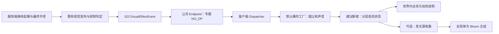

# RVP 炮弹与导弹高亮爆炸特效实现调研

> 调研日期：2026-10-04。范围：Minecraft 1.20.1 / Forge 47.4.13，RVP 当前工作区（HEAD `20b76ac5`，含既有未提交改动）与本地 `ywzj_vehicle_fish` 源码。本文为只读调研结果，**没有实现新效果，没有修改 Java、武器 JSON、贴图、模型或着色器**。文中的新增类、参数和数值均为建议，不能当作当前已支持的配置。

## 1. 结论与推荐路线

**可以完全在 RVP 内实现炮弹、火箭弹、导弹的高亮爆炸，第一阶段不需要修改本体、不需要新增 Mixin，也不需要新增贴图。** 当前已有默认爆炸工厂、网络事件、全亮加色粒子、温压火球和热成像通道，缺的是面向常规爆炸的分层高亮造型，以及可选的专用 Bloom 后处理。

建议按以下顺序落地：

1. **默认爆炸增强**：在现有 `rvp:mchr_explosion` 中组合短促白热核心、橙黄火团、柔和光晕，再接现有烟尘与火星；复用现有资源。先解决“爆炸看起来明显发亮”。
2. **可选的独立 Bloom**：只收集 RVP 爆炸的发光部分，离屏模糊后合成；无光影时也能出现溢出轮廓的辉光。失败时回退第一阶段。
3. **环境照明另立需求**：让墙壁、地面、载具受爆炸光照，是动态照明问题，不能用全亮粒子或 Bloom 冒充。第一阶段不依赖动态光源模组。

如果只想先确认“白橙火球”的观感，现有 `rvp:thermobaric` 可以通过当前参数缩短火球时序、关闭凝结云和尘环做配置实验；但它会替代默认爆炸，并采用自己的声音、云团和屏幕反馈体系，不宜直接作为所有常规炮弹的最终实现。

## 2. “高亮”实际包含四种能力

| 能力 | 玩家看到的现象 | 技术手段 | 当前 RVP 状态 |
| --- | --- | --- | --- |
| 自发光 / 全亮 | 夜晚仍然清楚、颜色不随方块光照变暗 | 粒子 `getLightColor()` 返回 `0xF000F0`，或不采样 lightmap 的着色器 | 已有 |
| 加色火光与光斑 | 白热中心、橙色边缘，多层叠加显得更亮 | 加色混合＋颜色、尺寸、透明度随时间变化 | 已有基础能力，默认爆炸造型可增强 |
| Bloom / 辉光 | 发光轮廓向附近屏幕像素柔和扩散 | 发光源缓冲＋降采样＋模糊＋合成 | 本次检查的爆炸路径未发现独立 Bloom 实现 |
| 动态环境照明 | 附近墙地面、车辆被短暂照亮，可能带遮挡 | 光照管线或已验证的动态光源集成 | 现有全亮 / 加色路径不能提供 |

全屏白闪是第五种“镜头反馈”，现有温压已支持；它不能替代世界内火球，也不应作为普通炮弹高亮的默认解法。`FULL_BRIGHT` 不是 HDR 强度，普通颜色缓冲饱和后继续加色只会变白；Bloom 的存在也不等于场景被真实照亮。

对于小光源，世界内柔边 billboard 可以近似光晕；对于复杂火球轮廓，单独提取发光源再模糊更适合。此区分与 [NVIDIA GPU Gems：Real-Time Glow](https://developer.nvidia.com/gpugems/gpugems/part-iv-image-processing/chapter-21-real-time-glow) 的技术分类一致，下面的 RVP 接入设计为本次调研建议。

## 3. 现有代码证据与可复用部分

以下源码链接相对本文位置，行号仅为本次快照定位，后续以类名、方法名为准。

| 位置 | 核验结果 | 对新效果的意义 |
| --- | --- | --- |
| [RVP_BaseBullet](../../src/main/java/org/ywzj/rvp/entity/projectile/RVP_BaseBullet.java)，约 4114～4135 行 | 发布自定义视觉后，根据 `publishedCount`、HBM 与显式屏蔽标志决定是否发布默认视觉 | 应接爆炸事件，不能只接弹体移除或渲染器 |
| [RVP_DefaultExplosionVisualService](../../src/main/java/org/ywzj/rvp/weapon/visual/RVP_DefaultExplosionVisualService.java)，`spawn` | 发送 `rvp:mchr_explosion`；事件带最终半径、种子、时间、类型和音效；默认广播 1536 格，`scale/density=1`、`flash=true` | 通用常规爆炸已有一次性 S2C 入口 |
| [RVP_DefaultExplosionEffectFactory](../../src/main/java/org/ywzj/rvp/client/visual/RVP_DefaultExplosionEffectFactory.java)，188 行起 | 非水下爆炸先生成闪光，再生成烟、碎屑、曳光火星和飞溅火星；水下分支提前返回 | 可以局部替换高亮层，保留声音和水幕 |
| [RVP_MchrFlareParticle](../../src/main/java/org/ywzj/rvp/client/particle/RVP_MchrFlareParticle.java)，51、114、138、170 行附近 | `SRC_ALPHA, ONE`、深度不写、全亮 `0xF000F0`；FLASH 寿命 8 tick，尺寸扩张、alpha 二次衰减 | 当前已经发光，不是缺少全亮开关 |
| [RVP_DefaultExplosionEffectInstance](../../src/main/java/org/ywzj/rvp/client/visual/RVP_DefaultExplosionEffectInstance.java) | 当前只维护延迟声音，`render` 为空，`isFinished` 仅看声音 | 若把高亮几何交给实例，需要一起扩展生命周期 |
| [RVP_ThermobaricRenderer](../../src/main/java/org/ywzj/rvp/client/visual/thermobaric/RVP_ThermobaricRenderer.java)，`renderFireball` | 火球用 `POSITION_TEX_COLOR` 着色器，不采样 lightmap；以 `SRC_ALPHA, ONE` 绘制多团火焰与三层核心 | 可提取造型、颜色、时间曲线思路，不必复制完整温压系统 |
| [RVP_RenderTypes](../../src/main/java/org/ywzj/rvp/client/render/RVP_RenderTypes.java)，185～199 行 | `texturedAdditiveNoDepthWrite` 使用 `ADDITIVE_TRANSPARENCY`、实体半透明 shader、lightmap、颜色写入 | 名称相似，但混合因子与闪光粒子不同，见 §6 |
| [RVP_ClientVisualEffectDispatcher](../../src/main/java/org/ywzj/rvp/client/visual/RVP_ClientVisualEffectDispatcher.java) | 工厂注册、实例 tick/render/close；实例上限 24；另有 `renderThermal` | 可复用生命周期，但 24 个实例不等于限制所有已生成粒子 |
| [RVP_ClientVisualEvents](../../src/main/java/org/ywzj/rvp/client/visual/RVP_ClientVisualEvents.java) | `ClientTick.END` 推进，`AFTER_WEATHER` 自绘，卸载清理 | 第一阶段无需新注入点 |
| [RVP_NuclearShockwaveRenderer](../../src/main/java/org/ywzj/rvp/client/nuclear/RVP_NuclearShockwaveRenderer.java) | 已有 `RegisterShadersEvent`、`TextureTarget`、场景拷贝和尺寸更新 | 可参考 API 用法；它是折射冲击波，不是现成 Bloom |
| [RVP_ThermalParticleChannel](../../src/main/java/org/ywzj/rvp/client/particle/RVP_ThermalParticleChannel.java) | 注册热粒子，并把几何实例重绘到本体 thermal buffer | 新高亮层必须明确热成像是否、怎样重绘 |

本体只读定位：[VehicleExplosion.java](../../../ywzj_vehicle_fish/src/main/java/org/ywzj/vehicle/util/VehicleExplosion.java) 的 `effect(ServerVehicleExplosion)` 及后续分档方法，使用原版 FLASH、EXPLOSION、烟粒子与本体 SmokeCloud 粒子。RVP 已有视觉抑制门面，本任务无需修改本体这条链路。

当前网络链路可直接沿用：



### 3.1 当前闪光究竟有多大、持续多久

工厂传入 `radius × 2 × min(scale, 2)`；粒子构造时又乘 `0.5`。因此当前 FLASH 的**初始半宽**是 `radius × min(scale, 2)`，不是注释可能让人误解的传入 `scale` 原值。其寿命为 8 tick，在 20 TPS 下约 0.4 秒；过程中半宽按 `1 + 1.5 × progress` 增大，alpha 按 `(1-progress)²` 衰减。

普通烟数量上限为 500，按 `smokeRadius = radius × 0.7` 的平方增长。仅增加这类烟的数量不会产生新的发光火球，反而可能增加遮盖和透明过绘。烟粒子的 `getLightColor()` 返回 `15 << 20`，只有天空光通道拉满，和 FLASH 的双通道全亮不同。

默认工厂在收到事件时立即生成全新粒子；`startGameTime` 补偿当前只进入声音实例。高延迟下视觉可能仍从第 0 帧重新闪起。新高亮状态应在创建时补偿年龄，过期的短闪直接跳过，不应重复补播。

## 4. 资源现状：已有资产足够做第一阶段

本次递归只读检查覆盖 `src/main/resources/` 与整个 `limitless_vehicle/`，包括各自命名空间；没有执行任何资源写入。下列候选资源在源码资源中已存在，本次载具包扫描未发现同名候选副本。

| 已有资源 | 检查结果 | 建议用途 |
| --- | --- | --- |
| `assets/ywzj_rvp/textures/nuclear/flare.png` | 256×256；已查看图像，是带星芒的亮斑；像素 alpha 最小 0、最大 255 | 短促中心闪光；不要当作纯圆形柔边光晕反复放大 |
| `assets/ywzj_rvp/textures/nuclear/particle_base.png` | 16×16；已查看图像，透明边界的不规则白色小团 | 多团火球、颗粒感火焰，与温压现有用法一致 |
| `assets/ywzj_rvp/textures/boom/smoke.png` | 默认烟现用的 8 帧横排贴图 | 灰黑烟、余烟；不将整套烟改为全程加色 |
| `assets/ywzj_rvp/textures/white/white.png` | 已存在，温压几何使用 | 可供原型几何使用；不把普通白色矩形直接当作柔边光晕 |
| `assets/rvp/visual_effects/thermobaric_standard.json` | 当前温压预设已存在 | 参考当前字段与阶段时间，不覆盖原文件 |

**资源事实应以文件为准**：`RVP_MchrFlareParticle` 旧注释称 `flare.png` 的 alpha 全不透明，但当前文件实测并非如此。这不证明现有效果有故障，却说明不能仅据注释判断换混合模式后的边缘表现。贴图外圈 RGB、alpha、shader discard 和采样过滤需一起检查。

第一阶段柔圆光晕可用顶点颜色渐变的圆形三角扇：中心有颜色和 alpha、外围 alpha 为 0，深度测试开启。这是无需新贴图的近似方案；若要精细火球翻页动画或专用柔边贴图，应另行制作资产。

未来任何新贴图、着色器 JSON / GLSL、预设资源写入前，都要再次检查源码与载具包的完整相关目录，并按根目录 [AGENTS.md](../../AGENTS.md) 向用户说明具体文件后取得确认。已有资源不得直接覆盖。本次文档中的候选资源清单不代替未来写入时的确认。

## 5. 第一阶段：增强默认爆炸中的高亮层

### 5.1 组成与时间设计

下表为原型起点，**不是当前默认值，也不是实测定稿**。1 tick 在正常 20 TPS 下约为 50 ms。尺寸使用“最终杀伤半径 × 独立视觉系数”，不能反向修改杀伤半径。

| 层 | 建议持续时间 | 外观和运动 | 渲染 |
| --- | --- | --- | --- |
| 起爆白热核心 | 2～4 tick | 极快出现，白黄中心，快速衰减 | 1 个小亮斑，加色 |
| 主火团 | 6～12 tick | 多个错相膨胀的橙黄团，中心较白，外缘逐渐暗红 | 近距 6～12 个 billboard，无光照采样或全亮＋加色 |
| 外围光晕 | 4～8 tick | 尺寸较大但能量低的柔圆渐变，独立淡出 | 1 个渐变面，加色；后续可由 Bloom 接管 |
| 烟尘与火星 | 沿用当前或另行调参 | 烟有体积和明暗层次，火星分散 | 烟保持标准 alpha 混合；火星加色 |

不通过无限叠面“堆亮度”；优先设计清楚的白热中心、橙色过渡和灰烟对比。新火团不要依赖采样到非空气方块，保证空爆导弹同样有高亮。地面尘、碎屑仍按环境产生；水下保持当前水幕分支，不无条件补上空气火球。

视觉状态按事件种子初始化一次，逐帧只读取 `age + partialTick`。建议使用归一化进度 `u = clamp(t / duration, 0, 1)`，尺寸快速增长后收敛，强度按 `(1-u)²` 或分段包络衰减。火团错相应固定在初始化结果内，避免每帧重新随机导致闪烁。低 FPS 需确认极短闪光仍能被看到。

### 5.2 接入方式比较

| 方案 | 优点 | 必须处理的问题 | 判断 |
| --- | --- | --- | --- |
| 在默认工厂中增加少量全亮粒子 | 代码改动少，可继续走粒子和热粒子系统 | 全局预算、网络年龄补偿、受粒子管理与排序影响，后续专用 Bloom 较难收集 | 适合快速效果原型 |
| 默认实例持有独立高亮状态，在现有 render 中绘制 | 生命周期、LOD、遮挡、Bloom 发光源可统一管理 | 当前实例只管声音，必须改结束条件和热成像绘制 | **推荐正式方向** |
| 新建 `rvp:bright_explosion` 工厂 | 可按武器单独选择完整风格 | 会替代默认爆炸，必须组成完整烟、声、火光效果 | 仅在确需多种完整爆炸风格时采用 |
| 全部改用温压类型 | 当前配置即可验证白橙火团观感 | 语义、默认声音、凝结云、烟团预算和时序与常规爆炸不同 | 只适合验证或温压武器 |

建议新增客户端 `RVP_ExplosionGlowState` 与 `RVP_ExplosionGlowRenderer`（名称为提案）。前者保存本次事件年龄、视觉半径、固定随机火团与阶段参数；后者只消费状态并绘制。默认工厂选择环境分支后创建状态，默认实例持有它，避免全局列表重复管理同一份效果。

相应改动清单：

- `RVP_DefaultExplosionEffectFactory`：保持水下提前返回；普通路径将原单 FLASH 替换为新状态，避免旧 FLASH 与新白热核心双重闪光；烟尘、音效选择保持原有职责。
- `RVP_DefaultExplosionEffectInstance`：tick 同时推进声音和高亮；结束条件改为“声音结束 **且** 高亮结束”；close 释放状态与尚未播放的声音。`sound=false` 不能使高亮在首 tick 被删除。
- 新 renderer：在已有 `AFTER_WEATHER` 调用里绘制；明确全亮与混合状态；实现 `renderThermal` 时只提交热源几何，不重复执行普通 Bloom。
- 全局预算：在实例创建与绘制之前限制新高亮层的数量及屏幕面积；不要只依赖 dispatcher 创建完成后的 24 实例淘汰。
- 默认发布端无需为每个火团增加网络包；使用既有 seed、position、radius、startGameTime 在客户端确定性生成。

第一阶段若统一增强全部默认爆炸，无需逐武器配置。炮弹与导弹用已有爆炸尺度或类型化参数区分，不按武器 ID 写条件；不会修改 `VehicleProjectileRenderLogic` 的飞行中弹体职责，也不新增爆炸实体来承载短暂视觉。

### 5.3 默认视觉抑制是关键边界

当前 `RVP_BaseBullet` 在任意有效自定义视觉发布后，使用 `publishedCount > 0` 抑制默认 MCHR。因此：

- 仅新增一条“光晕效果”的 `visual_effect_data`，可能同时失去默认烟尘及默认声音。
- `suppress_native_explosion_effect=false` 控制的是**本体**视觉，不会恢复 RVP 默认烟。
- `suppress_rvp_default_explosion=false` 也不能抵消 `publishedCount > 0` 的抑制。
- 服务端发布成功不等于客户端有对应工厂；拼错或未注册的类型可能让爆炸失去预期视觉。

正式接入应优先在默认工厂内部组合各层。若采用独立类型，应由同一工厂完整拥有烟尘、高亮与声音，复用抽出的发射/声音服务，不能再手动回调默认工厂制造第二份事件或第二套声音。

## 6. 混合、深度和全亮的实现要点

### 6.1 两种“加色”不可混用

当前闪光与温压火球使用：

```text
SRC_ALPHA, ONE：Cout = Csrc × Asrc + Cdst
```

已用本地 Minecraft 1.20.1 / Forge 47.4.13 映射 jar 的 `javap -p -c` 核验：原版 `RenderStateShard.ADDITIVE_TRANSPARENCY` 对应 `ONE, ONE`；`LIGHTNING_TRANSPARENCY` 对应 `SRC_ALPHA, ONE`。因此当前 `RVP_RenderTypes.texturedAdditiveNoDepthWrite` 的加色关系为：

```text
ONE, ONE：Cout = Csrc + Cdst
```

后者的混合阶段不使用 alpha 衰减 RGB。若 shader 未将 alpha 乘入 RGB，仅降低顶点 alpha 不能获得与现有 FLASH 相同的平滑淡出，还可能在 shader 的 alpha discard 门槛处突然消失。推荐为新高亮层显式选用 `SRC_ALPHA, ONE`，或在专用 shader 中预乘颜色后使用 `ONE, ONE`；不要为了一个爆炸效果直接改变共享 RenderType 的现有语义。

实体格式渲染即使给出 `uv2(FULL_BRIGHT)`，仍可能受实体 shader 的法线方向光等因素影响。用于无方向性 billboard 时，更直接的原型路径是现有温压的 `POSITION_TEX_COLOR`；若使用粒子格式，则明确 `getLightColor()` 全亮。颜色、贴图与光照要作为一组验证。

### 6.2 深度原则

- 世界内火球和光晕应开启深度测试，关闭深度写入：地形遮挡火光，透明面不把后续世界内容挡死。
- 不用 `disableDepthTest` 实现“远距离高亮”；它会产生穿墙效果。
- 深度不写只处理不透明遮挡，并不能自动解决烟、玻璃、水与不同透明绘制批次的先后关系。自绘火光在粒子后提交可能透过烟显得过强，须在原型中观察再决定排序或能量衰减。
- 正常雾应按选定 shader / 渲染策略验证；无雾光晕只能是明确的风格选择，不能无意中令远处火球无衰减。
- 开始绘制时明确目标与状态，结束时用 `try/finally` 恢复 framebuffer、viewport、投影/模型矩阵、shader、混合、颜色与深度状态。嵌套热成像/光影时不能假定进入目标总是主 framebuffer。

Forge 的粒子由客户端 provider / Particle 实例承载，其渲染行为由 `ParticleRenderType` 决定；既有 RVP 直接使用 `ParticleEngine.add` 的客户端路径可以复用，无须把每个闪光面都注册成网络粒子类型。参见 [Forge 1.20.1 粒子文档](https://docs.minecraftforge.net/en/1.20.1/gameeffects/particles/)。

## 7. 第二阶段：RVP 自有、可关闭的 Bloom

### 7.1 推荐结构

建议增加独立客户端 Bloom 管理器（拟名 `RVP_ExplosionBloomRenderer`）。它是所有有效爆炸共享的**一套逐帧管线**，不是每个爆炸一套后处理。

```text
高亮实例提交可发光几何
    → 使用场景深度生成发光源 mask（只画可见的 RVP 火光）
    → 对 mask 降采样
    → 两个小缓冲 ping-pong 模糊
    → 向正常世界画面加色合成
    → 后续既有 TV / UI 等处理按约定顺序执行
```

第一版优先“独立发光 mask”，避免从整幅画面阈值提取白色导致天空、雪地、HUD 也发光。主火球仍由第一阶段绘制；Bloom 只增加外扩光，不重复把中心火球画亮一遍。保留第一阶段的弱光晕作为后处理关闭时的回退，Bloom 开启时降低它的能量，避免重复发亮。

### 7.2 必须先解决的工程问题

1. **深度来源**：最容易验证的起点是与场景同尺寸的发光 mask，使用兼容的场景深度后再降采样。半分辨率深度需要单独处理，不能把缩放深度 blit 当作所有驱动都支持的操作。光影或 DH 深度不可可靠取得时，回退普通高亮。
2. **遮挡时机**：先对发光几何做深度测试，再模糊。墙后完全不可见的爆心不能给 mask 写入亮色；可见亮边模糊后在屏幕边缘轻微扩散属于 Bloom 的预期效果，不等同于整团穿墙。若要求严格轮廓阻断，另做深度感知模糊。
3. **场景目标与阶段**：现有自绘位于 `AFTER_WEATHER`；新增最终合成可先实验 `AFTER_LEVEL`。Forge 源码明确前者处于 Fabulous 目标中，不能假设它与普通主目标完全等价。[Forge RenderLevelStageEvent 源码](https://github.com/MinecraftForge/MinecraftForge/blob/1.20.x/src/main/java/net/minecraftforge/client/event/RenderLevelStageEvent.java)。本次另核验了本地 **47.4.13 sources jar** 的相同阶段说明；网上 `1.20.x` 分支会变化，不应据其最新签名替换本项目 API。
4. **既有后处理顺序**：[TVMissileVideoPostHandler](../../src/main/java/org/ywzj/rvp/client/shader/TVMissileVideoPostHandler.java) 已在 `AFTER_LEVEL / LOWEST` 做黑白处理。普通视图可先合成彩色 Bloom，再统一通过 TV 黑白滤镜；若反序会出现黑白画面上的彩色光晕。热成像建议先关闭普通彩色 Bloom，只通过既有热通道显示火球，后续再设计白热专用辉光。
5. **每帧只执行一次**：只在普通世界目标中收集/合成；不能在热成像的 `renderThermal`、反射或离屏视图里重复执行。同一个游戏 tick 可对应多帧，不能只用 gameTime 去重。
6. **资源生命周期**：渲染线程分配；窗口尺寸变化重建；资源重载重取 shader；退出世界清空来源；关闭效果或销毁管理器时释放 render target。未发生爆炸时不做整屏模糊。
7. **状态恢复和回退**：恢复进入时的读/写 framebuffer 与 viewport，不照抄“最后固定绑 mainTarget”的假设。shader 加载、FBO、深度或目标兼容失败时一次性记录原因，关闭 Bloom，保留第一阶段。
8. **HDR 与颜色空间**：LDR mask 足以做第一版视觉辉光，强度可在合成时控制；若要求保留大于 1 的发光能量，需要浮点附件和明确的线性颜色/色调映射策略，不能默认 `TextureTarget` 就是 HDR。不要以反复叠白代替这个设计。

可以通过客户端事件和独立管理器实现上述原型；本次没有发现必须新增 Mixin 的理由。新增 GLSL / shader JSON 属于资源写入，需在实施前按 §4 确认。不要通过替换 `GameRenderer` 的单一活动后处理链来安装 Bloom，以免覆盖既有 TV、热成像或其他视图效果。

### 7.3 外部光影策略

全亮粒子不保证被某个光影包判定为“高能发光材质”，自定义 shader 也不保证进入光影包的 Bloom。Iris 文档区分非透明/透明粒子程序及粒子渲染顺序，这说明最终呈现依赖管线，而非只由 lightmap 数值决定。[Iris ShaderDoc](https://github.com/IrisShaders/ShaderDoc/blob/master/iris-features.md#particles-iris-16)。该文档只用于解释兼容原理，**不证明 Forge 1.20.1 的某个 Oculus 版本具有同样行为**。

建议客户端提供“普通高亮 / RVP Bloom / 关闭附加辉光”的选择。外部光影启用但未经过测试时，保守禁用 RVP Bloom、保留普通高亮，并允许用户明确选择经过验证的组合。光影包自带 Bloom 的视觉结果单独验收；不默认同时开启两套辉光。

## 8. 参数与数据模型建议

### 8.1 当前已经可用的参数边界

- `detonate_data.visual_effect_data[]` 已有 `enabled`、`effect_type`、`preset`、`preset_data`、`scale`、`density`、`duration_ticks`、`broadcast_range`、`sound`、`flash`、`shake` 等字段；**是否消费由具体工厂决定**。
- 默认自动 MCHR 事件的 `preset_data` 当前主要承载 `weapon_kind` 与 `explosion_sound`，并没有通用的 `bloom_strength`、`fireball_duration` 解析器；向现有武器随便填这些键不会生效。
- `flash` 的实际语义不同：默认工厂用它控制世界闪光；温压实例用它控制屏幕闪白，主火球另由 `show_core` 控制。不能把 `flash=false` 理解为关闭所有类型的发光。
- 温压已有 `core_color`、`flame_color`、`show_core`、`max_fireball_clouds`、`core_start_tick`、`core_full_tick`、`core_fade_duration_ticks` 等字段，能用于原型调参，但不是默认爆炸的参数。

### 8.2 建议的配置分工（均未实现）

| 层级 | 建议字段或职责 | 原型默认 / 单位 / 生效条件 |
| --- | --- | --- |
| 类型化高亮预设 | `core_duration_ticks` | 3 tick；高亮启用时，白热核心阶段 |
| 类型化高亮预设 | `fireball_duration_ticks` | 10 tick；主火团阶段，0 表示不生成 |
| 类型化高亮预设 | `halo_duration_ticks` | 6 tick；普通回退光晕阶段 |
| 类型化高亮预设 | `core_color` / `flame_color` | `#FFF2CC` / `#FF7A20`；颜色不是物理温度 |
| 类型化高亮预设 | `radius_factor` | 1.0，无量纲；乘最终爆炸半径，仅影响画面 |
| 类型化高亮预设 | `max_fireball_clouds` | 12 个；客户端可降采样，不能被 density 绕过全局预算 |
| 类型化高亮预设 | `bloom_strength` | 0.6，无量纲的合成系数；仅客户端开启 Bloom 后生效，不代表 HDR 辐射强度 |
| 客户端设置 | `explosion_glow_quality` | 建议默认中档；限制面数、距离档、屏幕面积 |
| 客户端设置 | `explosion_bloom_enabled` | 初版默认 false；通过兼容回归后再决定是否默认开启 |
| 客户端设置 | `explosion_flash_strength` | 建议默认 1.0、允许 0；降低短促亮度，不应顺带禁掉烟与声音 |

第一阶段可先使用客户端内建类型化默认值，避免新增资源。若后续需要逐武器覆盖，优先扩展当前数据模型与既有事件载荷；每个 `@SerializedName` 字段按根目录 AGENTS 要求，以 [RVP_FireData](../../src/main/java/org/ywzj/rvp/weapon/data/RVP_FireData.java) 的说明层级写明单位、默认、生效条件。AGENTS 引用的 `.cursor/skills/mcheli-rvp-port/data-class-javadoc.md` 在本次工作区未找到，因此没有把它列为已读依据。只接受当前 schema，不引入旧键兼容或自动迁移。

若新增独立类型的资源预设，不能直接把它塞入温压现用的整个 `visual_effects` 扫描目录而不做隔离：`RVP_ThermobaricPresetManager` 当前会把该目录对象按温压 patch 解析。可使用独立的新目录，例如 `explosion_visual_presets`（提案），或先设计明确类型分派；不能让两种预设被错误解释。

通用事件的 `preset_data` 受 UTF-8 8 KiB 限制，传递小参数即可；不发送逐粒子位置序列、不传纹理二进制，也不为提高亮度扩大发包范围。

## 9. 性能与远距离显示

最大的 GPU 风险是透明面覆盖屏幕的总面积，而不只是粒子数。贴脸时一张巨大光晕就可能覆盖整屏；很多炮弹同时爆炸时，应先减少外层面积和层数，再减少核心可读性。

建议的初始预算如下，均待实机采样：

| 距离 | 主火团 | 核心与光晕 | 目标 |
| --- | ---: | --- | --- |
| 0～128 格 | 6～12 | 各 1 层 | 保留分层与膨胀细节 |
| 128～512 格 | 2～4 | 简化各 1 层 | 控制过绘，仍能辨识爆点 |
| 512～1536 格 | 0～1 | 最多 1 个亮斑 | 保留短暂爆点，不持续维持巨大球面 |

建议单帧全部爆炸的主火团最多 96 个，新高亮层总实例继续受现有 24 实例上限约束；同时设屏幕面积预算，优先保留可见、较近的短时核心。此预算只覆盖新增高亮，不等于解决当前默认烟的全部开销。粒子引擎中的既有烟在工厂返回后独立存活，不能通过销毁声音实例回收。

Bloom 可先以宽高各 1/2 的模糊缓冲起步，低档宽高各 1/4；降采样过度会让细小远距闪光跳动，必须检查移动镜头下的稳定性。对所有爆炸共用一次模糊与合成，无发光源时完全跳过。预分配状态、复用缓冲，避免每帧建大量列表或创建/释放 FBO。

1536 格是默认事件的**广播半径**，不保证该处已有客户端方块、正确水体采样、原版粒子可见或远景地形深度。自绘可以绕开部分粒子生成距离限制，但不能绕过视锥、雾和正确地形遮挡。现有 DH 兼容对象主要针对载具/弹体；不能假定新爆炸自动继承其深度保护。DH 遮挡未接通前，超出可靠场景深度的高亮应裁剪或降级，不能穿山显示。

## 10. 环境照明为何单独处理

若目标包括“爆炸瞬间把附近墙面染橙”，可选路线是：集成已确认支持临时世界位置光源的照明 API，或建设受支持光影管线的光源通道。需要另外核验 Forge 1.20.1 版本、许可、依赖与阴影/遮挡能力，不能只凭“装了动态光源模组”就断言任意自定义粒子会照明。

在地面画加色圆片，只是局部受光的视觉近似，不能照亮竖墙、载具和复杂地形，也没有真实遮挡。临时放置发光方块会改变世界并触发光照更新，不适合毫秒级大量爆炸特效。本轮建议先完成世界高亮和可选 Bloom，保留照明为独立扩展。

## 11. 实施验证清单

本次只有文档，没有运行编译、服务端或客户端；以下是实施后的验收要求，不能视为已经通过。

| 场景 | 验收点 |
| --- | --- |
| 无光影，白天 / 黑夜 | 白热核心与橙色边缘清楚；夜间不发黑；白天不会只剩一块白矩形 |
| 小炮弹、大口径炮弹、普通导弹 | 比例合理，短闪与烟衔接；不按武器 ID 特判 |
| 地爆、空爆、近炸 | 每次有效起爆只有一套高亮与声音；空中无方块仍能生成火团 |
| 水面上、水下 | 水下保持水幕，不出现空气火球；声音路径正常 |
| 墙后、山后、烟中、玻璃和水前后 | 不透明遮挡可靠；透明顺序无明显穿透或突然反转 |
| 热成像、TVMissile、普通视角切换 | 热源正常，无重复合成；TV 不出现意外彩色 Bloom；退出滤镜后恢复 |
| Fast / Fancy / Fabulous | framebuffer 与透明目标正确，退出绘制不污染后续内容 |
| 用户实际使用的 Oculus / 光影包组合 | 记录准确版本；光影自身 Bloom 与 RVP Bloom 不双重过曝；未知组合能回退 |
| DH 开关及远距 512 / 1024 / 1536 格 | 区分事件收到、几何绘制、地形遮挡；山后不可见 |
| 连续炮击，1 / 8 / 24 次并发，近距离贴脸 | 记录 CPU/GPU 帧时间、活动实例、面数、mask 尺寸与内存；先关烟对比高亮增量成本，再看完整效果 |
| 网络迟到超过短闪寿命 | 不重新从零播放白闪；仍存活的阶段按年龄衔接，声音延迟不被破坏 |
| sound=false、flash=false、低特效设置 | 关闭声音不提前回收火球；关闭强闪仍保留必要爆点与烟，按类型明确控制语义 |
| 切换维度、退出、F3+T、缩放窗口 | 无旧世界残留、失效纹理引用或 render target 泄漏 |
| 专用服务器 | 新类不触发客户端类加载，公共数据和网络包保持双端安全 |

实施后的编译按仓库要求在根目录运行：

```powershell
./gradlew build
```

专服以相同环境后台运行 `./gradlew runServer`，每 10 秒轮询一次日志；出现 `Done (Xs)!` 视为启动通过。日志检索使用 `rg -a`，新增错误按 [调试与修复规范](../调试与修复规范.md) §5.1 的历史基线判断。构建和服务端通过不能替代客户端视觉验收。

有意义的自动化检查包括：视觉年龄与过期门控、声音/视觉联合结束条件、有限值与参数范围、稳定随机种子、预算上限及世界清理。颜色层次、透明排序、真实帧耗与外部光影兼容应实机验证，不用仅镜像实现的单元测试代替。

## 12. 调研依据与限制

- 本地证据：§3 所列源码、两处资源目录、当前 `thermobaric_standard.json`、Forge 47.4.13 sources jar；通过 `javap` 核验当前映射 jar 的透明混合因子，通过像素读取核验两张候选贴图尺寸和 alpha 范围。
- 原有项目说明：[视觉系统当前架构](./RVP视觉系统当前架构与击毁烟现状_20260929.md)、[visual_effect_data 开发指南](./RVP%20visual_effect_data视觉效果开发指南.md)。与旧文字存在差异时，本调研采用当前执行代码和实际资源，不把过期注释当作实现事实。
- 外部一手资料：[Forge 1.20.1 Particles](https://docs.minecraftforge.net/en/1.20.1/gameeffects/particles/)、[Forge 渲染阶段源码](https://github.com/MinecraftForge/MinecraftForge/blob/1.20.x/src/main/java/net/minecraftforge/client/event/RenderLevelStageEvent.java)、[NVIDIA Real-Time Glow](https://developer.nvidia.com/gpugems/gpugems/part-iv-image-processing/chapter-21-real-time-glow)、[Iris ShaderDoc](https://github.com/IrisShaders/ShaderDoc/blob/master/iris-features.md)。访问日期均为 2026-10-04；外部原理不等于本项目兼容性测试结果。

尚未验证：当前实机爆炸观感、所用光影与版本、Fabulous/光影下每阶段实际绑定目标、新增高亮的 GPU 成本，以及 DH 深度对自绘爆炸的可用性。第一阶段具备明确的现有代码接入点；第二阶段仍需渲染原型验证这些条件后再定稿。
