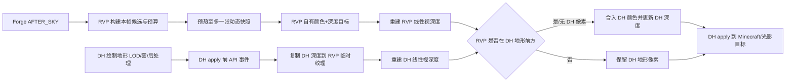

# limitless-vehicle-rvp-addon 与 Distant Horizons 地形 LOD 遮挡兼容方案

> 文档日期：2026-08-19  
> 目标环境：Minecraft 1.20.1、Forge、`ywzj_vehicle`、`limitless-vehicle-rvp-addon`、Distant Horizons  
> 文档性质：设计方案，不代表代码已经实现  
> RVP 基线：`ed6ed7f75079659181eb3b6526c008999e9d8dea`  
> Distant Horizons 外层仓库基线：`50ee3d53041ba928c57ae75c5073ad3b209ed419`  
> Distant Horizons Core 子模块基线：`5479d36064e5040a05552f25033a22dc04d6fc6c`  
> DH 版本/API：`3.2.1-b-dev` / API `7.1.0`

## 1. 结论

推荐方案不是简单把 RVP 从 Forge `AFTER_ENTITIES` 挪到 `AFTER_LEVEL`，也不是关闭深度测试，而是增加一个仅在 Distant Horizons 存在时启用的客户端兼容通道：

1. RVP 仍按现有快照、代理、LOD/Billboard、预算和动态远平面逻辑选择并绘制载具，但先绘制到 RVP 自己的透明颜色纹理和深度纹理。
2. 在 DH 完成地形 LOD、雾和后处理之后、执行 apply shader 之前，通过 DH API 7.1.0 取得本帧 DH 颜色/深度纹理。
3. 把 DH 深度复制到 RVP 自有临时纹理，分别用 RVP 与 DH 的逆投影矩阵把两个非线性深度重建为同一相机空间中的线性视深度。
4. 只有当载具像素比 DH 地形像素更近，或该像素没有 DH 地形时，才把载具颜色合入 DH 颜色纹理；同时把可见载具像素写成 DH 所用的深度表示。
5. DH 随后的 apply shader 会把已经包含载具的结果合入 Minecraft 目标，因此不会再发生“DH 最后覆盖 RVP”的顺序错误，同时山体确实位于载具前方时仍能正常遮挡。

该方案使用 DH 官方 API、Forge 事件和独立管理类，不新增 Mixin，不修改 `ywzj_vehicle`，也不修改 DH 源码。`AFTER_LEVEL + 关闭深度测试` 只保留为用户明确选择的“始终可见”降级模式，因为它会造成穿山显示。

## 2. 问题边界

本文解决的是渲染合成问题：RVP 超视距载具已经同步到客户端、候选也已进入渲染预算，但最终画面被 DH 地形 LOD 的颜色或深度结果错误覆盖。

本文不解决以下问题：

- 服务端没有加载目标载具，导致快照中根本没有目标。
- 载具超过 RVP `maxDistance`、被目标数量上限淘汰或代理已过期。
- display、Bedrock 模型、纹理或动态快照资源本身缺失。
- Distant Horizons 地形数据缺洞、生成滞后或其自身与某个光影包不兼容。
- 正常的物理遮挡：山体确实处于相机和载具之间时，默认深度感知模式仍应遮挡载具。

如果业务要求“即使隔着山也必须看到目标”，应使用单独命名的战术可视模式，而不能把它伪装成深度兼容修复。

## 3. 当前 RVP 渲染链路

当前入口为：

`src/main/java/org/ywzj/rvp/client/render/remotevisibility/RVP_RemoteVehicleVisualRenderer.java`

其关键行为如下：

- 订阅 Forge `RenderLevelStageEvent.Stage.AFTER_ENTITIES`。
- 排除 512 格以内目标，复用客户端远端代理、LOD/Billboard 计划和渲染预算。
- 从事件投影恢复 near/far，仅扩展 far plane，并创建与扩展投影配套的独立 `Frustum`。
- 通过 `RVP_RemoteVehicleRenderScope` 临时替换 `RenderSystem` 投影和雾参数。
- 使用独立 `REMOTE_BUFFERS`，并在恢复投影前 `endBatch()`。
- 不清深度缓冲、不关闭深度测试，因此当前设计假定“同一目标缓冲里已经存在的深度就是可信遮挡信息”。

这套假定对原版世界渲染成立，但对 DH 不总成立。DH 可能使用独立纹理、Reverse-Z、apply shader、Oculus 覆盖帧缓冲以及延迟透明通道；Forge `AFTER_ENTITIES` 不是 DH 所有最终合成路径的绝对末端。

现有技术文档也已明确指出：远距作用域不清深度且保留深度测试；第三方 shader 可能替换投影、RenderTarget 或雾语义。因此本兼容方案应建立在现有隔离设计之上，而不是删除它。

## 4. Distant Horizons 1.20.1 实际渲染行为

### 4.1 进入时机

DH Forge 端的 `MixinLevelRenderer` 在原版 `renderChunkLayer(RenderType.solid())` 的开头调用 `ClientApi.INSTANCE.renderLods()`。也就是说，常规不延迟的 DH LOD 主通道在原版实体之前开始。

当启用延迟透明渲染时，DH 还会在原版透明地形阶段调用 `renderDeferredLodsForShaders()`。因此只依赖 RVP 的 `AFTER_ENTITIES`，不能保证一定晚于 DH 的透明 LOD 或光影集成通道。

### 4.2 独立颜色和深度纹理

OpenGL 路径的 `GlDhMetaRenderer` 默认建立自己的颜色/深度附件：

- 深度纹理格式为 `DEPTH32F`。
- 每帧清理 DH 自有目标，不应由 RVP 再次清理。
- DH 可能使用 Forward-Z，也可能使用 Reverse-Z。
- 没有光影包时，当前 `GlDhRenderApiDefinition` 默认选择 Reverse-Z；光影包启用时为兼容旧路径改用 Forward-Z。
- DH 根据深度模式选择 `GL_LESS` 或 `GL_GREATER`。

因此不能把 RVP 主世界投影产生的原始深度值直接与 DH 深度纹理做大小比较。

### 4.3 apply shader

DH Core 的 `apply.frag` 读取 DH 深度纹理，判断该像素是否被 DH 绘制；若被绘制则输出 DH 颜色，否则 `discard`。当前 OpenGL apply shader本身不把 DH 深度直接复制到 Minecraft 深度附件，但 Oculus/Iris 可通过 DH 的 override/API 路径改变最终帧缓冲和消费时机。

这解释了为什么问题可能只在特定组合出现：

- 普通 OpenGL 路径中，DH 主要表现为先合入颜色，后续 Minecraft 内容通常还能覆盖它。
- 延迟透明或光影覆盖路径可能在 `AFTER_ENTITIES` 之后再次消费 DH 纹理或写入其它目标，从而把 RVP 盖掉。
- 仅调整 Forge 监听优先级无法约束 DH 的 Mixin 注入点、DH API 事件以及 Oculus 内部合成顺序。

### 4.4 可用的官方 API

DH API 7.1.0 已提供本方案所需的公共能力：

- `DhApiAfterDhInitEvent`：在 DH 初始化完成后安全启用适配器。
- `DhApiBeforeApplyShaderRenderEvent`：DH apply shader 执行前触发。
- `DhApiBeforeRenderPassEvent`：DH 每个地形渲染 pass 开始前触发。
- `DhApiBeforeRenderCleanupEvent`：每个 pass 完成、清理开始前触发。
- `IDhApiRenderProxy#getRenderingEngine()`：判断是否为 OpenGL 引擎。
- `getDhColorTextureGlId()` / `getDhDepthTextureGlId()`：取得本帧公共颜色/深度纹理 ID。
- `DhApiRenderParam`：提供 DH/MC 投影、模型视图矩阵、near/far、partial tick 和当前 pass。

API 文档明确说明纹理可能随分辨率或资源状态重建，因此必须在每次合成事件中重新查询 ID，禁止永久缓存 DH 纹理 ID。

## 5. 根因模型

问题不是单一的“谁先画”，而是三个状态没有统一：

| 状态 | RVP 当前来源 | DH 来源 | 冲突后果 |
|---|---|---|---|
| 颜色目标 | 当前 Minecraft/光影目标 | DH 颜色纹理或 override 目标 | 后执行的合成可能覆盖先前 RVP 颜色 |
| 深度目标 | Minecraft 当前深度附件 | DH `DEPTH32F` | 两侧并不一定看到同一遮挡结果 |
| 深度编码 | RVP 临时扩展 far plane，通常 Forward-Z | DH 独立 near/far，可能 Reverse-Z | 原始 `0..1` 深度不可直接比较 |
| 渲染时序 | Forge `AFTER_ENTITIES` | solid 前主 pass，透明阶段可能有 deferred pass | 单一 Forge 阶段不能覆盖全部 DH 路径 |

正确修复必须同时处理颜色归属、深度空间和渲染时序。

## 6. 方案比较

| 方案 | 能否保证不被 DH 后盖 | 正常山体遮挡 | 光影/延迟透明 | 结论 |
|---|---:|---:|---:|---|
| 调高 Forge 事件优先级 | 否 | 不稳定 | 否 | 拒绝，无法约束 Mixin/API 通道 |
| 从 `AFTER_ENTITIES` 改到 `AFTER_LEVEL` | 大多可以 | 取决于最终深度是否含 DH | 不稳定 | 仅适合降级 |
| `AFTER_LEVEL` 并关闭深度测试 | 是 | 否，会穿山 | 仍可能写错光影目标 | 仅作为显式“始终可见”模式 |
| 清除 DH 或主深度 | 是 | 否，且破坏全画面 | 风险极高 | 拒绝 |
| 在 DH 地形之前直接写入 DH FBO | 常规路径可以 | 可以 | 受 DH far plane、雾/SSAO 和目标覆盖影响 | 可做简化备选，不推荐为最终方案 |
| RVP 离屏 + 线性深度比较 + DH apply 前合成 | 是 | 可以 | 可按 pass 扩展 | 推荐 |

## 7. 推荐架构

### 7.1 总体流程



### 7.2 新增模块建议

建议新增以下客户端类，名称可在实现时微调：

| 类 | 职责 |
|---|---|
| `RVP_DistantHorizonsCompatBootstrap` | 不引用 DH 类型；仅检查 `ModList`、客户端环境和配置，隔离可选依赖类加载。 |
| `RVP_DhApi71Bridge` | 唯一直接引用 DH API 7.1 类型的适配层；注册/注销 DH 事件。 |
| `RVP_RemoteVehicleFrameCoordinator` | 为一帧建立候选、预算、Billboard 计划和唯一渲染路由，避免原通道与 DH 通道双画。 |
| `RVP_RemoteVehicleOffscreenTarget` | 管理 RVP 自有 RGBA8 颜色、深度纹理、FBO、尺寸变化和销毁。 |
| `RVP_DhFramebufferSet` | 管理只属于 RVP 的临时 FBO；把 DH 公共纹理作为附件，但绝不拥有或删除 DH 纹理。 |
| `RVP_DhDepthCopy` | 把 DH 深度复制到 RVP 自有纹理，避免同一纹理同时作为采样源和写入附件。 |
| `RVP_DhDepthCompositeRenderer` | 执行线性深度重建、可见性判定、颜色合成和 DH 深度回写。 |
| `RVP_DhGlStateScope` | 完整保存/恢复 FBO、viewport、shader、深度、混合、颜色掩码、活动纹理、投影等状态。 |
| `RVP_DhCompatDiagnostics` | 受控日志、每帧计数、失败熔断和调试信息。 |

所有字段和方法应按项目规范写清晰中文注释；调用本项目或本体方法时注明调用目的。DH 适配代码只能位于客户端包，公共/服务端代码不得引用 DH 客户端或 OpenGL 类型。

### 7.3 复用现有渲染器而不是复制逻辑

应把 `RVP_RemoteVehicleVisualRenderer` 拆成三个可复用阶段：

1. `prepareFrame(...)`：读取远端代理、排除正常实体、计算包围盒、LOD/Billboard 计划、投影需求和预算。
2. `renderPrepared(...)`：接受明确的投影、PoseStack、相机、目标缓冲和 Frustum，绘制已经选中的载具。
3. `finishFrame(...)`：提交隔离缓冲并记录本帧路由状态。

原版无 DH 路径继续在 `AFTER_ENTITIES` 调用这三个阶段；DH 路径在 `AFTER_SKY` 完成准备/动态快照预热，在 DH 合成事件中调用离屏绘制与合成。这样 LOD、Billboard、高模预算、光照和代理姿态只有一份实现。

### 7.4 每帧唯一消费

协调器维护单调递增的客户端渲染帧序号：

- `AFTER_SKY` 开始新帧并准备计划。
- DH 兼容通道成功合成后，把该帧标为 `DH_COMPOSITED`。
- 原 `AFTER_ENTITIES` 看到 `DH_COMPOSITED` 时跳过，防止双画。
- 如果 DH 已加载但本帧没有触发 API 事件、纹理不可用或 FBO 不完整，则按配置选择原通道或显式降级通道。
- 换维度、退出世界、资源重载和窗口尺寸变化时清除未消费计划。

## 8. 深度感知合成

### 8.1 为什么必须先复制 DH 深度

OpenGL 不允许可靠地一边采样一张纹理、一边把同一纹理作为当前 FBO 的写入附件。该反馈环行为未定义。因此流程必须是：

1. 把 DH 深度附件 blit/copy 到 RVP 自有 `dhDepthCopy`。
2. 颜色合成 FBO 只附加 DH 颜色纹理，DH 深度仅从副本采样。
3. 深度回写 FBO 只附加 DH 深度纹理，仍从副本采样。
4. 两个 pass 都结束后恢复进入事件前的全部 GL/RenderSystem 状态。

禁止清除 DH 颜色或深度；只清除 RVP 自有离屏目标。

### 8.2 线性视深度

RVP 与 DH 的原始深度都在 `0..1`，但 near/far 和正反向可能不同。比较前应通过各自逆投影重建相机空间位置：

```glsl
vec3 reconstructViewPosition(vec2 uv, float depth, mat4 inverseProjection) {
    // OpenGL 1.20.1 路径把纹理深度还原到 NDC。
    vec4 clip = vec4(uv * 2.0 - 1.0, depth * 2.0 - 1.0, 1.0);
    vec4 view = inverseProjection * clip;
    return view.xyz / view.w;
}

float viewDepth(vec2 uv, float depth, mat4 inverseProjection) {
    return -reconstructViewPosition(uv, depth, inverseProjection).z;
}
```

实际实现必须用 CPU/GPU 对照测试确认 `DhApiMat4f` 到 JOML/GLSL 的行列布局，禁止未经验证直接把 `getValuesAsArray()` 传给 JOML 构造器。建议逐字段转换，并用 near/far 测试点验证投影后深度。

可见性判定：

```text
visible = RVP 像素存在
          AND (DH 像素为空
               OR rvpViewDepth <= dhViewDepth + effectiveBiasBlocks)
```

这里比较的是同一屏幕像素、同一相机空间中的视深度，不是世界欧氏距离。

### 8.3 Forward-Z / Reverse-Z

不能以“1.20.1 一定 Forward-Z”为前提。当前 DH 源码在无光影时默认 Reverse-Z，在光影启用时改为 Forward-Z。

兼容层应从 DH 投影矩阵验证 near/far 映射并推导空深度值：

- 把相机空间 `-nearClipPlane` 和 `-farClipPlane` 投影到纹理深度。
- 接近 far plane 的端点就是本帧 DH 空深度候选。
- 对矩阵有限性、可逆性、near/far 顺序和端点误差做严格校验。
- 无法可靠判定时禁止猜测，立即进入配置指定的降级路径并只记录一次警告。

不要引用 DH 内部 `EDhRenderDepth`；它不属于本方案所需的公共 API，而且会增加版本耦合。

### 8.4 遮挡容差

DH 地形是简化几何，轮廓可能相对真实地形有数格偏差。建议提供小幅、明确受限的视深度容差：

```toml
dhOcclusionBiasBlocks = 2.0
dhOcclusionMaxBiasBlocks = 8.0
```

默认先使用固定 2 格。只有真实测试证明远距离轮廓仍过度遮挡时，才考虑随距离缓慢增加，并受 8 格硬上限约束。容差过大会让山脊后的载具泄漏出来，因此必须列入画质设置而非隐藏常量。

### 8.5 DH 深度回写

可见载具像素合入 DH 颜色后，还应把其视深度转换成 DH 本帧投影所对应的原始深度，并写入 DH 深度附件：

- 处于 DH near/far 范围内时，按 DH 投影精确编码。
- 超过 DH far plane 时不能伪造一个“正确”的 DH 深度；默认只允许颜色合成并写入与空值不同的 apply 标记深度，同时把该像素计入 `beyondDhFar` 诊断。
- 如果 Oculus/光影依赖 DH 深度的精确物理含义，则超过 DH far 的目标应改走专门降级，而不是使用标记深度。

建议默认策略：普通 DH OpenGL 可允许 `beyondDhFar` 颜色合成；Oculus/光影下超过 DH far 的目标使用 `SILHOUETTE` 或 `HIDE`，直至对应管线通过实机验证。

## 9. DH API 接入时序

### 9.1 初始化

```text
客户端初始化
  -> ModList 检查 distanthorizons
  -> 仅在存在时反射加载 RVP_DhApi71Bridge
  -> 绑定 DhApiAfterDhInitEvent
  -> 校验 API major/minor、渲染引擎和 OpenGL 纹理接口
  -> 绑定合成事件
```

反射只用于“是否加载带 DH 类型的适配类”这一道边界。适配类内部应使用有类型的官方 API，禁止大面积字符串反射，也禁止直接调用 `com.seibel.distanthorizons.core.*` 内部实现。

建议最低能力为 API 7.1.0，因为本方案依赖 `getRenderingEngine()` 和按引擎区分的纹理 getter。API 主版本不匹配时默认关闭深度合成。

### 9.2 非延迟透明

当 `getDeferTransparentRendering()==false`：

1. `AFTER_SKY` 准备 RVP 帧计划和动态快照。
2. DH 绘制 opaque、可选 transparent、SSAO、雾和 far fade。
3. `DhApiBeforeApplyShaderRenderEvent` 中渲染 RVP 离屏目标并执行一次深度感知合成。
4. 事件返回后 DH apply shader 消费已经合成的纹理。
5. 原版地形、实体等继续绘制；512 格以内正常内容仍由 Minecraft 深度正确遮挡。

这是首个实现阶段必须支持的主路径。

### 9.3 延迟透明与 Oculus

当 `getDeferTransparentRendering()==true` 时，DH 的透明 LOD 可能在实体之后再次渲染。推荐分两级交付：

**阶段一（安全降级）**

- 不宣称深度感知合成已覆盖 Oculus。
- 使用 `SILHOUETTE` 或用户明确启用的 `ALWAYS_VISIBLE` 晚期通道。
- 日志明确输出当前使用的降级原因，不静默切换。

**阶段二（完成实机验证后）**

- 在 `DhApiBeforeRenderCleanupEvent` 且 `renderPass == TRANSPARENT` 时，对最终 DH 透明深度重新执行一次合成。
- 必须避免同一半透明 Billboard 被合成两次。可选择在 deferred 模式只在透明 pass 结束时合成，或者在第一 pass 保存/恢复仅覆盖 RVP 像素的基线后再合成。
- 必须验证 Oculus 是在该事件之后消费 DH 纹理；若目标光影管线更早消费，则需要 Oculus 官方接口，而不是猜测 FBO。

在没有完成上述验证前，文档和配置界面应把 Oculus 模式标为实验性。

## 10. 离屏目标与 GL 状态纪律

### 10.1 RVP 自有资源

建议完整分辨率下至少维护：

- RVP 颜色：`RGBA8`，约 4 byte/像素。
- RVP 深度：`DEPTH32F`，约 4 byte/像素。
- DH 深度副本：32 位浮点或等价可采样格式，约 4 byte/像素。

理论额外显存约为 12 byte/像素：

| 分辨率 | 估算额外显存 |
|---|---:|
| 1920×1080 | 约 23.7 MiB |
| 2560×1440 | 约 42.2 MiB |
| 3840×2160 | 约 94.9 MiB |

实现后应通过候选屏幕包围矩形/scissor 减少清理和全屏合成带宽；资源仍按 viewport 尺寸分配。若完全没有 RVP 远距候选，不创建或不触碰这些目标。

### 10.2 所有权

- RVP 只删除自己创建的 FBO、shader 和纹理。
- DH API 返回的纹理 ID 只借用，不删除、不改采样参数、不改尺寸。
- DH ID 变化时重新附加并检查 FBO 完整性。
- 资源重载、窗口缩放、换维度和退出世界时安全释放 RVP 资源。

### 10.3 状态恢复

兼容 pass 必须在 `finally`/`AutoCloseable` 中恢复至少以下状态：

- draw/read framebuffer；
- viewport、scissor 及 scissor box；
- 当前 program、VAO；
- active texture 和用到的纹理绑定；
- 深度测试、depth func、depth mask、clear depth；
- blend 开关及独立 RGB/Alpha blend function/equation；
- cull、color mask；
- RenderSystem 投影和模型视图状态。

任何异常都不得阻止 DH 自己的 apply/cleanup 继续执行。

## 11. 配置与降级策略

建议放入客户端配置：

```toml
[remoteVehicleRendering.distantHorizons]
# OFF：禁用 DH 适配；AUTO：优先深度感知，失败时按 fallbackMode；DEPTH_AWARE：失败则不强制显示。
compatMode = "AUTO"

# 深度感知不可用时：CURRENT_PASS、SILHOUETTE、ALWAYS_VISIBLE、HIDE。
fallbackMode = "SILHOUETTE"

# 允许简化 LOD 轮廓相对载具深度的基础容差，单位格。
occlusionBiasBlocks = 2.0

# 遮挡容差硬上限，单位格。
maxOcclusionBiasBlocks = 8.0

# Oculus/光影下是否允许实验性 DH 纹理合成。
allowExperimentalShaderPipeline = false

# 输出每秒受限的兼容统计和降级原因。
diagnostics = false
```

降级语义：

| 模式 | 行为 | 代价 |
|---|---|---|
| `CURRENT_PASS` | 继续现有 `AFTER_ENTITIES` | 可能仍被特定 DH/光影通道覆盖 |
| `SILHOUETTE` | 在晚期只画可配置颜色的轮廓/标记 | 不会完全丢失目标，仍明确表达“被遮挡” |
| `ALWAYS_VISIBLE` | `AFTER_LEVEL` 画完整 Billboard 并忽略深度 | 保证可见，但会穿山，必须由用户明确选择 |
| `HIDE` | 不画本帧不可信目标 | 视觉最保守，但不满足持续可见需求 |

默认推荐 `AUTO + SILHOUETTE`，不要默认静默开启穿山显示。

## 12. 可选依赖与打包

### 12.1 Gradle

只把 DH API 作为 `compileOnly`；运行时由玩家安装的 DH 提供。开发运行可单独加入 DH 完整模组，但不得把 DH 打进 RVP jar。

具体 Maven 坐标应以实际采用的 DH API 发布物为准；DH 自身 `DhApi.READ_ME` 也要求编译期使用 API jar、运行期使用完整模组。

### 12.2 mods.toml

可声明客户端可选依赖：

```toml
[[dependencies.ywzj_rvp]]
modId="distanthorizons"
mandatory=false
versionRange="[0,)"
ordering="AFTER"
side="CLIENT"
```

这里故意不靠模组版本范围判断兼容能力：DH 的 beta/dev 后缀可能影响 Forge 版本比较，而本方案真正依赖的是 API 7.1 能力。运行时必须检查 `DhApi.getApiMajorVersion()/getApiMinorVersion()`；完成发布版本验证后，也可以再把可选依赖范围收紧到已验证区间。

### 12.3 类加载隔离

没有安装 DH 时，以下条件必须成立：

- RVP 主类、通用配置、服务端类和普通远距渲染类的常量池中不出现 DH 类型。
- 只有 `ModList.get().isLoaded("distanthorizons")` 为真时才加载 `client.compat.distanthorizons` 包。
- 专用服务器不扫描或验证 DH 客户端桥接类。

## 13. 不使用 Mixin 的理由

本需求可以由 JSON 之外的现有扩展机制完成：DH 官方 API 提供纹理和渲染事件，Forge 提供帧阶段，RVP 可以用独立管理类完成离屏/合成。因此没有新增 Mixin 的必要性。

禁止为本方案：

- 注入 DH `LodRenderer`、`GlDhMetaRenderer` 或 apply shader 调用点；
- 注入 Minecraft `LevelRenderer` 争抢最终顺序；
- `@Redirect` DH FBO 或深度调用；
- 直接访问 DH `common/core` 内部 singleton。

官方 API 版本不满足时应降级，而不是用 Mixin 补洞。

## 14. 实施步骤

### 阶段 A：无行为重构

1. 把当前候选准备、预算选择和实际绘制拆开。
2. 引入 `RVP_RemoteVehicleFramePlan`，确保同一帧可以选择不同目标缓冲。
3. 保持无 DH 时的像素结果、预算和日志不变。
4. 增加“每帧只消费一次”测试。

### 阶段 B：DH API 启动与诊断

1. 添加 `compileOnly` DH API 和客户端可选依赖。
2. 实现类加载隔离、API 7.1 能力检查和事件注册。
3. 仅记录纹理 ID、尺寸、pass、引擎和正/反深度判定，不改变画面。
4. 验证无 DH、服务端和旧 DH 均能正常启动。

### 阶段 C：非光影 OpenGL 深度感知合成

1. 建立 RVP 离屏颜色/深度目标。
2. 实现 DH 深度复制和逆投影比较 shader。
3. 在 `DhApiBeforeApplyShaderRenderEvent` 合成一次。
4. 支持正常模型、真实 LOD、slot texture Billboard 和动态快照 Billboard。
5. 完成 Reverse-Z、窗口缩放、资源重载和异常恢复验证。

### 阶段 D：简化 LOD 容差与降级表现

1. 加入受限遮挡 bias。
2. 实现 `SILHOUETTE` 与 `ALWAYS_VISIBLE`，明确视觉差异。
3. 增加每帧计数和受限日志。

### 阶段 E：Oculus/延迟透明

1. 使用指定 Oculus 版本和至少两种光影包验证事件消费时机。
2. 验证透明水面位于载具前/后时的深度结果。
3. 只有确认 DH 纹理在 cleanup 后仍由 Oculus 消费，才启用 transparent cleanup 二次通道。
4. 无法确认时保持安全降级，不通过内部类或 Mixin 强行适配。

## 15. 测试矩阵

### 15.1 功能场景

| 场景 | 预期 |
|---|---|
| DH 未安装 | 完全走现有 `AFTER_ENTITIES`，无 DH 类加载错误 |
| DH 已安装但关闭 LOD | 适配器不应制造黑屏或空深度；RVP 正常显示 |
| 载具在远山前 | 载具完整显示，不被 DH 颜色覆盖 |
| 载具在远山后 | 默认深度模式被山遮挡；`SILHOUETTE` 仅显示轮廓 |
| 载具掠过山脊 | 无整车闪烁，bias 不产生明显穿山 |
| 飞机位于地形上方 | 机体不被地面 LOD 错误覆盖 |
| 512 格交接 | 正常实体与远端代理不双画、不同时消失 |
| 超过 DH far 但未超过 RVP maxDistance | 按配置显示并记录 `beyondDhFar`，不随机深度翻转 |
| 动态快照首次预热 | 不在 DH FBO 切换期间泄漏 viewport/主目标 |
| 换维度/重载资源/调整窗口 | 所有 RVP 自有 GL 资源正确重建，无 DH 纹理误删 |

### 15.2 深度模式

- DH Reverse-Z、无光影。
- DH Forward-Z、Oculus/光影启用。
- DH near clip 自动变化。
- RVP far plane 小于、等于和大于 DH far plane。
- 非对称投影、缩放视角和第三人称相机。

### 15.3 透明与后处理

- DH 透明质量关闭、非延迟透明、延迟透明。
- 水面在载具前方、后方和相交位置。
- DH fog/SSAO/far fade 开关组合。
- RVP `removeTerrainFog` 开关组合。
- dynamic snapshot、slot texture、真实 LOD、基础高模回退。

### 15.4 稳定性和性能

- 1080p、1440p、4K。
- 1、8、32 个远端目标。
- 连续旋转相机触发快照方向分桶。
- 连续运行 30 分钟，观察 VRAM、FBO 数量和 GL 错误。
- 合成 pass GPU 时间建议目标：1440p、32 个 Billboard 时平均不超过 0.5 ms；最终阈值以目标硬件实测确定。

## 16. 自动化测试建议

无需真实 OpenGL 的单元测试：

- DH/API 矩阵到 JOML 的字段映射。
- Forward-Z 和 Reverse-Z near/far 端点推导。
- RVP/DH 不同 far plane 下的线性深度重建与比较。
- 空深度识别和非有限矩阵拒绝。
- bias 边界与硬上限。
- 帧路由只消费一次。
- DH 缺失、API 版本不足和纹理查询失败的状态机。

需要真实客户端的集成测试：

- FBO 完整性、纹理重建和 GL 状态前后快照一致。
- apply 前合成结果截图比对。
- deferred transparent/Oculus 的最终消费时机。

## 17. 诊断信息

建议调试输出每秒至多一次：

```text
RVP DH compat: state=DEPTH_AWARE_OPENGL,
api=7.1.0, pass=OPAQUE_AND_TRANSPARENT,
dhDepth=REVERSE_Z, selected=12, visible=9,
occluded=3, biasAccepted=1, beyondDhFar=0,
fallback=NONE, compositeMs=0.31
```

必须记录一次性降级原因：

- `DH_API_TOO_OLD`
- `NON_OPENGL_ENGINE`
- `TEXTURE_UNAVAILABLE`
- `FRAMEBUFFER_INCOMPLETE`
- `UNSUPPORTED_PROJECTION`
- `DEFERRED_SHADER_UNVERIFIED`
- `NO_DH_EVENT_THIS_FRAME`

不要逐帧刷日志。

## 18. 验收标准

首个可发布版本至少满足：

1. 无 DH 时行为与当前实现一致。
2. DH 3.2.1-b-dev、API 7.1.0、Minecraft 1.20.1 Forge、无光影时，远山前方的 RVP 载具不再被 DH 地形 LOD 后覆盖。
3. 远山确实位于载具前方时仍能遮挡；默认模式不穿山。
4. Reverse-Z 和 Forward-Z 判定均有自动化测试，不直接比较不同投影的原始深度。
5. 不清除 DH 深度、不删除 DH 纹理、异常后不污染 FBO/viewport/投影/混合状态。
6. 动态快照、真实 LOD、slot texture 和高模回退均能通过同一兼容通道。
7. API 不可用时明确降级，客户端不崩溃，服务端不加载 DH 客户端类。
8. 不新增 Mixin，不修改 `ywzj_vehicle`，不修改载具结构模型。

Oculus/光影只有在阶段 E 的事件消费时机和透明深度矩阵全部通过后，才能从“实验性”改为“正式支持”。

## 19. 预计修改范围

实现时预计修改/新增：

- 重构 `RVP_RemoteVehicleVisualRenderer`，拆出帧计划与目标无关的绘制入口。
- 小幅扩展 `RVP_RemoteVehicleProjection`，暴露经测试的逆投影/深度范围信息；不得把 DH 分支硬塞进通用数学类。
- 新增 `client.compat.distanthorizons` 包及上述桥接、FBO、shader、诊断类。
- 新增客户端配置和中文说明。
- 新增合成 vertex/fragment shader 资源。
- 新增纯数学、路由和失败状态单元测试。
- 更新超视距渲染技术文档的兼容章节。

不需要修改：

- `ywzj_vehicle` 本体源码。
- DH 源码。
- 载具包 Bedrock 结构模型。
- 远端快照网络协议，除非后续业务另行要求“强制穿山可见”等服务端权威策略。

## 20. 源码依据

### RVP

- `docs/RVP超视距载具渲染/RVP_载具实体超远距离渲染技术文档与调参指南_20260818.md`
- `src/main/java/org/ywzj/rvp/client/render/remotevisibility/RVP_RemoteVehicleVisualRenderer.java`
- `src/main/java/org/ywzj/rvp/client/render/remotevisibility/RVP_RemoteVehicleProjection.java`
- `src/main/java/org/ywzj/rvp/client/render/remotevisibility/RVP_RemoteVehicleRenderScope.java`
- `src/main/java/org/ywzj/rvp/client/render/remotevisibility/RVP_RemoteVehicleBillboardManager.java`

### Distant Horizons 外层仓库

- `forge/src/main/java/com/seibel/distanthorizons/forge/mixins/client/MixinLevelRenderer.java`
- `forge/src/main/java/com/seibel/distanthorizons/forge/ForgeClientProxy.java`
- `common/src/main/java/com/seibel/distanthorizons/common/render/openGl/GlDhMetaRenderer.java`
- `common/src/main/java/com/seibel/distanthorizons/common/render/openGl/GlDhRenderApiDefinition.java`
- `common/src/main/java/com/seibel/distanthorizons/common/render/openGl/postProcessing/apply/GlDhApplyShader.java`
- `common/src/main/java/com/seibel/distanthorizons/common/wrappers/VersionConstants.java`

### Distant Horizons Core 子模块

本地 DH 工作树的 `coreSubProjects` 未初始化，但外层仓库明确锁定到 Core 提交 `5479d36064e5040a05552f25033a22dc04d6fc6c`。本次按该提交核对：

- `api/.../DhApi.java`
- `api/.../IDhApiRenderProxy.java`
- `api/.../DhApiRenderParam.java`
- `api/.../DhApiBeforeApplyShaderRenderEvent.java`
- `api/.../DhApiBeforeRenderCleanupEvent.java`
- `core/.../RenderParams.java`
- `core/.../LodRenderer.java`
- `core/.../RenderUtil.java`
- `core/.../EDhRenderDepth.java`
- `core/src/main/resources/assets/distanthorizons/shaders/apply/gl/apply.frag`

Core 固定提交入口：  
`https://gitlab.com/jeseibel/distant-horizons-core/-/tree/5479d36064e5040a05552f25033a22dc04d6fc6c`

## 21. 最终建议

按“阶段 A → B → C”先完成无光影 OpenGL 主路径，再做阶段 D 的可观察降级，最后单独攻关阶段 E。不要为了快速消除覆盖现象直接关闭深度测试；那会把一个合成顺序缺陷变成永久穿山语义，也会掩盖 Oculus 实际目标缓冲仍未对齐的问题。

推荐首个实现目标可概括为：**同一帧、同一屏幕像素、把 RVP 和 DH 深度还原到同一相机空间后再决定谁可见，并让决定发生在 DH 最终 apply 之前。**
