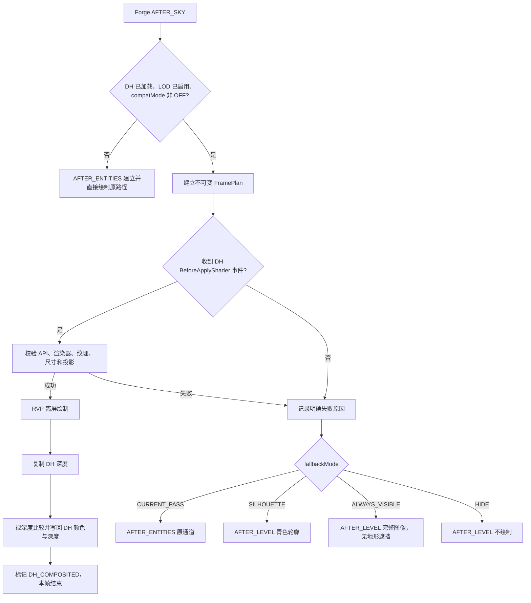

# RVP Distant Horizons 地形 LOD 遮挡兼容技术文档与调参指南

> 文档状态：以 2026-09-03 当前工作区实际实现为准
> 适用项目：`limitless-vehicle-rvp-addon`（Minecraft 1.20.1 Forge）  
> 配置文件：`.minecraft/config/ywzj_rvp-client.toml`  
> 适用对象：客户端开发、整合包作者、实机测试与性能调优人员

## 1. 结论先行

当前实现已经把 RVP 超视距载具从单一的 Forge `AFTER_ENTITIES` 绘制，扩展为一条可选的 Distant Horizons（下文简称 DH）深度感知合成通道：

- 未安装 DH、DH 关闭 LOD 渲染或用户把兼容模式设为 `OFF` 时，继续使用原有 `AFTER_ENTITIES` 路径，行为不变。
- DH API 7.0.1+ 的 7.x 版本且使用原生 OpenGL 渲染器时，RVP 会在 DH apply shader 前取得当帧颜色、深度纹理，将远距载具离屏绘制后按相机空间视深度与 DH 地形比较，并把可见颜色和深度写回 DH 目标。
- API、纹理、投影或光影管线不满足要求时，不会取消 DH 自身事件，也不会盲目继续写纹理；系统会按显式回退配置选择原通道、青色轮廓、始终可见或隐藏。
- 整个兼容层位于 RVP 客户端代码中，不修改 `ywzj_vehicle` 本体，不使用 Mixin，也不依赖 DH 的内部 `common/core` 实现。

默认配置是面向普通玩家的折中方案：`AUTO + SILHOUETTE + 2 格 bias`。能可靠取得 DH 深度时遵守地形遮挡；不能可靠取得时用青色轮廓提示远距目标，避免目标静默消失。

## 2. 功能边界

### 2.1 已实现

- DH 为可选客户端依赖；无 DH 客户端和专用服务器不会解析 DH API 类型。
- 对 DH API 7.0.1～7.x 做运行期 major/minor/patch 检查；已验证公开版基线为 DH 3.2.0-b / API 7.0.1。
- 仅接受 DH `OPEN_GL` 且 `isNativeRenderer() == true` 的纹理共享路径。
- 在 DH `before apply shader` 官方事件中逐帧查询颜色、深度纹理 ID。
- 同时支持标准 Forward-Z 和 Reverse-Z 投影。
- RVP 与 DH 使用不同投影矩阵时，分别逆投影到相机空间后再比较视深度。
- DH 与晚期回退的 RVP 离屏绘制使用独立远距投影：根据最终候选包围球前缘动态抬高 near（最高 256 格并保留 16 格余量），且从最终 float 矩阵反解并校正实际 far，避免极远距离模型面深度坍缩或被量化后的远平面切除。
- 对 DH 地形 LOD 几何误差提供 0～8 格的遮挡容差。
- 成功合成后回写 DH 深度，避免后续透明/合成阶段把载具误当作无深度颜色。
- 深度通道不可用时提供四种明确的回退语义。
- 资源重载、世界卸载和退出服务器时释放 RVP 自有 GL 资源。
- 调试日志按原因去重，周期统计最多每秒一次。

### 2.2 当前没有实现

- 没有按候选包围盒裁剪到局部矩形；当前离屏目标与合成均使用完整 DH 纹理尺寸。
- 没有 GPU query 或像素回读，因此日志不统计“可见/被挡/超 far”像素数。
- 没有针对某个光影 Mod、Oculus 或延迟透明实现专用的第二合成阶段。
- `occlusionBiasBlocks` 是固定格数，不随目标距离自动增长。
- 未把 `allowExperimentalShaderPipeline=true` 解释为“已兼容所有光影”；它只允许尝试当前 before-apply 路径。

这些边界是实际代码现状，不应把原方案稿中的后续阶段当作已经完成。

## 3. 帧流程与唯一消费

一帧远距载具计划只能被一条路径消费。`RVP_RemoteVehicleFrameCoordinator` 与 `RVP_RemoteVehicleFrameRoute` 负责避免 DH 成功后又在 Forge 阶段重复绘制。



具体阶段如下：

1. `AFTER_SKY`：调用 `prepareFrame`，冻结本帧候选、预算、投影和相机相关数据。没有候选时计划为 `null`。
2. DH `DhApiBeforeApplyShaderRenderEvent`：兼容桥取得本帧计划和 DH 纹理，尝试深度合成。
3. `AFTER_ENTITIES`：仅 `CURRENT_PASS` 回退会在这里消费计划；DH 已成功的帧不会重复绘制。
4. `AFTER_LEVEL`：处理 `SILHOUETTE`、`ALWAYS_VISIBLE` 或 `HIDE`，并清理本帧引用。

当 DH 官方 `renderingEnabled` 在运行中关闭时，监听器会同步状态；下一帧直接恢复普通 `AFTER_ENTITIES` 路径。

## 4. 深度感知合成原理

### 4.1 为什么不能直接比较两张原始深度图

RVP 远距载具投影的 far plane 会按目标距离扩展，而 DH 使用自己的投影矩阵、near/far 和深度方向。两张纹理中的 `0.5` 不一定代表相同距离，因此不能直接做 `rvpDepth < dhDepth`。

离屏通道不能直接沿用原版世界投影的 `near=0.05`。在数千至数万格距离下，Forward-Z 即使使用 `DEPTH32F`，绝大多数有效深度也会挤在接近 `1.0` 的极小区间；模型不同表面会落入同一深度档位。同时，double far 写入 float 矩阵后，实际远裁剪面可能向相机方向偏移。当前实现因此为离屏通道保存第二张投影：

1. 候选初筛后，只按最终预算目标重新计算投影；
2. 用候选包围球最靠近相机一侧的视深度规划 near，保留 16 格余量并限制在 256 格以内；
3. 构造 float 矩阵后反解实际 near/far，若实际 far 没有覆盖计划范围则增加编码 far 并重试；
4. 离屏 Frustum、模型绘制和 RVP 逆投影统一使用这张最终矩阵；普通 `AFTER_ENTITIES` 世界直绘仍保留原版 near，避免破坏与主世界深度缓冲的编码一致性。

当前 shader 分别使用 RVP 逆投影和 DH 逆投影，把同一屏幕 UV 下的原始深度重建为各自相机空间位置，再以正向视深度比较：

```text
rvpViewDepth = -rvpViewPosition.z
dhViewDepth  = -dhViewPosition.z

若 rvpViewDepth > dhViewDepth + occlusionBiasBlocks：
    RVP 像素位于 DH 地形之后，丢弃
否则：
    保留 RVP 像素
```

`occlusionBiasBlocks` 不是把载具向前移动，而是容许载具比简化后的 DH 地形深一点。它用于吸收 LOD 山脊、坡面与真实地形之间的几何误差。

### 4.2 Forward-Z、Reverse-Z 与空深度

RVP 自有投影会用绘制计划中的 near/far 校验端点；DH 投影则直接逆投影纹理深度 `0` 和 `1`，从 `dhProjectionMatrix` 恢复矩阵实际使用的 near/far：

- near≈0、far≈1：判为 Forward-Z；
- near≈1、far≈0：判为 Reverse-Z；
- 端点不接近上述任一种、矩阵不可逆或 near/far 非法：拒绝合成并报告 `UNSUPPORTED_PROJECTION`。

不能用 `DhApiRenderParam.nearClipPlane` 校验 DH 矩阵端点。DH 3.2.0-b 在普通高度下会把投影矩阵的实际 near 限制到 7.5 格，但事件字段仍可能是数百格的过度绘制裁剪距离；二者不一致属于正常运行事实。事件 near/far 只作为原始诊断参数保留，深度重建、空深度和 far 越界判断都以矩阵反解结果为准。

far 端点同时作为 DH 空深度。只有采样值与空深度差异大于阈值时，才认为该像素存在 DH 地形。

### 4.3 深度回写

可见的 RVP 像素会重新乘以 DH 投影矩阵，编码成 DH 使用的深度并写入 `gl_FragDepth`。当目标超过 DH far plane，或编码深度出现 NaN/Infinity 时，当前原生 OpenGL 路径会写入一个极靠近空深度的标记，同时保留颜色。

这项行为保证“载具比 DH far plane 更远”不会仅因为超出 DH 投影范围而被无条件丢弃；但它也是需要重点实机验证的边界场景。

## 5. OpenGL 资源与状态安全

### 5.1 资源所有权

RVP 创建并拥有：

- 一张 RGBA8 远距载具颜色纹理；
- 一张 DEPTH32F 远距载具深度纹理；
- 一张 DEPTH32F DH 深度复制纹理；
- 关联的 FBO。

DH 颜色、深度纹理只在当帧借用并挂接到 RVP 自建 FBO。RVP 不永久缓存其 ID，也绝不删除 DH 纹理。

按照 12 字节/像素估算，RVP 自有三张纹理的理论显存占用为：

| DH 目标尺寸 | 理论纹理占用 |
| --- | ---: |
| 1920×1080 | 约 23.7 MiB |
| 2560×1440 | 约 42.2 MiB |
| 3840×2160 | 约 94.9 MiB |

表中不含驱动对齐、FBO 元数据、载具模型/快照纹理，也不把 DH 自有纹理重复计入。窗口尺寸变化时资源按需重建；没有远距载具计划时不会执行合成。

### 5.2 状态恢复

合成和晚期回退均通过 `RVP_DhGlStateScope` 捕获并恢复关键状态，包括：

- draw/read framebuffer、viewport、scissor；
- Minecraft `ShaderInstance`、原生 program、VAO；
- active texture 与相关绑定；
- depth test、depth func、depth mask、depth clear value；
- blend 开关、函数和方程；
- cull、color mask、clear color。

这样可避免兼容层把状态泄漏给 DH 后续 apply shader 或 Minecraft 其他世界渲染阶段。

## 6. 可选依赖与版本策略

`mods.toml` 把 `distanthorizons` 声明为 `CLIENT`、非强制依赖。普通入口 `RVP_DistantHorizonsCompatBootstrap` 不引用任何 DH 类型；只有确认 Mod 已加载后，才反射载入 `RVP_DhApi7Bridge`。

项目编译期使用 Modrinth 上的 DH API 7.0 工件 `GgrzKRsK`，运行期最低要求已验证的 API 7.0.1。兼容桥只调用 7.0 已公开的事件、原生渲染器判定和纹理 getter；7.1 及后续 7.x 仍需通过相同运行期能力检查。维护时需注意：

- 不得把运行期要求放宽到未验证的 7.0.0，也不得未经适配接受未来 API 8.x；
- 不得把 DH API 类复制或打包进 RVP jar；
- 不得在桥以外的类直接引用 `com.seibel.distanthorizons.*`；
- DH 后续若移除现有 getter，应只更新隔离桥和编译依赖，不扩散到渲染业务层。
- 初始化、版本、渲染器或事件绑定的永久失败原因由 bootstrap 跨帧保留；只有桥已就绪而某帧没有消费 apply 前事件时才报告 `NO_DH_EVENT_THIS_FRAME`。

## 7. 配置字段

配置位于 `ywzj_rvp-client.toml` 的 `[remoteVehicleRendering.distantHorizons]`：

| 字段 | 范围/枚举 | 默认 | 实际语义 |
| --- | --- | --- | --- |
| `compatMode` | `OFF` / `AUTO` / `DEPTH_AWARE` | `AUTO` | 关闭、自动深度合成并回退、或严格要求深度合成 |
| `fallbackMode` | `CURRENT_PASS` / `SILHOUETTE` / `ALWAYS_VISIBLE` / `HIDE` | `SILHOUETTE` | `AUTO` 合成失败时的显示语义 |
| `occlusionBiasBlocks` | 0.0～8.0 | 2.0 | DH 地形遮挡比较的基础容差，单位格 |
| `maxOcclusionBiasBlocks` | 0.0～8.0 | 8.0 | 容差硬上限；有效值为两者较小值 |
| `allowExperimentalShaderPipeline` | `true` / `false` | `false` | 是否允许在 DH 延迟透明/未验证光影管线上尝试当前合成 |
| `diagnostics` | `true` / `false` | `false` | 是否每秒最多输出一次状态、候选数与耗时 |

两个容易误解的规则：

1. `DEPTH_AWARE` 会强制把有效回退视为 `HIDE`，配置文件中的 `fallbackMode` 此时不会生效。
2. 有效 bias 是 `min(occlusionBiasBlocks, maxOcclusionBiasBlocks)`；当前没有按距离放大 bias 的逻辑。

默认配置示例：

```toml
[remoteVehicleRendering.distantHorizons]
    compatMode = "AUTO"
    fallbackMode = "SILHOUETTE"
    occlusionBiasBlocks = 2.0
    maxOcclusionBiasBlocks = 8.0
    allowExperimentalShaderPipeline = false
    diagnostics = false
```

## 8. 模式选择指南

### 8.1 推荐：普通整合包与玩家客户端

```toml
compatMode = "AUTO"
fallbackMode = "SILHOUETTE"
occlusionBiasBlocks = 2.0
maxOcclusionBiasBlocks = 8.0
allowExperimentalShaderPipeline = false
```

这是默认组合。正常时使用地形遮挡；发生不兼容时显示青色边缘，既不会把完整载具画穿山，也不会让远距目标无提示地消失。

### 8.2 追求严格视觉真实性

```toml
compatMode = "AUTO"
fallbackMode = "HIDE"
occlusionBiasBlocks = 0.5
maxOcclusionBiasBlocks = 2.0
allowExperimentalShaderPipeline = false
```

适合录像、截图或不接受任何穿山提示的客户端。缺点是 DH 事件或纹理暂时不可用时，远距载具会完全不显示。

若要把“任何深度失败都隐藏”设为不可被回退配置改变的规则，可使用 `DEPTH_AWARE`。调试阶段不建议一开始就用它，因为失败现象只有“目标消失”，信息量最低。

### 8.3 战术可读性优先

```toml
compatMode = "AUTO"
fallbackMode = "ALWAYS_VISIBLE"
occlusionBiasBlocks = 2.0
maxOcclusionBiasBlocks = 8.0
```

只有明确接受“兼容失败时完整载具可能穿山”时才使用。该模式不会改变服务端授权范围或候选预算，只改变客户端最终合成语义。

### 8.4 临时关闭兼容进行 A/B 对照

```toml
compatMode = "OFF"
```

此时使用原有 `AFTER_ENTITIES` 路径。它适合判断问题来自远距载具本身，还是来自 DH 深度合成；但 DH 后续 pass 仍可能覆盖原通道结果。

## 9. 遮挡容差调参

### 9.1 先理解两个相反症状

| 症状 | 原因倾向 | 调整方向 |
| --- | --- | --- |
| 载具贴着远处山脊时闪烁、被坡面错误吞掉 | DH 简化地形比视觉轮廓更靠近相机 | 每次把 bias 增加 0.5～1.0 格 |
| 载具已经深入山体后仍有部分露出 | 容差过大 | 每次把 bias 减少 0.5～1.0 格 |
| 所有遮挡都像失效 | 多半不是 bias，而是 `ALWAYS_VISIBLE` 回退或深度通道失败 | 开启 diagnostics，先查状态 |
| 目标完全消失且无日志统计 | 可能是 `DEPTH_AWARE/HIDE`、无候选或未进入 DH 路径 | 临时改为 `AUTO + SILHOUETTE` 定位 |

### 9.2 推荐校准步骤

1. 固定分辨率、FOV、DH 质量和光影状态，开启 `diagnostics=true`。
2. 选择一条轮廓明显的山脊，在山前、山脊相切、山后各放置一个载具。
3. 分别在约 500、1000、2000 格观察静止、横移和缩放瞄准镜场景。
4. 从 `occlusionBiasBlocks=0.0` 开始，每次增加 0.5 格，直到山脊相切目标不再持续闪烁。
5. 检查山后目标是否仍能漏出；若漏出，回退 0.5 格。
6. 把 `maxOcclusionBiasBlocks` 设为最终允许的上限。由于当前没有距离缩放，它主要是配置保险，不会主动增加容差。
7. 关闭诊断日志，保留最终参数。

建议起点：

| DH 地形/使用场景 | 建议 bias |
| --- | ---: |
| 高质量 LOD、平缓地形、视觉真实性优先 | 0.0～1.0 |
| 默认质量、一般山地 | 1.5～2.5 |
| 低质量 LOD、陡峭山脊、远距离观察 | 2.5～4.0 |
| 超过 4.0 | 仅在明确复现并确认不是回退/投影问题后使用 |

不要用 8 格 bias 掩盖所有问题。它是硬上限允许值，不是推荐值。

## 10. 诊断日志

打开：

```toml
diagnostics = true
```

成功示例的字段结构：

```text
RVP DH compat: state=DEPTH_AWARE_OPENGL api=<实际版本> pass=<pass> dhDepth=FORWARD_Z|REVERSE_Z selected=<数量> compositeMs=<毫秒>
```

回退示例的字段结构：

```text
RVP DH compat: state=FALLBACK reason=<原因> fallback=<模式> selected=<数量>
```

失败警告按 `reason` 只输出一次；启用诊断后的周期状态最多每秒一次。因此日志没有逐帧刷屏不代表系统停止工作。

| reason | 含义 | 优先处理 |
| --- | --- | --- |
| `DH_API_TOO_OLD` | DH API 低于 7.0.1，或不是已支持的 7.x | 使用 DH 3.2.0-b / API 7.0.1 或兼容的后续 7.x |
| `DH_BRIDGE_INITIALIZING` | DH 已加载，但初始化完成事件尚未确认桥能力 | 若进入世界后持续出现，检查 DH 初始化日志与事件绑定 |
| `DH_INIT_EVENT_BIND_FAILED` | 初始化完成事件注册失败 | 检查 DH API 完整性及注册返回的 detail |
| `DH_APPLY_EVENT_BIND_FAILED` | apply 前事件注册失败 | 检查 DH API 事件实现及注册返回的 detail |
| `NON_OPENGL_ENGINE` | DH 不是原生 OpenGL 渲染器 | 保持安全回退；不要强行开启实验选项 |
| `TEXTURE_UNAVAILABLE` | 当帧颜色/深度 ID、尺寸或 shader 不可用 | 检查 DH 状态、资源重载与日志 detail |
| `FRAMEBUFFER_INCOMPLETE` | 借用纹理挂接或合成过程异常 | 检查显卡驱动、DH/光影组合和完整异常栈 |
| `UNSUPPORTED_PROJECTION` | 投影不是已验证的 Forward-Z/Reverse-Z，或矩阵非法 | 关闭实验光影路径并提供复现矩阵/日志 |
| `DEFERRED_SHADER_UNVERIFIED` | DH 延迟透明开启，但实验开关为 false | 接受回退；仅为测试临时开启实验选项 |
| `NO_DH_EVENT_THIS_FRAME` | 桥已就绪且已准备计划，但本帧没有成功收到/消费 DH apply 前事件 | 检查 DH 是否实际绘制 LOD 及事件顺序；版本/绑定失败会报告更具体原因 |
| `DH_BRIDGE_LOAD_FAILED` | 反射加载强类型桥失败 | 检查 DH API 类兼容性和完整异常栈 |

`diagnostics` 当前给出的 `compositeMs` 是整段 RVP 离屏绘制、DH 深度复制与全屏合成的 CPU 侧经过时间，不是纯 GPU query，不能直接当成精确 GPU 耗时。

## 11. 性能调优

### 11.1 主要成本

- 远距载具模型/LOD/快照本身的离屏绘制；
- 一次 DH 深度复制；
- 一次全屏深度比较与颜色合成；
- 与 DH 目标相同分辨率的三张 RVP 自有纹理。

载具绘制成本随候选数量、模型复杂度和高模回退数量变化；深度复制与全屏合成成本主要随分辨率变化，而不是随候选数量线性变化。

### 11.2 调优顺序

1. 先用 `[remoteVehicleRendering]` 下的 `maxRenderedVehicles` 控制每帧远距载具总数。
2. 再用 `maxFallbackHighModels` 限制没有整模型 LOD 时的高模回退数。
3. 4K 或高分辨率下若 `compositeMs` 明显增加，优先降低输出分辨率/渲染比例，而不是调整 bias；bias 只改变遮挡判定。
4. `SILHOUETTE` 与 `ALWAYS_VISIBLE` 回退仍需一次离屏绘制和全屏合成；`HIDE` 在失败帧最省，`CURRENT_PASS` 则回到原渲染成本。
5. 完成诊断后关闭 `diagnostics`，减少日志噪声；日志本身通常不是主要渲染瓶颈。

## 12. 光影与延迟透明

当 DH 报告 `getDeferTransparentRendering() == true` 时，默认配置会报告 `DEFERRED_SHADER_UNVERIFIED` 并进入回退。这是有意的安全边界：当前实现没有证明所有光影组合都在同一时机消费同一组颜色/深度纹理。

只有为收集兼容数据时才建议：

```toml
allowExperimentalShaderPipeline = true
diagnostics = true
```

测试后必须检查：

- 山前/山后遮挡是否正确；
- 透明地形、水面、云雾前后的层级；
- 切换维度、重载资源、缩放窗口后是否出现黑屏或残影；
- 载具是否重复绘制；
- DH 自身颜色或深度是否被破坏。

出现黑屏、整屏闪烁、深度反转或持续 `FRAMEBUFFER_INCOMPLETE` 时，应立即恢复 `false` 并使用安全回退；不要用增大 bias 处理管线级错误。

## 13. 实机验证矩阵

自动化测试覆盖了投影数学、Forward-Z/Reverse-Z、DH 事件 near 与矩阵实际 near 不一致、DH 矩阵到 JOML 的逐字段映射、离屏动态 near、65,536 格 float far 覆盖与载具尺度深度分离、帧计划唯一消费、强制非扩展投影的渲染作用域，以及“只有隔离桥可引用 DH 类型”的架构约束。发布 jar 审计不得包含 `com/seibel/distanthorizons` 类。

这些测试不能替代带显卡驱动和真实 DH 的客户端验证。发布前至少执行：

| 维度 | 测试值 |
| --- | --- |
| DH | 未安装 / 已安装但 LOD 关闭 / 已安装且 LOD 开启 |
| 模式 | `OFF` / `AUTO` 四种 fallback / `DEPTH_AWARE` |
| 投影 | 默认视角 / 瞄准镜缩放 / 调整 FOV |
| 深度 | 山前 / 山脊相切 / 山后 / 超过 DH far plane |
| 分辨率 | 1080p / 1440p / 4K 或目标整合包实际分辨率 |
| 生命周期 | 进出世界 / 换维度 / F3+T 资源重载 / 改窗口尺寸 / 退出服务器 |
| 光影 | 无光影 / 目标光影组合，实验开关分别 false、true |
| 目标 | 单车 / 多车达到预算上限 / 有 LOD 模型 / 高模回退 / 动态快照 |

验收标准：

- DH 缺失或关闭时，原路径无回归；
- DH 成功时，山前目标显示、山后目标遮挡、山脊相切不持续抖动；
- 同一载具同一帧不重复绘制；
- 回退行为与配置完全一致；
- 资源重载、缩放窗口和换维度后无黑屏、FBO 错误或旧帧残影；
- 专用服务器可启动，发布 jar 不打包 DH API 类。

## 14. 常见问题速查

### 只看到青色轮廓

说明当前进入 `SILHOUETTE`，不是深度合成的正常颜色。开启 `diagnostics`，按 `reason` 定位。不要先调 bias，因为回退轮廓不读取 DH 深度。

### 载具完整穿山

先检查是否为 `fallback=ALWAYS_VISIBLE`。若日志为 `DEPTH_AWARE_OPENGL`，再把 bias 降到 0～1 做 A/B 对照；若仍穿山，记录 DH 深度模式、render pass、FOV 和复现场景。

### `DEPTH_AWARE` 下目标消失

这是配置设计：该模式失败时强制 `HIDE`。先改为 `AUTO + SILHOUETTE` 获取可见回退和失败原因，问题解决后再恢复严格模式。

### 山脊边缘闪烁

确认日志处于 `DEPTH_AWARE_OPENGL` 后，将 bias 每次增加 0.5 格。若增加到 4 格仍严重闪烁，应按投影、DH LOD 更新或光影管线问题调查，而不是直接拉到 8。

### 开启实验光影后黑屏或地形异常

恢复 `allowExperimentalShaderPipeline=false`。当前开关只放行实验，并不承诺该光影组合兼容。

### 4K 下显存或帧时成本过高

当前资源和全屏 pass 都按 DH 纹理尺寸分配。优先降低渲染分辨率，并压低 `maxRenderedVehicles`、`maxFallbackHighModels`；等待未来实现局部矩形合成后再重新评估。

## 15. 代码维护入口

| 职责 | 类/资源 |
| --- | --- |
| Forge 阶段编排、候选准备与实际绘制 | `RVP_RemoteVehicleVisualRenderer` |
| 单帧计划与唯一消费状态 | `RVP_RemoteVehicleFramePlan`、`RVP_RemoteVehicleFrameCoordinator`、`RVP_RemoteVehicleFrameRoute` |
| 无 DH 类型的可选依赖入口 | `RVP_DistantHorizonsCompatBootstrap` |
| 唯一 DH API 强类型边界 | `RVP_DhApi7Bridge` |
| 离屏绘制、深度比较与晚期回退 | `RVP_DhDepthCompositeRenderer` |
| 投影识别和逆投影数学 | `RVP_DhProjectionMath` |
| DH 深度复制 | `RVP_DhDepthCopy` |
| 借用 DH 纹理的 FBO | `RVP_DhFramebufferSet` |
| RVP 自有载具离屏目标 | `RVP_RemoteVehicleOffscreenTarget` |
| GL 状态保护 | `RVP_DhGlStateScope` |
| 生命周期清理 | `RVP_DhCompatLifecycle` |
| 诊断日志 | `RVP_DhCompatDiagnostics` |
| 深度合成 shader | `assets/ywzj_rvp/shaders/core/dh_depth_composite.*` |
| 回退 shader | `assets/ywzj_rvp/shaders/core/dh_fallback_composite.*` |
| 客户端参数 | `RVP_ClientConfig` |

维护原则：继续保持 DH API 只存在于隔离桥、每帧重新查询借用纹理、失败不取消 DH 事件、同一计划只消费一次、只释放 RVP 自有资源。若未来要支持新的光影阶段，应新增公开事件上的独立通道并先完成实机验证，不应通过 Mixin 修改 DH 或 Minecraft 核心渲染方法。

## 16. 与原方案稿的关系

原始设计稿位于 `./RVP_Distant-Horizons地形LOD遮挡兼容方案_20260819.md`。该文件用于说明设计背景和阶段规划；本文档是当前代码的运行事实与调参依据。两者不一致时，以当前代码、配置默认值和本文列出的“当前没有实现”为准。
