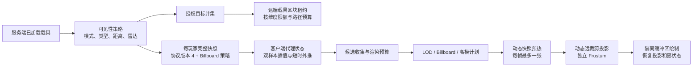

# limitless-vehicle-rvp-addon 载具实体超远距离渲染技术文档与配置调参指南

> 文档日期：2026-08-18  
> 代码基线：远裁剪墙修复后的激进 Billboard LOD 实现，含动态快照观察方向与纹理 U/V 轴修复（网络协议版本 4）  
> 适用环境：Minecraft 1.20.1、Forge、`ywzj_vehicle`、`limitless-vehicle-rvp-addon`  
> 参考方案：[超视距载具渲染重构计划](./limitless-vehicle-rvp-addon_超视距载具渲染重构计划_20260818.md)

## 1. 文档定位

本文描述当前已经提交的载具实体超远距离渲染实现，并给出服务端、客户端、资源包三侧的配置与调参方法。本文以当前代码行为为准；重构计划用于保留设计过程、阶段任务和验收记录。

这套系统解决的是：载具离开原版约 512 格实体渲染范围后，仍能以轻量静态模型继续显示，最远可由 `maxDistance` 扩展到 65536 格；同时避免为了显示远处载具而在客户端创建真实世界实体、执行载具逻辑或渲染整套特效。

当前实现包含以下能力：

- 服务端按观察者、模式、载具类型矩阵和距离计算可见目标。
- 使用完整快照同步远端载具的模型元数据、位置、姿态和必要动态状态。
- 客户端使用不加入 `ClientLevel` 的代理载具完成插值和静态模型绘制。
- 复用 RVP 的 Bedrock 模型与 LOD 规则；默认把缺少有效 LOD 的目标转为动态 3D 快照 Billboard。
- 可由服务端强制所有超视距载具使用 Billboard，并在槽位缩略图与动态 3D 快照之间选择来源。
- 用独立远端投影矩阵和视锥解决远裁剪墙，不修改主世界投影的长期状态。
- 可选择剔除普通地形雾，避免 512 格附近的雾墙遮挡仍由实体渲染或远端通道渲染的载具。
- 可按授权目标维持有限的区块路径租约，降低移动载具离开已加载区块后立即丢失的概率。

### 1.1 当前提交状态

本次重构对应的连续提交为：

| 提交 | 阶段 | 已落地内容 |
|---|---|---|
| `6b3103c3` | 阶段 A | 服务端可见性、完整快照协议和客户端非世界代理基础链路。 |
| `6641022b` | 阶段 B | 远端静态模型绘制、预算、LOD 复用和正常实体互斥。 |
| `72580366` | 阶段 C | 授权目标区块租约、路径预算、统计与清理。 |
| `dd7a03fa` | 缺陷修复 | 动态 far plane、独立视锥、投影/雾作用域，以及 `removeTerrainFog`。 |
| 当前实现 | 激进 Billboard LOD | 服务端权威策略、动态高模快照、视角分桶 LRU、预热降级、离屏观察方向/纹理原点修复和协议版本 4。 |

代码、自动化测试和构建层面的实现已经完成；重构计划中 RVR-16～RVR-23 的真实游戏验收仍需按场景执行，本文第 13 节给出了对应的回归清单。

## 2. 快速启用

默认配置已经启用本功能。服务端和客户端版本必须一致，当前网络协议版本为 `4`。

服务端 `config/ywzj_rvp-common.toml` 的最小配置：

```toml
[remoteVehicleRendering]
enabled = true
aggressiveLodBillboard = true
forceAllVehicleBillboard = false
billboardSource = "DYNAMIC_SNAPSHOT"
dynamicSnapshotWarmupMode = "HIDE"
visibilityMode = "VEHICLE_OCCUPANTS"
maxDistance = 4096.0
syncIntervalTicks = 5
maxTargetsPerPlayer = 32
chunkLoadingMode = "VISIBLE_TARGETS"
maxChunkLoadedVehiclesPerDimension = 32
chunkLookAheadTicks = 5
```

客户端本地 `config/ywzj_rvp-common.toml` 建议保留：

```toml
[remoteVehicleRendering]
enabled = true
removeTerrainFog = true
scopeZoomPreferModelRendering = true
```

客户端 `config/ywzj_rvp-client.toml` 的默认配置：

```toml
[remoteVehicleRendering]
maxRenderedVehicles = 32
maxFallbackHighModels = 8
maxExtrapolationTicks = 5
```

多人游戏中，服务端的 common 配置决定“哪些目标会被同步”以及四项 Billboard 策略；这些策略随每份远距完整快照强制下发，客户端本地同名值不覆盖服务器。每位玩家客户端本地 common 配置中的 `removeTerrainFog` 仍只决定“该客户端是否剔除普通地形雾”。Forge common 文件本身不会自动覆盖客户端文件，强制效果来自版本 4 网络快照。

## 3. 总体架构



设计边界如下：

- 512 格以内继续由原版/本体实体渲染链负责。
- 超过 512 格且不超过 `maxDistance` 的授权目标，才进入远端快照和代理渲染链。
- 远端代理不是世界实体，不参与碰撞、AI、物理、音效、粒子、乘员和交互。
- 远端通道只绘制静态载具主体，不调用完整实体渲染器。
- 客户端发现同 ID 的正常实体已经加载时，会跳过远端代理，避免双重绘制。

## 4. 服务端可见性与快照

### 4.1 目标边界

服务端使用水平距离判断远端目标：

- `水平距离 <= 512`：不发送到远端渲染通道。
- `512 < 水平距离 <= maxDistance`：可进入远端候选。
- `水平距离 > maxDistance`：不可见。

512 是正常实体渲染与远端渲染的交接边界，不建议通过调参改变其语义。远端渲染并不保证 512 格以内的正常实体一定可见，正常实体仍受本体追踪、客户端实体加载和普通渲染条件约束。

### 4.2 载具分类

当前分类规则：

| 分类键 | Java 类型 | 说明 |
|---|---|---|
| `helicopter` | `RotaryWingVehicle` | 旋翼载具 |
| `aircraft` | `FixedWingVehicle` | 固定翼载具 |
| `ground_vehicles` | 其他 `AbstractVehicle` | 地面及未单列载具 |

`VehiclePart` 不作为独立目标同步。配置中的分类 token 必须使用上述小写写法；未知 token 会被忽略并记录警告，重复 token 会被去重，空列表是合法配置。

### 4.3 可见性模式

`visibilityMode` 支持：

| 值 | 行为 |
|---|---|
| `OFF` | 关闭远端目标授权，并向曾接收过目标的客户端发送空快照清理状态。 |
| `RADAR_DETECTED` | 玩家必须乘坐可分类载具；1024 格以内按类型矩阵可见，超过 1024 格还必须被本机或关联/部署 UAV 的雷达当前探测到。 |
| `VEHICLE_OCCUPANTS` | 玩家必须乘坐可分类载具；按观察载具类型矩阵决定目标类型。默认值。 |
| `ALL_PLAYERS` | 所有玩家都可获得远端目标。步行/旁观玩家没有观察载具分类，因此不应用类型矩阵；乘坐载具时仍应用矩阵。 |

观察者当前乘坐的载具会被排除，不会作为自己的远端目标。

### 4.4 筛选和排序

每次计算顺序概括如下：

1. 只收集当前已经加载、存活、未移除、数据完整的载具。
2. 应用模式、观察者条件和目标类型白名单。
3. 应用 512 格下限、`maxDistance` 上限和必要的雷达条件。
4. 按水平距离升序排序；距离相同时按实体 ID 升序排序。
5. 截断到 `maxTargetsPerPlayer`。

因此达到目标上限时，近处目标优先，结果具有稳定顺序。

### 4.5 完整快照协议

服务端在 Server Tick 的 END 阶段工作。首次启用时立即计算，之后按 `syncIntervalTicks` 重算。每份 S2C 快照包括：

- 维度标识、服务端游戏时间、玩家级严格递增序列号。
- 服务端权威的两个 Billboard 开关、图像来源和动态快照预热方式。
- 每个目标的实体 ID、实体类型、载具 ID、display ID。
- 位置、速度、X/Y/Z 姿态。
- 离地高度、摧毁状态、发动机状态、功率和发动机转速。

单包最多接受 1024 个条目。解码端会拒绝非法数量、负序列号/实体 ID、空资源 ID、非有限浮点值和负离地高度。

快照是“完整集合”而不是增量：新快照中缺失的旧目标会立即从代理表移除。关闭功能、切换为 `OFF`、离开世界、切换维度或资源重载时也会清理相应状态。

## 5. 区块租约与服务端开销

远端渲染只能发现已加载载具。为了让已经获得授权的移动载具不因离开当前加载区块而立刻消失，服务端可为目标路径申请短期区块租约。

### 5.1 模式

| `chunkLoadingMode` | 行为 |
|---|---|
| `OFF` | 不为远端载具额外申请区块租约。 |
| `AI_UAV_ONLY` | 仅对 Gunner AI/UAV 类目标申请租约，适合限制开销。 |
| `VISIBLE_TARGETS` | 对当前至少被一名玩家授权可见的目标申请租约。默认值。 |

租约每 tick 根据上一次可见性计算得到的授权并集重新核对。目标必须仍能解析到有效实体，并且至少存在一个有效授权观察者。

### 5.2 维度限额和选择优先级

每个维度最多选择 `maxChunkLoadedVehiclesPerDimension` 辆载具。超额时优先级为：

1. 上一轮已经选中的目标，降低频繁抖动。
2. 正在水平移动的目标。
3. 到最近授权观察者距离更近的目标。
4. 实体 ID 更小的目标，保证稳定排序。

### 5.3 路径前瞻

路径终点按 `当前位置 + 速度 × chunkLookAheadTicks` 计算。值为 0 时只维持当前区块。远端租约复用统一的区块路径管理器：

- 优先级低于等待中和活动中的弹体路径。
- 每 tick 全局最多新增 64 个区块中心。
- 每实体每 tick 路径预算最多 64 个区块。
- 租约驻留时间为 15 tick，并通过连续刷新维持。

提高 `chunkLookAheadTicks` 会扩大高速载具的前方覆盖，但也会更快消耗路径预算。它不是越大越稳，过大时反而可能让单车路径触及 64 区块限制。

### 5.4 重要限制

区块租约不会扫描整个未加载世界。因此，一辆从一开始就停在完全未加载区块中的载具不会凭空进入候选；租约主要用于维持已经被服务端发现和授权的目标。

本体自身已有的 UAV ticket 不会被此重构移除，因为本项目不修改 `ywzj_vehicle` 本体源码。

## 6. 客户端代理与运动平滑

客户端为每个条目创建轻量代理 `AbstractVehicle`，但不会把它加入 `ClientLevel`。代理只用于复用载具数据初始化和 Bedrock 静态模型渲染所需的字段。

### 6.1 生命周期与安全检查

- 不同维度或序列号过期/重复的快照会被拒绝。
- 单包内重复实体 ID 只采用第一条。
- 未知实体类型或不是 `AbstractVehicle` 的类型不会创建代理。
- 实体类型、vehicle ID、display ID 变化时重建代理。
- 已摧毁代理重新变为未摧毁状态时重建，避免残留不可逆状态。
- 25 个客户端 tick 未收到更新的代理会过期。
- 正常世界实体与代理 ID 相同时，正常实体优先，远端绘制跳过该代理。

### 6.2 插值和外推

每个代理保存最近两个样本：

- 渲染时间相对服务端快照延迟一个快照间隔，用于在两个样本间插值。
- 位置采用线性插值。
- 角度使用环绕角插值，避免从 179° 到 -179° 时绕远路。
- 超过最新样本时可按速度外推，最多 `maxExtrapolationTicks`，硬上限为 5 tick。
- 外推达到上限后停止继续漂移，等待下一份权威快照。

`syncIntervalTicks` 不建议达到或超过 25。固定 25 tick 过期时间会导致高间隔配置在延迟或服务端卡顿时周期性清理代理。推荐范围是 3～10 tick。

## 7. 远端渲染、远裁剪与雾

### 7.1 渲染阶段与预算

远端载具在 Forge 世界渲染的 `AFTER_ENTITIES` 阶段绘制。候选首先执行数据有效性、512 格边界、粗略包围体和预算检查。

屏幕贡献度近似为：

```text
contribution = structureSize² / max(1, cameraDistance²)
```

排序优先级：贡献度降序、距离升序、实体 ID 升序。随后依次应用：

- `maxRenderedVehicles`：远端绘制总上限。
- `maxFallbackHighModels`：所有实际基础高模回退的目标上限，包括关闭激进策略后的无 LOD 目标、缺少 `slot_texture`、动态快照生成失败以及 `MODEL` 预热。

动态快照、槽位缩略图和 `HIDE`/`SLOT_TEXTURE` 预热不占用高模限额；它们仍占用 `maxRenderedVehicles` 总量。动态快照生成发生在总量和高模预算选中之后，每帧最多生成一张。

客户端本地 `scopeZoomPreferModelRendering=true` 且玩家正在使用载具、进入 `SCOPE` 观瞄并达到最终 FOV 缩放阈值时，只覆盖 Billboard 决策：有有效 LOD 的目标仍走普通 LOD 且只占总量预算，无有效 LOD 的目标回退基础高模并继续受 `maxFallbackHighModels` 限制。

### 7.2 静态主体绘制

远端通道只绘制载具静态主体：

- 校验 display、模型、纹理和中心偏移。
- 两个 Billboard 开关都关闭时，有 LOD 选择对应 LOD，无 LOD 使用基础模型与距离骨骼隐藏规则降级。
- 默认策略下，无有效 LOD 的目标改走动态 3D 快照 Billboard；`forceAllVehicleBillboard=true` 时所有目标均改走 Billboard。
- 临时把插值姿态写入代理，复用本体载具的 Y-X-Z 旋转顺序，绘制后在 `finally` 中恢复。
- 已加载位置使用世界光照；未加载位置使用中性光照 `block=8, sky=10`。
- 损毁状态会把方块光和天空光除以 1.5。
- 不绘制乘员、装饰实体、弹孔，也不执行音效、粒子和完整实体渲染链。

远端模型使用独立的缓冲区，批次会在远端投影与雾作用域内结束，避免顶点延迟到恢复主投影后才提交。

### 7.3 激进 Billboard LOD 与动态快照

Billboard 是否生效由服务端快照中的策略决定：

```text
forceAllVehicleBillboard
    OR (aggressiveLodBillboard AND 没有任何成功烘焙的 lod_models 规则)
```

客户端本地观瞄缩放模型优先条件生效时，上述服务端 Billboard 策略仅在当前客户端临时跳过；目标随后按普通 LOD、无 LOD 回退基础高模的顺序规划。该选项不修改服务端策略、同步目标或其他玩家的渲染结果。

`SLOT_TEXTURE` 直接复用 display 的透明 `slot_texture`，始终使用当前相机完整朝向。未配置槽位图时回退基础静态高模，并计入 `maxFallbackHighModels`。

`DYNAMIC_SNAPSHOT` 使用基础 display 高模和基础纹理生成透明正交快照，但只绘制静态主体，不执行动画、乘员、部件、弹孔、声音、粒子或完整实体渲染器。快照按车型、display、模型、纹理、结构尺寸和“观察方向转换到载具局部空间后的偏航/俯仰”缓存：

- 分辨率固定为 256×256，带深度缓冲和透明背景。
- 偏航、俯仰均按 22.5° 分桶；相机或载具转动跨过桶边界时请求新快照。
- 世界观察方向先通过载具 Y-X-Z 旋转的逆变换进入模型局部空间；所得向量已经是“载具中心指向观察者”的离屏相机方向，直接进入 JOML `lookAt`，不得再叠加 180° 偏航，否则会把机头和机尾互换。
- 动态快照直接采样 RenderTarget 颜色附件：其 V=0 位于底部，并且 JOML 离屏视图的屏幕右轴与 Minecraft 相机朝向 Billboard 的屏幕右轴手性相反。提交世界 Billboard 时只对动态纹理使用反向 U 和底部原点 V，分别避免侧视轮廓左右镜像以及旋翼、车顶等上下颠倒。普通 `slot_texture` 继续使用标准资源纹理 U/V。
- LRU 最多 128 张；颜色和深度缓冲合计显存上限约为 64 MiB，具体还受驱动对齐影响。
- 每帧只生成优先级最高的一张缺失快照，生成完成后当帧即可显示。
- 离屏生成发生在远距投影作用域开启前，并在 `finally` 中恢复投影、模型视图、主 RenderTarget 和 viewport。

`dynamicSnapshotWarmupMode` 控制快照尚未生成时的表现：

| 值 | 行为 |
|---|---|
| `HIDE` | 默认；暂不绘制，等待逐帧预热，不产生临时高模压力。 |
| `SLOT_TEXTURE` | 配有 `slot_texture` 时临时显示缩略图；缺图时暂不绘制。 |
| `MODEL` | 临时绘制基础静态高模，并受 `maxFallbackHighModels` 限制。 |

动态快照生成失败后，本资源代际内不会逐帧重试，而是回退基础静态高模；资源重载、换维度或退出世界会注销动态纹理、销毁 RenderTarget 并允许重新生成。

### 7.4 动态远裁剪投影

旧问题的根因是主世界投影矩阵的 far plane 仍停留在原版距离，即使代理和模型存在，GPU 也会把远处几何裁掉，形成“远裁剪墙”。

当前实现从本帧投影矩阵保留以下参数：

- 透视 FOV。
- 宽高比。
- 非对称投影偏移。
- near plane。

只替换深度投影中与 far plane 有关的系数，并按候选所需距离动态扩展。范围上限由授权距离 65536、最大剔除半径 1024 和 16 格安全余量共同约束，最大约为 66576。

扩展投影只在远端绘制作用域内生效，并创建配套的独立 `Frustum`。绘制结束或发生异常时，投影和雾参数都会恢复；不会清空深度缓冲，也不会关闭深度测试，因此近处地形仍能正确遮挡远处载具。

若当前 shader 提供的是无法安全识别的非标准投影矩阵，系统会受控降级到原投影与原视锥，并只记录一次警告。此时第三方 shader 下仍可能出现旧式远裁剪，应先根据日志确认是否触发降级。

### 7.5 地形雾剔除

`removeTerrainFog=true` 用于处理 512 格到当前雾墙之间，普通地形雾遮挡正常实体载具或远端代理的问题。

该配置只在以下条件全部满足时生效：

- 客户端本地 common 配置的 `enabled=true`。
- 客户端本地 `removeTerrainFog=true`。
- 当前是普通地形雾 `FOG_TERRAIN`。
- 摄像机不在水、熔岩、细雪等特殊雾介质中。
- 玩家没有失明或黑暗效果。

生效时会通过 Forge 雾事件把普通地形雾设置为无雾效果。它不会剔除天空雾、液体雾、细雪雾、失明或黑暗效果。

注意：这是客户端全局的普通地形雾视觉选项，而不是只在载具像素处挖洞。关闭后可恢复普通地形雾，但雾墙可能再次遮挡 512 格附近的载具。

远端绘制作用域还会在普通环境中把雾结束距离临时扩展到当前所需 far distance，并保留雾起始距离、颜色和形状；特殊介质和状态效果不会被强行覆盖。

## 8. LOD 配置与资源包制作

远距离体验仍受 LOD 覆盖率影响，但默认激进策略会把没有有效 LOD 的目标转为动态快照，不再逐帧绘制基础高模。补齐真实 LOD 仍能消除首次快照生成与缓存占用，并在关闭 Billboard 或选择 `MODEL` 预热时提供稳定降级。

### 8.1 LOD 字段

载具 display JSON 可配置 `lod_models`。单条 LOD 规则支持：

| 字段 | 默认值 | 含义 |
|---|---:|---|
| `model` | 必填 | 地面/通用 LOD 模型。 |
| `model_air` | `model` | 空中状态模型；未配置时回退到 `model`。 |
| `texture` | 基础纹理 | LOD 专用纹理；未配置时使用基础纹理。 |
| `distance` | `32` | 普通视角距离阈值。 |
| `air_distance` | `16` | 空中状态距离阈值。 |
| `air_height` | `10` | 达到该离地高度后按空中规则判断。 |
| `zoom_distance` | `-1` | 缩放视角专用普通阈值；`-1` 表示使用普通阈值。 |
| `zoom_air_distance` | `-1` | 缩放视角专用空中阈值；`-1` 表示使用空中阈值。 |

示意配置：

```json
{
  "lod_models": [
    {
      "model": "rvp:entity/lod/example_lod1",
      "texture": "rvp:textures/entity/lod/example.png",
      "distance": 256,
      "air_distance": 384,
      "air_height": 10
    },
    {
      "model": "rvp:entity/lod/example_lod2",
      "texture": "rvp:textures/entity/lod/example.png",
      "distance": 1024,
      "air_distance": 1536,
      "air_height": 10
    }
  ]
}
```

规则从列表末尾向前评估，因此应按距离由近到远排列。LOD 回退迟滞系数为 0.85：切换到远级后，需要退回到阈值的约 85% 内才降回近级，避免临界距离反复闪烁。

远端代理第一次渲染会立即评估 LOD，之后约每 20 tick 复核；远端使用显式摄像机距离和服务端同步的离地高度。普通实体则使用玩家距离与客户端世界高度图。

### 8.2 距离骨骼隐藏

没有独立 LOD 模型时，可使用 `distance_hidden_bones` 在基础高模降级路径隐藏细小骨骼。动态快照使用完整基础静态主体生成轮廓，不消费逐车距离骨骼状态；它通过缓存消除后续逐帧顶点提交。

### 8.3 推荐制作原则

- 256～512 格：保留轮廓、主翼、旋翼、炮塔等主要辨识结构。
- 1024～2048 格：合并小部件，移除座舱内部、起落架细节、小挂件和不可辨识面。
- 4096 格及以上：以稳定剪影为主，减少材质切换和透明面。
- 给常见载具优先补齐 LOD，再提高服务器目标数和客户端渲染上限。
- 模型只放在载具包 `assets/rvp/models/bedrock/` 并由 display JSON 引用，不在 Java 中维护模型 ID 白名单。
- 不要为了本功能擅自修改 `*.structure.json` 的骨层级、pivot、cube 几何或父级关系；结构模型调整必须按项目资产流程先确认和备份。

## 9. 完整配置参考

### 9.1 `ywzj_rvp-common.toml`

| 路径 | 类型/范围 | 默认值 | 作用与建议 |
|---|---|---:|---|
| `remoteVehicleRendering.enabled` | boolean | `true` | 服务端控制同步功能；客户端本地值还作为地形雾剔除的总开关。 |
| `remoteVehicleRendering.removeTerrainFog` | boolean | `true` | 客户端本地选项，剔除普通地形雾；不由服务器同步。 |
| `remoteVehicleRendering.scopeZoomPreferModelRendering` | boolean | `true` | 客户端本地选项；使用载具进入 `SCOPE` 且最终 FOV 达到缩放阈值时跳过 Billboard，改走普通 LOD、无 LOD 回退基础高模；不由服务器同步。 |
| `remoteVehicleRendering.aggressiveLodBillboard` | boolean | `true` | 服务端权威；无成功烘焙 LOD 规则的超视距载具使用 Billboard。 |
| `remoteVehicleRendering.forceAllVehicleBillboard` | boolean | `false` | 服务端权威；强制所有超视距载具使用 Billboard，并覆盖上一项。 |
| `remoteVehicleRendering.billboardSource` | enum | `DYNAMIC_SNAPSHOT` | 服务端权威；选择 `SLOT_TEXTURE` 或动态高模快照。 |
| `remoteVehicleRendering.dynamicSnapshotWarmupMode` | enum | `HIDE` | 服务端权威；选择 `HIDE`、`SLOT_TEXTURE` 或 `MODEL`。 |
| `remoteVehicleRendering.visibilityMode` | enum | `VEHICLE_OCCUPANTS` | 远端授权策略。 |
| `remoteVehicleRendering.maxDistance` | 512～65536 | `4096` | 服务端水平授权距离。距离翻倍通常会显著扩大候选面积。 |
| `remoteVehicleRendering.syncIntervalTicks` | 1～200 | `5` | 快照重算/发送间隔。建议 3～10，避免达到 25。 |
| `remoteVehicleRendering.maxTargetsPerPlayer` | 0～1024 | `32` | 单玩家服务端快照目标上限；0 等价于不发送目标。 |
| `remoteVehicleRendering.chunkLoadingMode` | enum | `VISIBLE_TARGETS` | 远端目标区块租约策略。 |
| `remoteVehicleRendering.maxChunkLoadedVehiclesPerDimension` | 0～1024 | `32` | 每维度获得远端租约的载具上限。0 可保留同步但关闭租约。 |
| `remoteVehicleRendering.chunkLookAheadTicks` | 0～200 | `5` | 按速度预测区块路径的 tick 数。高速载具可略增，通常不超过 10。 |

类型矩阵：

```toml
[remoteVehicleRendering.visibilityByObserverVehicleType]
helicopter = ["helicopter", "aircraft", "ground_vehicles"]
aircraft = ["helicopter", "aircraft", "ground_vehicles"]
ground_vehicles = ["helicopter", "aircraft"]
```

默认情况下，空中观察者可看所有载具，地面载具观察者只看空中目标。矩阵在 `VEHICLE_OCCUPANTS`、`RADAR_DETECTED` 和乘坐载具的 `ALL_PLAYERS` 观察者上生效。

### 9.2 `ywzj_rvp-client.toml`

| 路径 | 类型/范围 | 默认值 | 作用与建议 |
|---|---|---:|---|
| `remoteVehicleRendering.maxRenderedVehicles` | 0～1024 | `32` | 每帧远端载具总数上限。0 会保留网络代理但不绘制。 |
| `remoteVehicleRendering.maxFallbackHighModels` | 0～1024 | `8` | 实际基础高模回退的每帧上限；包括 Billboard 缺图、失败和 `MODEL` 预热，运行时不会超过总绘制上限。 |
| `remoteVehicleRendering.maxExtrapolationTicks` | 0～5 | `5` | 最新样本之后的最大外推时间。网络稳定时可降到 2～3。 |
| `remoteVehicleRendering.distantHorizons.compatMode` | enum | `AUTO` | `OFF` 关闭适配；`AUTO` 优先深度感知并允许降级；`DEPTH_AWARE` 失败时隐藏。 |
| `remoteVehicleRendering.distantHorizons.fallbackMode` | enum | `SILHOUETTE` | 深度合成不可用时选择 `CURRENT_PASS`、轮廓、显式始终可见或隐藏。 |
| `remoteVehicleRendering.distantHorizons.occlusionBiasBlocks` | 0～8 | `2` | DH 简化轮廓的视深度容差，单位格。 |
| `remoteVehicleRendering.distantHorizons.maxOcclusionBiasBlocks` | 0～8 | `8` | 遮挡容差硬上限；当前固定 bias 也受此值钳制。 |
| `remoteVehicleRendering.distantHorizons.allowExperimentalShaderPipeline` | boolean | `false` | 是否允许未经完整实机验证的延迟透明/光影管线实验性合成。 |
| `remoteVehicleRendering.distantHorizons.diagnostics` | boolean | `false` | 每秒至多一次输出合成状态、候选数、深度方向和耗时。 |
| `lod.lodZoomEnabled` | boolean | `true` | 缩放视角是否使用专用 LOD 距离。 |
| `lod.lodZoomFovRatio` | 0.1～99 | `0.75` | FOV 低于正常 FOV 的此比例时视为缩放。 |
| `lod.lodZoomDistanceMultiplier` | 1～10 | `1.5` | 未设置专用 zoom 阈值时，对普通 LOD 阈值的缩放倍数。 |

客户端预算不改变服务器发送量。若服务器每人发送 64 个目标、客户端只允许绘制 16 个，剩余代理仍会接收和维护，只是不进入本帧绘制。四项 Billboard 策略与此不同：它们由服务端强制下发；客户端仍可用总量与高模预算限制本机实际工作量。

## 10. 调参方法

建议按以下顺序调整，每一步单独观察，避免同时改动后无法定位瓶颈：

1. 确定业务可见性：先选 `visibilityMode` 和类型矩阵。
2. 确定战场尺度：调整 `maxDistance`。
3. 限制网络与候选：调整 `maxTargetsPerPlayer`。
4. 控制区块开销：选择 `chunkLoadingMode`，再调每维度上限和前瞻。
5. 选择 Billboard 覆盖范围、来源和预热方式；默认动态快照 + `HIDE` 最偏向稳定降压。
6. 控制 GPU/CPU 绘制：调整客户端总预算和高模降级预算。
7. 平衡平滑与时延：联合调整同步间隔和外推 tick。
8. 制作与校准 LOD：最后再增加超远距离目标密度。
9. 根据视觉需求决定是否剔除普通地形雾。

### 10.1 关键参数之间的关系

`maxDistance` 主要影响服务端候选范围和客户端动态 far plane。它不等价于区块视距，也不会加载观察者到目标之间的所有区块。

`maxTargetsPerPlayer` 是网络和客户端代理的第一道上限；`maxRenderedVehicles` 是实际远端绘制上限；`maxFallbackHighModels` 只限制最终确实需要基础高模的子集。推荐保持：

```text
maxFallbackHighModels <= maxRenderedVehicles <= maxTargetsPerPlayer
```

这不是强制约束，但最容易理解和稳定。如果客户端上限大于服务器目标上限，多出的渲染预算不会产生目标。

同步间隔与外推时间应满足：

```text
maxExtrapolationTicks 约等于或略小于 syncIntervalTicks
syncIntervalTicks < 25
```

硬上限使 `maxExtrapolationTicks` 不会超过 5，所以将同步间隔设置为 10～20 时，插值后更容易出现短暂停顿；这属于节省网络/计算与运动连续性之间的取舍。

### 10.2 推荐档位

#### 默认平衡档

适合常规多人服和 4096 格战场：

```toml
# common
maxDistance = 4096.0
syncIntervalTicks = 5
maxTargetsPerPlayer = 32
aggressiveLodBillboard = true
forceAllVehicleBillboard = false
billboardSource = "DYNAMIC_SNAPSHOT"
dynamicSnapshotWarmupMode = "HIDE"
chunkLoadingMode = "VISIBLE_TARGETS"
maxChunkLoadedVehiclesPerDimension = 32
chunkLookAheadTicks = 5

# client
maxRenderedVehicles = 32
maxFallbackHighModels = 8
maxExtrapolationTicks = 5
```

#### 服务端性能优先档

```toml
# common
maxDistance = 2048.0
syncIntervalTicks = 10
maxTargetsPerPlayer = 16
aggressiveLodBillboard = true
forceAllVehicleBillboard = true
billboardSource = "DYNAMIC_SNAPSHOT"
dynamicSnapshotWarmupMode = "HIDE"
chunkLoadingMode = "AI_UAV_ONLY"
maxChunkLoadedVehiclesPerDimension = 16
chunkLookAheadTicks = 3

# client
maxRenderedVehicles = 16
maxFallbackHighModels = 4
maxExtrapolationTicks = 3
```

适合玩家多、载具密度高或区块生成/加载较重的服务器。运动更新会比默认档更稀疏。

#### 低配客户端档

```toml
# 服务端如允许可配合降低
maxDistance = 2048.0
syncIntervalTicks = 10
maxTargetsPerPlayer = 12
aggressiveLodBillboard = true
forceAllVehicleBillboard = true
billboardSource = "SLOT_TEXTURE"
dynamicSnapshotWarmupMode = "HIDE"
chunkLoadingMode = "AI_UAV_ONLY"
maxChunkLoadedVehiclesPerDimension = 8
chunkLookAheadTicks = 2

# client
maxRenderedVehicles = 8
maxFallbackHighModels = 2
maxExtrapolationTicks = 3
```

该档位强制使用现成 `slot_texture`，适合最低绘制压力；未配置槽位图的载具会竞争高模降级上限 2，因此载具包仍应补齐缩略图或 LOD。

#### 大型战场档

```toml
# common
maxDistance = 8192.0
syncIntervalTicks = 5
maxTargetsPerPlayer = 64
aggressiveLodBillboard = true
forceAllVehicleBillboard = false
billboardSource = "DYNAMIC_SNAPSHOT"
dynamicSnapshotWarmupMode = "SLOT_TEXTURE"
chunkLoadingMode = "VISIBLE_TARGETS"
maxChunkLoadedVehiclesPerDimension = 48
chunkLookAheadTicks = 5

# client
maxRenderedVehicles = 48
maxFallbackHighModels = 8
maxExtrapolationTicks = 5
```

该档位用槽位图遮盖动态快照预热空窗。只建议在主要载具已有 1024 格以上 LOD、服务器区块 I/O、客户端 GPU 和约 64 MiB 动态快照缓存上限均完成实测后使用；不要直接把距离和目标数拉到范围上限。

### 10.3 雾的选择

- 追求清晰识别和远距离作战：`removeTerrainFog=true`。
- 希望保留原版大气遮蔽：`removeTerrainFog=false`，但需接受雾墙可能遮住载具。
- 水下、熔岩、细雪、失明和黑暗中的雾不会被此选项移除，这是预期行为。
- 使用第三方 shader 时，应分别验证远裁剪矩阵和 Forge 雾事件是否被 shader 正确尊重。

### 10.4 Distant Horizons 地形 LOD 遮挡兼容

安装 Distant Horizons 且客户端配置不是 `OFF` 时，远距载具会在 `AFTER_SKY` 完成候选、预算和动态快照预热，然后等待 DH 官方 `BeforeApplyShader` API 事件。兼容层把正常模型、真实 LOD、槽位 Billboard 和动态快照统一绘制到 RVP 自有 RGBA8/DEPTH32F 目标；复制 DH 深度后，分别使用 RVP 与 DH 逆投影把原始深度还原到相机视深度，再决定该像素是否位于 DH 地形前方。

可见像素会把离屏目标中的预乘颜色还原为直通颜色，再以标准 alpha 混合写入 DH 颜色纹理，并按 DH 当帧投影写回对应深度；超过 DH far 的普通原生 OpenGL 像素使用靠近空值的 apply 标记深度。RVP 只删除自己创建的纹理和 FBO，不清除或删除 DH 资源。窗口缩放会按纹理尺寸重建，资源重载、换维度和退出世界会释放 RVP 自有资源。

兼容层运行时要求已验证的 DH API 7.0.1～7.x，并校验原生 OpenGL 渲染能力。API 版本不足、非原生 OpenGL、事件绑定失败、纹理不可用、投影端点无法判定或 FBO 不完整时会按配置明确降级，且永久初始化原因不会被误报为 `NO_DH_EVENT_THIS_FRAME`。默认 `AUTO + SILHOUETTE` 在世界末端只合成青色边缘；`ALWAYS_VISIBLE` 会忽略地形深度并产生穿山语义，必须由用户明确启用。延迟透明/Oculus 默认标记为 `DEFERRED_SHADER_UNVERIFIED` 并降级，只有显式打开实验选项才尝试 apply 前通道，不能视为正式光影支持。

## 11. 性能观察与统计

### 11.1 服务端

重点观察：

- 每名玩家授权目标数是否经常达到 `maxTargetsPerPlayer`。
- 每维度授权目标、符合租约条件目标、最终选中租约数。
- 因维度预算被丢弃的目标数。
- 规划区块数、实际获批区块数和路径预算耗尽的载具数。
- MSPT/TPS、区块加载和生成峰值、S2C 流量。

租约服务提供 `DimensionStatistics`，包含：

- `authorizedTargetCount`
- `eligibleTargetCount`
- `selectedLeaseCount`
- `dimensionBudgetDroppedCount`
- `plannedChunkCount`
- `grantedChunkCount`
- `pathBudgetExhaustedVehicleCount`

启用生命周期调试日志时会周期性输出统计。当前没有专用管理命令或 HUD，因此性能测试应同时采集服务端 profiler、网络流量和日志。

### 11.2 客户端

重点观察：

- 远端候选数、预算后绘制数、实际高模回退数、动态快照预热速度和 LRU 条目数。
- 512 格交接处是否重复、消失或被雾遮挡。
- 1024、2048、4096、目标最大距离附近是否仍被裁剪。
- LOD 切换是否抖动，缩放视角是否过早进入高模。
- 第三方 shader 下是否出现投影降级警告。
- GPU 帧时间、顶点数量和材质批次，而不只看平均 FPS。

性能不足时，优先处理顺序建议为：保持动态快照预热为 `HIDE` → 必要时由服务端强制全部 Billboard 或改用 `SLOT_TEXTURE` → 补齐 LOD/槽位图 → 降低 `maxFallbackHighModels` → 降低 `maxRenderedVehicles` → 降低服务端目标数或距离。

## 12. 常见问题排查

### 12.1 完全看不到远端载具

依次检查：

1. 服务端 `enabled` 是否为 true，模式是否不是 `OFF`。
2. 客户端与服务端 mod 版本是否一致，网络协议是否均为版本 4。
3. 目标水平距离是否严格大于 512 且不超过 `maxDistance`。
4. `VEHICLE_OCCUPANTS`/`RADAR_DETECTED` 下玩家是否正在乘坐可分类载具。
5. 观察载具类型矩阵是否允许目标类型。
6. `RADAR_DETECTED` 且距离超过 1024 时，雷达是否真的在当前探测表中包含目标。
7. 目标是否已被服务端加载、存活且具有完整 vehicle/display 数据。
8. `maxTargetsPerPlayer`、`maxRenderedVehicles` 是否为 0。

### 12.2 512 格附近载具被一堵雾墙挡住

- 确认客户端本地 common 中 `enabled=true` 且 `removeTerrainFog=true`。
- 确认当前不是水下、熔岩、细雪、失明或黑暗环境。
- 第三方 shader 可能自行实现雾而绕过 Forge 事件，需要关闭 shader 对照测试。
- 此问题与服务端是否发送代理是两个层面：512 格内可能仍是正常实体，只是被普通地形雾遮挡。

### 12.3 远处仍在固定距离被切掉

- 查看日志是否出现非标准投影矩阵降级提示。
- 关闭 shader/光影包进行对照测试。
- 确认目标确实进入本帧候选，而不是被服务器距离、类型、雷达或目标数预算排除。
- 确认客户端绘制预算和高模降级预算没有耗尽。

主世界视距较小不应再直接形成远端模型的固定 far 裁剪墙；当前实现使用远端作用域内的动态投影和独立视锥。

### 12.4 载具周期性消失或移动卡顿

- 保持 `syncIntervalTicks < 25`，推荐 3～10。
- 检查服务端卡顿和网络丢包；代理固定 25 tick 未更新会过期。
- 适当增加 `maxExtrapolationTicks`，但最大只能为 5，且不能代替稳定快照。
- 如果是高速目标离开已加载区块，检查租约模式、维度上限、前瞻值及路径预算统计。

### 12.5 只有部分载具显示

- 检查 `maxTargetsPerPlayer` 是否先在服务端截断。
- 检查 `maxRenderedVehicles` 和 `maxFallbackHighModels`。
- 默认动态快照 + `HIDE` 会按优先级每帧只预热一张；大量新目标初次出现时会逐帧补齐，并非网络丢失。
- `SLOT_TEXTURE` 缺图、动态快照失败和 `MODEL` 预热会竞争较小的高模降级预算；优先补齐槽位图和常用载具 LOD。
- 检查 display 中的模型、纹理和中心偏移是否有效。

### 12.6 远端模型或状态错误

- 核对 vehicle ID、display ID 和实体类型是否与服务端资源一致。
- 资源包重载会清空代理、LOD 状态和动态快照 RenderTarget；等待下一份网络快照和逐帧快照预热重新创建。
- 离地高度来自服务端 `MOTION_BLOCKING` 高度图；地形复杂处空地 LOD 判定可能与视觉感受略有差异，可调整 `air_height`。
- 未加载位置采用中性光照，颜色可能与真实区块光照不同，这是无客户端区块数据时的降级行为。

### 12.7 Billboard 迟迟不出现或角度跳变

- 确认服务端四项 Billboard 配置已经随版本 4 快照下发；多人服客户端本地同名配置不会覆盖服务器。
- `HIDE` 预热每帧最多生成一张，默认 32 个全新视角约半秒完成；频繁跨越 22.5° 分桶时会继续请求新视角。
- 若动态快照出现“向左飞但机尾朝左”的侧视左右镜像，确认客户端已更新到对 RenderTarget 单独使用反向 U 的版本；若旋翼或车顶朝下，则确认同时使用底部原点 V。更新后重启客户端或执行资源重载，以清除旧进程内已经生成的视角缓存。
- `SLOT_TEXTURE` 来源要求 display 配置有效透明槽位图；缺图会改走高模预算。
- 动态快照首次生成失败后会在当前资源代际回退高模；可修复资源后执行资源重载触发重试。
- 第三方 shader 若改变 RenderTarget、投影或透明混合语义，应关闭 shader 对照测试，并检查主画面是否在离屏生成后正确恢复。

### 12.8 服务端 TPS 或区块 I/O 增高

按顺序尝试：

1. 降低 `maxChunkLoadedVehiclesPerDimension`。
2. 降低 `chunkLookAheadTicks`。
3. 从 `VISIBLE_TARGETS` 改为 `AI_UAV_ONLY` 或 `OFF`。
4. 降低 `maxTargetsPerPlayer` 和 `maxDistance`。
5. 适当增大 `syncIntervalTicks`，降低可见性扫描与网络频率。

注意：同步间隔只降低周期性的快照计算和发送频率；租约目标的有效性核对与刷新仍按 tick 进行。

## 13. 验收与回归建议

### 13.1 功能场景

- 玩家步行、乘直升机、固定翼和地面载具时分别验证四种可见性模式。
- 在 511、512、513、1024、2048、4096 和 `maxDistance` 前后布置目标。
- 验证正常实体加载后远端代理不会重复绘制。
- 验证目标离开快照、切换维度、退出世界和资源重载后的清理。
- 验证目标移动、转向、俯仰、翻滚、发动机开关、功率和损毁状态。
- 验证 LOD 地面/空中、缩放视角和 0.85 迟滞。
- 分别验证无 LOD 默认动态快照、强制全 Billboard、`SLOT_TEXTURE`、三种预热模式以及缺图/失败高模降级。
- 绕载具水平和垂直观察，分别从车头、车尾和左右两侧确认快照观察面与实际姿态一致；让目标向屏幕左、右两侧飞行，确认快照机头指向与实际运动方向一致。直升机还应确认旋翼始终位于机身上方。随后确认 22.5° 分桶更新、Billboard 始终朝向相机且尺寸锚定于 `position + centerOffset`。

### 13.2 远裁剪和雾

- 在原版渲染器下验证 512～`maxDistance` 连续可见，无固定远裁剪墙。
- 验证近处山体/建筑仍能依靠深度缓冲遮挡远端载具。
- 分别测试 `removeTerrainFog=true/false`。
- 验证普通地形雾被剔除，而水、熔岩、细雪、失明、黑暗等特殊雾保持。
- 使用项目支持的 shader 组合做对照，检查非标准投影降级日志。

### 13.3 压力和稳定性

- 单维度放置超过服务端与客户端预算的目标，验证排序稳定且近处/高贡献目标优先。
- 让多辆高速载具跨区块移动，观察租约预算和消失情况。
- 多玩家从不同方向观察同一批目标，检查授权并集和维度租约上限。
- 至少进行 30～60 分钟飞行与切维度测试，检查代理、LOD 实例、动态快照 LRU、RenderTarget、缓冲区和租约是否持续增长。
- 制造超过 128 个车型/视角缓存键，确认 LRU 保持上限；切维度、退出世界和资源重载后确认显存资源释放。
- 记录启用前后 MSPT、S2C 带宽、客户端帧时间和显存占用。

当前重构计划中的 RVR-16～RVR-23 仍应以真实游戏运行结果为最终依据，尤其是 shader 兼容、特殊雾、长时间稳定性和大规模性能；自动化测试和编译通过不能替代这些场景。

## 14. 已知限制与非目标

- 不发现从始至终位于完全未加载区块的停放载具。
- 不让远端代理参与碰撞、受击、交互、AI、物理、音效和粒子。
- 不渲染乘员、装饰实体、弹孔和完整实体特效。
- 不保证所有第三方 shader 都能接受标准透视矩阵替换；不兼容时会安全降级。
- `removeTerrainFog` 是客户端全局普通地形雾开关，不是只针对载具的局部后处理。
- 未加载位置没有真实客户端光照，只能使用中性光照。
- `maxDistance` 不加载观察者与目标之间的连续地形，也不改变正常实体追踪范围。
- 当前没有面向管理员的远端渲染统计命令或客户端调试 HUD。
- 动态快照采用 22.5° 离散观察角，并非逐帧连续重绘；跨桶时轮廓可能产生轻微角度跳变。
- 动态快照只记录基础静态主体，不保留逐车动画、部件、距离隐藏骨骼或损伤几何差异。
- `SLOT_TEXTURE` 依赖载具包提供透明缩略图；缺失时只能受高模预算限制地降级。

## 15. 代码索引

以下是当前实现的主要入口，便于后续维护：

| 模块 | 主要职责 |
|---|---|
| `RVP_CommonConfig` | 服务端远端渲染、Billboard 策略、类型矩阵、租约及客户端本地地形雾配置。 |
| `RVP_ClientConfig` | 客户端绘制、基础高模降级、外推和缩放 LOD 配置。 |
| `RVP_RemoteVehicleVisibilityPolicy` | 观察者/目标分类、模式、距离、雷达、排序与截断。 |
| `RVP_RemoteVehicleVisualSyncService` | 服务端候选收集、玩家快照、序列号及授权并集。 |
| `RVP_RemoteVehicleChunkLeaseService` | 授权目标重解析、维度预算、路径计划与统计。 |
| `RVP_ChunkPathLoadManager` | 多优先级路径租约、全局/单实体区块预算。 |
| `S2CRemoteVehicleVisualSnapshot` | 协议版本 4 的完整远端载具快照与服务端 Billboard 策略。 |
| `RVP_ClientRemoteVehicleVisualState` | 非世界代理、服务端渲染策略、序列/维度校验、插值、外推、过期与清理。 |
| `RVP_RemoteVehicleVisualRenderer` | 候选预算、渲染计划编排、独立缓冲区和静态主体绘制。 |
| `RVP_RemoteVehicleFramePlan` / `RVP_RemoteVehicleFrameCoordinator` | 目标无关帧计划及 DH/原有/晚期降级的唯一消费路由。 |
| `RVP_RemoteVehicleBillboardManager` | Billboard 策略、角度分桶、模型局部观察方向、RenderTarget U/V 轴适配、动态快照 LRU、离屏状态恢复和 GPU 资源释放。 |
| `RVP_RemoteVehicleProjection` | 标准透视参数解析和动态 far plane 计划。 |
| `RVP_RemoteVehicleRenderScope` | 投影和雾参数的作用域切换及异常恢复。 |
| `RVP_RemoteVehicleFog` | 远端绘制期间的普通环境雾距离扩展。 |
| `RVP_RemoteVehicleTerrainFogHandler` | 客户端普通地形雾剔除事件。 |
| `client.compat.distanthorizons` | DH API 7.0.1+ 类加载隔离、投影验证、离屏资源、深度复制/合成、显式降级和诊断。 |
| `RVP_LodModelManager` | 普通实体与远端代理共享的 LOD 规则、缓存和迟滞。 |

## 16. 维护约定

后续修改远端渲染时应保持以下约束：

- 512 格服务端授权边界和客户端交接边界必须同步修改并配套回归。
- 协议字段变更必须提升协议版本，并同时更新编解码边界测试。
- 服务端 common 配置与客户端本地 common 配置的权威性必须在注释和文档中明确区分。
- 四项 Billboard 策略必须只消费经过快照维度与序号校验的服务端值；客户端本地 common 不得覆盖。
- 新增代理字段时，只同步静态绘制确实需要的数据，不把完整实体逻辑搬到客户端代理。
- 投影、雾、代理姿态、离屏 RenderTarget、模型视图和缓冲提交必须保持异常安全，任何路径结束后都要恢复主渲染状态。
- 保持远端租约低于弹体路径优先级，避免观赏性目标阻塞战斗关键加载。
- 优先用 display JSON 和 LOD 资源表达模型差异，不在 Java 中硬编码模型或武器 ID。
- 不修改 `ywzj_vehicle` 本体源码；新增行为放在 `limitless-vehicle-rvp-addon`。

---

如需判断一项配置是否值得提高，优先用同一场景做 A/B 数据对比。对于本功能，最有效的优化通常不是继续压缩同步，而是减少无效目标、限制区块租约、选择合适的 Billboard 来源和预热方式、补齐 LOD/槽位图，并把基础高模降级预算控制在客户端实际能承受的范围内。
