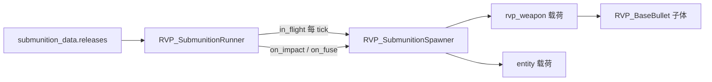

# 子母弹系统与 Mi-28 边界测试

本文档说明 RVP 拓展包 **子母弹 / 空中布撒** 的运行时架构、JSON 配置要点，以及 Mi-28 火箭挂架 **B01–B10** 边界测试弹的用法与预期现象。

字段权威定义见 [RVP包新增参数字段说明.md](./RVP包新增参数字段说明.md) 中 `submunition_data` 一节；示例 JSON 副本在 [examples/mi28_s13_boundary/](./examples/mi28_s13_boundary/)。

---

## 1. 与 `dispenser_data` 的区别

| 分组 | 时机 | 生成物 |
| --- | --- | --- |
| `submunition_data` | 飞行中 / 撞击 / 引信 | **弹体实体**（`rvp:*` 武器）或 **任意 `EntityType`** |
| `dispenser_data` | 落点（命中/引爆） | **方块/物品**（`useOn` 布撒） |

二者可组合：例如母弹空中放子弹药，子弹药落地再 `dispenser_data` 铺 TNT。

---

## 2. 运行时架构



| 类 | 包路径 | 职责 |
| --- | --- | --- |
| `RVP_SubmunitionData` | `weapon.data` | JSON 根；`releases[]` 或旧版 `count`/`delay_tick` 兼容 |
| `RVP_SubmunitionReleaseData` | `weapon.data` | 一条释放方案：触发器、节奏、`payloads`、`parent_action` |
| `RVP_SubmunitionPayloadData` | `weapon.data` | 单种载荷：`weapon_id` / `entity_type`、散布、速度继承 |
| `RVP_SubmunitionRunner` | `weapon.submunition` | 每枚弹体上的调度器（倒计时、波次、触发） |
| `RVP_SubmunitionSpawner` | `weapon.submunition` | 生成子体；`MAX_DEPTH = 4` 防无限链 |
| `RVP_SubmunitionSpreadApplicator` | `weapon.submunition` | `box` / `canister` 散布（复用 `RVP_SpreadDistributionUtil`） |
| `RVP_BaseBullet` | `entity.projectile` | `tickSubmunition()`、撞击/引信处 `trySubmunitionTrigger()` |

### 触发器（`triggers`）

| 值 | 调用时机 |
| --- | --- |
| `in_flight` | 每 tick，`delay_tick` 倒计时结束后按 `interval_tick` / `release_events` 释放 |
| `on_impact` | 方块或实体致死撞击（`on_block_hit` / `on_entity_hit` 也会匹配） |
| `on_block_hit` | 仅方块撞击 |
| `on_entity_hit` | 仅实体撞击（穿透耗尽后） |
| `on_fuse` | `detonateFuseAt` 内、爆炸链**之前** |

### 母弹行为（`parent_action`）

| 值 | 含义 |
| --- | --- |
| `continue` | 释放后母弹继续飞行/参与后续引爆 |
| `discard_after_release` | 本方案波次打完后丢弃母弹（集束弹开舱） |
| `discard_on_first_spawn` | 第一次生成载荷后立刻丢弃母弹（多级第一级） |

### 关键字段：`allow_submunition`

写在 **父级 `payloads[]` 条目**上（不是子战斗部 JSON 里）：

- **`false`（默认）**：子体**不会**执行自己武器 JSON 里的 `submunition_data`（防止叶子弹再开舱）。
- **`true`**：**多级火箭 / 链式战斗部** 必须写；否则子体在 `RVP_SubmunitionSpawner` 里会被 `disableSubmunitionReleases()`，二级及以后永远不会释放。

示例（一级 → 二级）：

```json
"payloads": [{
  "kind": "rvp_weapon",
  "weapon_id": "rvp:mi28_s13_stage2",
  "allow_submunition": true,
  "inherit_parent_velocity": true
}]
```

### 旧版兼容（无 `releases`）

```json
"submunition_data": {
  "count": 10,
  "delay_tick": 15,
  "interval_tick": 5,
  "spread": 0.45
}
```

等价于一条 `in_flight` 方案：克隆母弹武器（`weapon_id` 空），机枪母弹会套用历史减伤/关爆炸逻辑。

---

## 3. 安装 Mi-28 测试弹到载具包

`run/client_1/` 在 `.gitignore` 中，**仓库内示例**在 `docs/examples/mi28_s13_boundary/`。

**开发机（Gradle run）**

```powershell
$src = "limitless-vehicle-rvp-addon\docs\examples\mi28_s13_boundary\weapons"
$dst = "limitless-vehicle-rvp-addon\run\client_1\limitless_vehicle\rvp\data\rvp\weapons"
Copy-Item "$src\*.json" $dst -Force
```

在 `data/rvp/vehicles/mi28.json` 的 `sighting_system.weapons` 中保留（或添加）：

```json
{ "id": "rvp:mi28_s13_t01_cluster", "part_unit_id": "rocket" },
{ "id": "rvp:mi28_s13_t02_staged", "part_unit_id": "rocket" }
```

（B03–B10 同理，见下表 `资源 ID`。）

递增 `vehicle_pack.meta.json` 的 `version` 后进游戏。

**玩家目录**

将上述 `weapons/*.json` 复制到 `.minecraft/limitless_vehicle/rvp/data/rvp/weapons/`，并同步 `mi28.json` 与 `vehicle_pack.meta.json`。

---

## 4. Mi-28 边界测试弹 B01–B10

在瞄准具武器列表中选 **B01…B10** 名称。建议第三人称、平坦地形；**B07/B08/B09** 需刻意换目标类型。

| ID | 名称 | 边界点 | 预期现象 |
| --- | --- | --- | --- |
| `rvp:mi28_s13_t01_cluster` | B01 单 tick 齐射 24 | `interval_tick=0`，一次 24 波 | ~12 tick 空中**同时** 24 枚 HE，母弹消失；观察是否掉帧/漏弹 |
| `rvp:mi28_s13_t02_staged` | B02 延迟 1 tick | `delay_tick=1`，`inherit_vehicle_velocity` | 出膛**几乎立刻** 6 枚；子体带载具速度 |
| `rvp:mi28_s13_t03_starburst` | B03 迟释+母弹继续 | `delay_tick=80`，`parent_action: continue` | ~4s 时 5 枚 HE，**母弹继续飞**；落地仍有大爆 |
| `rvp:mi28_s13_t04_impact_split` | B04 高频 per_tick | `per_tick=3`，`interval=2`，`velocity_scale=0.12` | 每 2 tick 3 枚，共 12 波；子弹明显减速/下落 |
| `rvp:mi28_s13_t05_prox_bloom` | B05 双释放波次 | 两条 `in_flight`（delay 6 / 35） | 先 2 烟雾，后 6 HE；母弹全程保留至末段主爆 |
| `rvp:mi28_s13_t06_salvo` | B06 旧版 count | 无 `releases`，仅 count/interval | 10 枚、每 5 tick 1 枚；子体为**克隆母弹**且无二次开舱 |
| `rvp:mi28_s13_t07_dual` | B07 仅实体命中 | `on_entity_hit` only | **打地**：无子弹头；**打生物**：8×HE + 母弹爆 |
| `rvp:mi28_s13_t08_smoke_line` | B08 仅方块命中 | `on_block_hit` only | **打地**：6×燃烧弹 + 母弹爆；**打生物**：可能无燃烧抛洒 |
| `rvp:mi28_s13_t09_decoy` | B09 仅 on_fuse | 近炸 6 格 + `on_fuse` | **近实体**：先 12×HE 再中心大爆；**空地**通常仅直击 |
| `rvp:mi28_s13_t10_ground_disp` | B10 三级链 | L2→L3→4×HE，`allow_submunition` | 烟雾→电火花→末棒→4 HE；约三次脱壳 |

### 辅助战斗部（勿单独挂载）

| ID | 用途 |
| --- | --- |
| `rvp:mi28_s13_bomblet_he` | 通用小 HE |
| `rvp:mi28_s13_bomblet_inc` | 燃烧子弹头 |
| `rvp:mi28_s13_smoke` | 烟雾弹体 |
| `rvp:mi28_s13_dart` | 杆式小战斗部 |
| `rvp:mi28_s13_stage2` | 二级舱（演示用，非 B10） |
| `rvp:mi28_s13_chain_l2` / `chain_l3` | B10 链式中间级 |

---

## 5. 调试清单

| 现象 | 可能原因 |
| --- | --- |
| 二级不释放 | 上一级 `payloads` 未写 `allow_submunition: true` |
| 撞击无子弹头 | 触发器为 `on_entity_hit` 却打地面（或反之） |
| 近炸无开花 | 未靠近实体；`proximity_fuse_height` 过滤贴地目标 |
| 母弹不爆 | `parent_action: discard_after_release` 在开舱时已丢弃；或 `on_fuse` 方案 `discard` 且未 `continue` |
| 子体过多卡顿 | 降低 `release_events` 或 `payloads[].count` |

---

## 6. 编译与版本

- 修改 Java 后：`./gradlew :limitless-vehicle-rvp-addon:compileJava`
- 载具包示例版本：**0.5.48**（边界测试 B01–B10）

---

## 7. 相关文档

- [RVP包新增参数字段说明.md](./RVP包新增参数字段说明.md) — JSON 字段表
- [README.md](./README.md) — 文档索引与路径约定
- MCH 对照：`bomblet` / `bombletSTime` / `bombletDiff`、`spawnBulletInAir`
