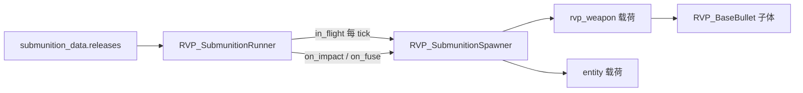

# 子母弹系统与 Mi-28 创意演示

本文档说明 RVP 拓展包 **子母弹 / 空中布撒** 的运行时架构与 JSON 配置要点。

> **Mi-28 火箭挂架 `mi28_s13_t01`…`t10`** 已改为 **G01–G10 分段制导演示导弹**，见 [导弹分段复合制导实现.md](./plan/导弹分段复合制导实现.md)。下文 C01–C10 子母弹表为历史参考；`docs/examples/` 中对应 JSON 已更新为导弹配置。

字段权威定义见 [RVP包新增参数字段说明.md](./plan/RVP武器数据模型/RVP包新增参数字段说明.md) 中 `submunition_data` 一节；示例 JSON 副本在 [examples/mi28_s13_boundary/](./examples/mi28_s13_boundary/)。

---

## 1. 与 `dispenser_data` 的区别

| 分组 | 时机 | 生成物 |
| --- | --- | --- |
| `submunition_data` | 飞行中 / 撞击 / 引信 | **弹体实体**（`rvp:*` 武器）或 **任意 `EntityType`** |
| `dispenser_data` | 落点（命中/引爆） | **方块/物品**（`useOn` 布撒） |

二者可组合：例如母弹空中放子弹药，子弹药落地再 `dispenser_data` 铺 TNT。

---

## 2. 运行时架构



| 类 | 包路径 | 职责 |
| --- | --- | --- |
| `RVP_SubmunitionData` | `weapon.data` | JSON 根；`releases[]` |
| `RVP_SubmunitionReleaseData` | `weapon.data` | 一条释放方案：触发器、节奏、`payloads`、`parent_action` |
| `RVP_SubmunitionPayloadData` | `weapon.data` | 单种载荷：类型/ID、数量、散布、速度继承、定向发射、子体权限与伤害修正 |
| `RVP_SubmunitionRunner` | `weapon.submunition` | 每枚弹体上的调度器（倒计时、波次、触发） |
| `RVP_SubmunitionSpawner` | `weapon.submunition` | 生成子体；`MAX_DEPTH = 4` 防无限链 |
| `RVP_SubmunitionReleaseCloudUtil` | `weapon.submunition` | release 级均匀球体积初始位置采样 |
| `RVP_SubmunitionSpreadApplicator` | `weapon.submunition` | `box` / `canister` 散布（复用 `RVP_SpreadDistributionUtil`） |
| `RVP_BaseBullet` | `entity.projectile` | `tickSubmunition()`、撞击/引信处 `trySubmunitionTrigger()` |

### 触发器（`triggers`）

| 值 | 调用时机 |
| --- | --- |
| `in_flight` | 每 tick，`delay_tick` 倒计时结束后按 `interval_tick` / `release_events` 释放 |
| `on_impact` | 方块或实体致死撞击（`on_block_hit` / `on_entity_hit` 也会匹配） |
| `on_block_hit` | 仅方块撞击 |
| `on_entity_hit` | 仅实体撞击（穿透耗尽后） |
| `on_fuse` | `detonateFuseAt` 内、爆炸链**之前** |

### 母弹行为（`parent_action`）

| 值 | 含义 |
| --- | --- |
| `continue` | 释放后母弹继续飞行/参与后续引爆 |
| `discard_after_release` | 本方案波次打完后丢弃母弹（集束弹开舱） |
| `discard_on_first_spawn` | 第一次生成载荷后立刻丢弃母弹（多级第一级） |

### 关键字段：`allow_submunition`

写在 **父级 `payloads[]` 条目**上（不是子战斗部 JSON 里）：

- **`false`（默认）**：子体**不会**执行自己武器 JSON 里的 `submunition_data`（防止叶子弹再开舱）。
- **`true`**：**多级火箭 / 链式战斗部** 必须写；否则子体在 `RVP_SubmunitionSpawner` 里会被 `disableSubmunitionReleases()`，二级及以后永远不会释放。

示例（一级 → 二级）：

```json
"payloads": [{
  "kind": "rvp_weapon",
  "weapon_id": "rvp:mi28_s13_stage2",
  "allow_submunition": true,
  "inherit_parent_velocity": true
}]
```

### release 级三维椭球释放云

`releases[]` 可让本方案的所有 payload 从母弹附近的权威三维椭球体积内生成：

```json
{
  "triggers": ["on_fuse"],
  "release_events": 1,
  "release_cloud_enabled": true,
  "release_cloud_radius": {
    "horizontal": 4.0,
    "vertical": 2.0
  },
  "payloads": [
    {
      "kind": "rvp_weapon",
      "weapon_id": "rvp:white_phosphorus_pellet",
      "count": 38
    }
  ]
}
```

- 开关默认 false，未配置的既有子母弹继续从母弹位置生成；两个轴半径默认均为 4 格，两轴都为 0 表示同点释放。
- `horizontal` 控制 X/Z 共用半径，`vertical` 控制 Y 半径。示例最大水平直径 8 格、最大高度 4 格；采样严格位于椭球内且按体积均匀分布。
- 云团本身只改变服务端初始位置，payload 的速度继承、发射角、速度散布和 `payloads_velocity` 会在之后照常计算；若使用 `spread.mode: cloud_radial_horizontal`，速度散布会读取最终出生位置相对当波母弹位置的 X/Z 投影作为云心外向方向。
- payload 若另配 `canister_type: 0`，其位置偏移会继续叠加到 release 云位置。
- 多波释放分别以当波发生时的母弹当前位置为中心；`rvp_weapon` 和 `entity` 两种载荷规则相同。

### 权威云心水平径向外散

需要让云内子体从各自位置自然向外散开、同时让 Y 完全由子体重力接管时，可使用：

```json
"launch_speed": 1.0,
"payloads_velocity": [0.0, 0.0, 0.0],
"spread": {
  "mode": "cloud_radial_horizontal",
  "cloud_direction_jitter": 15.0,
  "cloud_speed_jitter": 0.25
}
```

- 基础方向是最终出生偏移的 X/Z 归一化结果，方向扰动单位为度，速度扰动是 `launch_speed` 的比例。
- 纯竖直或零水平偏移会随机选择有限水平兜底方向；散布 Y 恒为 0，不会让云顶部子体先上扬。
- 该 X/Z 与母弹水平继承一起作为部署分量，可由子体的 `deployment_horizontal_half_life_ticks` 平滑衰减；`gravity` 独立控制下落。

### 世界系定向抛撒速度

`payloads[]` 可在现有继承速度、发射角和散布结果上追加世界坐标速度：

```json
"payloads": [{
  "kind": "rvp_weapon",
  "weapon_id": "rvp:mi28_s13_bomblet_he",
  "count": 12,
  "payloads_velocity": [0.0, -3.0, 0.0],
  "payloads_velocity_factor": 0.25
}]
```

- `payloads_velocity` 单位为格/tick，顺序是 `[x,y,z]`；上例为世界系向下冲量。
- `payloads_velocity_factor=f` 会为每枚子弹药独立抽取 `[1-f,1+f]` 的共同倍率，`f` 限制在 `0..1`。
- 随机倍率只改变冲量幅值，不分别扰动 XYZ，因此不会改变配置方向；需要角度散布时继续使用 `spread`。

### 定向发射（`launch_*`）

当 `launch_yaw`、`launch_pitch`、`launch_speed` 至少一项不是默认值时，载荷切换到定向发射模式：

```json
"payloads": [{
  "kind": "rvp_weapon",
  "weapon_id": "rvp:efp_pellet",
  "count": 40,
  "launch_yaw": 0.0,
  "launch_pitch": 90.0,
  "launch_angle_mode": "absolute",
  "launch_speed": 6.0,
  "spread": {
    "mode": "canister",
    "canister_type": 1,
    "canister_diff": 0.8
  }
}]
```

- yaw 约定为 `0=南/+Z`、`-90=东`、`90=西`；pitch 为 `90=正下`、`-90=正上`。
- `relative`（默认）把 yaw/pitch 叠加到母弹参考姿态；`absolute` 使用世界系固定角度。
- 定向发射模式会忽略 `inherit_parent_velocity` 与 `inherit_vehicle_velocity`。
- `launch_speed > 0` 直接决定速率；否则使用“母弹当前速率 × `velocity_scale`”。
- `spread` 围绕定向发射方向应用，`payloads_velocity` 仍在最后以世界坐标速度叠加。

全部载荷字段、默认值及仅限 `rvp_weapon` / `entity` 的生效条件，以字段权威文档中的 [`releases[].payloads[]`](./plan/RVP武器数据模型/RVP包新增参数字段说明.md#releasespayloads-单种载荷) 表为准。

---

## 3. 安装 Mi-28 测试弹到载具包

`run/client_1/` 在 `.gitignore` 中，**仓库内示例**在 `docs/examples/mi28_s13_boundary/`。

**开发机（Gradle run）**

```powershell
$src = "limitless-vehicle-rvp-addon\docs\examples\mi28_s13_boundary\weapons"
$dst = "limitless-vehicle-rvp-addon\run\client_1\limitless_vehicle\rvp\data\rvp\weapons"
Copy-Item "$src\*.json" $dst -Force
```

在 `data/rvp/vehicles/mi28.json` 的 `sighting_system.weapons` 中保留（或添加）：

```json
{ "id": "rvp:mi28_s13_t01_cluster", "part_unit_id": "rocket" },
{ "id": "rvp:mi28_s13_t02_staged", "part_unit_id": "rocket" }
```

（C03–C10 同理，见下表 `资源 ID`。）

递增 `vehicle_pack.meta.json` 的 `version` 后进游戏。

**玩家目录**

将上述 `weapons/*.json` 复制到 `.minecraft/limitless_vehicle/rvp/data/rvp/weapons/`，并同步 `mi28.json` 与 `vehicle_pack.meta.json`。

---

## 4. Mi-28 创意演示弹 C01–C10

在瞄准具武器列表中选 **C01…C10** 名称。建议第三人称、平坦开阔地形；含大量实体（鸡、蜂、TNT 等）的弹种可能卡顿，勿在生存主城测试。

| ID | 名称 | 演示要点 | 预期现象 |
| --- | --- | --- | --- |
| `rvp:mi28_s13_t01_cluster` | C01 AHEAD 360°箭幕 | `ring` + 36×`arrow`，一次齐射 | ~14 tick 母弹脱壳，水平 **360° 箭矢环** 后母弹小爆 |
| `rvp:mi28_s13_t02_staged` | C02 腹下集束导弹 | `interval=4`，`per_tick=2`，14 波×`drop_he` | 腹下 **分批** 抛出带重力子弹头，尾迹如雨；末波后母弹消失 |
| `rvp:mi28_s13_t03_starburst` | C03 生物雨（鸡） | 18×`chicken`，`cluster_center` | 空中 **鸡群** 散开下落；母弹脱壳后仍有中心爆炸 |
| `rvp:mi28_s13_t04_impact_split` | C04 蜂群囊 | 24×`bee`，`uniform` 方阵散布 | 蜂群囊破裂效果；注意蜜蜂可能激怒玩家 |
| `rvp:mi28_s13_t05_prox_bloom` | C05 烟花光环 | 16×`firework_rocket`，`parent_action: continue` | 环状烟花实体飞出，**母弹继续** 至落点主爆 |
| `rvp:mi28_s13_t06_salvo` | C06 TNT流星雨 | 10 波×1×`tnt`，每 5 tick | 间隔 **TNT 雨**；需留意点燃/爆炸链 |
| `rvp:mi28_s13_t07_dual` | C07 撞击荧光鱿 | `on_impact`：12×`glow_squid` + 8×`bat` | 命中瞬间 **发光鱿 + 蝙蝠** 喷出，再母弹爆炸 |
| `rvp:mi28_s13_t08_smoke_line` | C08 近炸雪球环 | 近炸 5.5 格 + `on_fuse` 32×`snowball` ring | 近实体引信时 **雪球环** + 中心大爆 |
| `rvp:mi28_s13_t09_decoy` | C09 双环集束（分批） | delay 18 / 38 各 10×`drop_he`，ring / `cluster_edge` | **两批** 环状集束，第二批后母弹脱壳 |
| `rvp:mi28_s13_t10_ground_disp` | C10 悦灵+骨粉地毯 | 飞行 `allay` + 命中 `rabbit` + `dispenser` 骨粉 | 途中悦灵、落地兔群 + **骨粉铺地**（`submunition` + `dispenser` 组合） |

### 辅助战斗部（勿单独挂载）

| ID | 用途 |
| --- | --- |
| `rvp:mi28_s13_drop_he` | C02/C09 下落集束子弹头（重力、可破坏方块） |
| `rvp:mi28_s13_bomblet_he` | 通用小 HE（历史示例） |
| `rvp:mi28_s13_bomblet_inc` | 燃烧子弹头 |
| `rvp:mi28_s13_smoke` | 烟雾弹体 |
| `rvp:mi28_s13_dart` | 杆式小战斗部 |
| `rvp:mi28_s13_stage2` | 二级舱（旧演示） |
| `rvp:mi28_s13_chain_l2` / `chain_l3` | 旧链式多级示例（当前 C 弹未使用） |

---

## 5. 调试清单

| 现象 | 可能原因 |
| --- | --- |
| 二级不释放 | 上一级 `payloads` 未写 `allow_submunition: true` |
| 撞击无子弹头 | 触发器为 `on_entity_hit` 却打地面（或反之） |
| 近炸无开花 | 未靠近实体；`proximity_fuse_height` 过滤贴地目标 |
| 母弹不爆 | `parent_action: discard_after_release` 会直接丢弃 |
| 子体过多卡顿 | 降低 `release_events` 或 `payloads[].count` |

---

## 6. 编译与版本

- 修改 Java 后：`./gradlew :limitless-vehicle-rvp-addon:compileJava`
- 载具包示例版本：**0.5.49**（创意演示 C01–C10）

---

## 7. 相关文档

- [RVP包新增参数字段说明.md](./RVP包新增参数字段说明.md) — JSON 字段表
- [README.md](./README.md) — 文档索引与路径约定
